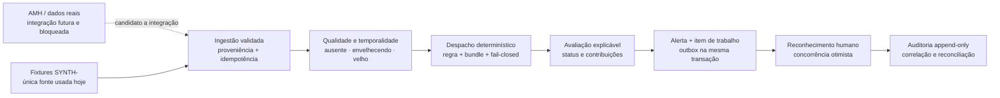

# IntensiCare V2

### Sinais clínicos claros. Contexto explicável. Resposta humana coordenada.

O **IntensiCare V2** é uma plataforma de apoio à decisão projetada para ajudar
equipes de terapia intensiva a reconhecer, priorizar, explicar e coordenar a
resposta à deterioração clínica. O produto organiza sinais dispersos em um
fluxo consultivo, rastreável e orientado à ação humana — sem automatizar a
decisão clínica.

> **Estado atual — engenharia e validação sintética.** A plataforma é
> executável e sua principal fatia vertical funciona de ponta a ponta com dados
> 100% sintéticos. Ela **não está liberada para uso clínico ou produção**, não
> acessou dados reais e não sustenta alegações de efetividade clínica,
> conformidade regulatória, segurança comprovada ou compatibilidade operacional
> com a AMH. Permanecem **0 vias clínicas acionáveis**, 47/47 vias candidatas
> inelegíveis e safety case em maturidade M0.

## O problema que o produto enfrenta

Na UTI, sinais relevantes podem estar distribuídos entre sistemas, medições e
momentos diferentes. O IntensiCare V2 foi desenhado para criar uma superfície
única em que o intensivista possa:

- visualizar o estado do leito e a qualidade temporal dos dados;
- entender quais parâmetros contribuíram para uma avaliação;
- distinguir dado ausente, envelhecendo, desatualizado ou não computável;
- reconhecer e coordenar trabalho sem apagar conflito, falha ou incerteza;
- recuperar a proveniência da entrada, da regra, do resultado e da ação humana.

Essas são capacidades de software demonstradas em cenário sintético — não uma
promessa de desfecho clínico.

## A experiência proposta



O caminho pontilhado representa uma dependência real ainda não satisfeita. O
caminho sólido é o fluxo já exercitado com fixtures sintéticas.

## O que já funciona

### Fatia vertical ponta a ponta

- ingestão de observações com validação, quarentena e idempotência por hash do
  corpo;
- avaliação determinística do NEWS2 em **modo sombra, não acionável**;
- estados explícitos de avaliação, sem converter ausência de dado em
  normalidade;
- criação durável de alerta, item de trabalho e outbox na mesma transação;
- projeção da grade de leitos e histórico explicável por parâmetro;
- reconhecimento de alerta com `If-Match`, controle de versão e tratamento
  explícito de conflitos;
- trilha de auditoria append-only para leituras e ações relevantes.

### Regras clínicas governadas

- kernel NEWS2 determinístico com vetores de teste e registro de comportamento;
- dispatcher versionado, verificação de bundle e recusa fail-closed;
- regra GCS implementada e testada no kernel, mas **não despachável na
  aplicação**, pois ainda não existe bundle GCS aprovado/carregável;
- assinatura, ativação, rollback, retirada e kill switch modelados no pacote de
  rule bundle;
- SOFA não implementado.

Nenhuma regra está aprovada para uso clínico acionável. A execução do NEWS2
serve à demonstração e validação técnica da arquitetura.

### Segurança e isolamento testáveis

- autenticação central com verificação JWS e adaptador OIDC/JWKS fail-closed;
- adaptador sintético restrito aos perfis de desenvolvimento e teste;
- contexto de tenant selado por transação e políticas de isolamento exercitadas
  contra PostgreSQL 16.14 real;
- testes adversariais para troca de papel, objetos alcançáveis, views,
  herança, funções e gatilhos `SECURITY DEFINER`;
- perfis endurecidos que recusam inicialização quando dependências obrigatórias
  estão ausentes.

Esses controles possuem evidência automatizada, mas **a fronteira de segurança
ainda depende de verificação independente e do gate humano MG-G6**. A integração
com um IdP real não foi executada; revogação de chave pode respeitar a janela de
cache JWKS; TLS do banco e o custo de latência do selo de tenant ainda não foram
validados para produção.

### API, eventos e operação

- contrato OpenAPI 3.1 e contrato AsyncAPI 3.0 versionados;
- erros `application/problem+json`, cursores e concorrência otimista;
- SSE contínuo no backend com replay por cursor, heartbeat, fila limitada,
  backpressure, autorização por entrega e ticket efêmero de uso único;
- superfícies distintas de liveness, readiness e startup;
- telemetria tipada, redação de dados sensíveis e pacote de vigilância.

O frontend ainda não consome o SSE contínuo: hoje ele usa leitura HTTP e expõe
estados de conectividade de forma conservadora. O AsyncAPI possui verificação
estrutural interna, mas ainda não foi validado contra o JSON Schema oficial da
especificação 3.0.

### UX clínica resiliente

- grade de leitos, detalhe explicável e reconhecimento em duas etapas;
- estados de carregamento, vazio, indisponibilidade, erro, degradação,
  envelhecimento, dado velho, sessão e avaliação não computável;
- comunicação que combina texto, ícone e cor;
- cancelamento real de requisição, preservação rotulada do último dado e
  recuperação de falha;
- testes de teclado, foco, live regions, contraste, alvos de toque, reflow em
  320 px e movimento reduzido.

WCAG 2.2 AA é requisito de projeto, **não uma conformidade declarada**. A
validação com pessoas usuárias de leitor de tela, ampliação e outras tecnologias
assistivas não foi executada; o critério 2.4.11 também permanece sem validação
dedicada.

## Evidência reproduzível desta árvore

Snapshot forense executado em **2026-08-17**. As contagens são medições do
estado local auditado, não SLA nem aprovação de release.

| Superfície | Resultado observado |
|---|---:|
| Projetos do workspace | 11 apps/pacotes |
| Testes de pacote, unidade e integração | 1.497 verdes; 0 falhas |
| Testes E2E em Chromium | 22 verdes; 0 falhas |
| Verificações OpenAPI/AsyncAPI | 148 verdes |
| Documentos verificados por convenção | 249 |
| Arquivos cobertos pela varredura de conteúdo proibido | 592 |
| Componentes no SBOM CycloneDX 1.6 | 58 |
| Imagem API inspecionada | UID 1000; 69.510.456 bytes; gate verde |
| Imagem web inspecionada | UID 101; 6.174.909 bytes; gate verde |

O gate agregado `pnpm verify` passou com PostgreSQL 16.14 real e fronteira
obrigatória. As imagens foram reconstruídas localmente a partir dos Dockerfiles
pinados por digest e passaram pela inspeção de usuário, conteúdo e superfície.
Isso **não** significa que os artefatos estejam assinados, que sua proveniência
tenha sido verificada ou que tenham sido promovidos.

A verificação de supply chain permanece transparente sobre dois achados: PGlite
e `@intensicare/fixtures-sinteticas` ainda pertencem ao grafo de dependências de
produção da API. Os perfis endurecidos impedem seu uso implícito, mas a separação
física do artefato de produção ainda é oportunidade de melhoria.

## Arquitetura do monorepo

| Área | Responsabilidade principal |
|---|---|
| `apps/api` | composição Fastify, ingestão, projeções, autenticação, eventos e health |
| `apps/web` | experiência React/Vite, estados resilientes e acessibilidade |
| `packages/contratos` | tipos compartilhados, OpenAPI e AsyncAPI |
| `packages/dominio` | invariantes e máquinas de estado puras |
| `packages/kernel-clinico` | avaliação determinística de NEWS2 e GCS |
| `packages/rule-bundle` | manifesto, assinatura, aprovação, ativação e rollback de regras |
| `packages/persistencia` | PostgreSQL/PGlite, migrações, RLS, outbox e auditoria |
| `packages/observabilidade` | métricas, tracing e redação por tipo |
| `packages/vigilancia` | sinais de desempenho, dano e drift |
| `packages/conformidade` | harness executável para contratos e cenários |
| `packages/fixtures-sinteticas` | dados artificiais identificados pelo prefixo `SYNTH-` |

As fronteiras seguem um monólito modular e são verificadas por um gate próprio.
Escolhas estruturais relevantes vivem em ADRs; uma dependência existente não é
tratada como decisão arquitetural implícita.

## Executar localmente

### Pré-requisitos

- Node.js `>=22 <23`;
- pnpm `9.0.0` via Corepack;
- Python 3 para os gates documentais;
- Chromium do Playwright para a suíte E2E;
- PostgreSQL 16 para reproduzir a fronteira real de tenant.

### Instalação e verificação principal

```bash
corepack enable
corepack prepare pnpm@9.0.0 --activate
pnpm install --frozen-lockfile
pnpm verify
```

### Demonstração sintética no navegador

A suíte E2E inicia API e web automaticamente, cria uma sessão apenas em memória
e usa exclusivamente fixtures `SYNTH-`:

```bash
pnpm test:e2e:instalar  # somente na primeira execução
pnpm test:e2e
```

Para exploração manual, em dois terminais:

```bash
# terminal 1
PERFIL=dev-synthetic pnpm --filter @intensicare/api dev

# terminal 2
pnpm --filter @intensicare/web dev
```

Depois, acesse `http://localhost:5173`. O perfil `dev-synthetic` é deliberado:
sem perfil explícito a API falha antes de abrir a porta. A readiness pode
responder 503 neste estágio porque bundle GCS e alvos operacionais obrigatórios
ainda não estão satisfeitos; isso é comportamento fail-closed, não um atalho a
ser removido.

### Gates especializados

```bash
pnpm test:fronteira       # requer PostgreSQL real e PG_TEST_URL
pnpm test:e2e             # navegador real contra API local sintética
pnpm check:supply-chain   # SBOM, licenças, vulnerabilidades, segredos e workflows
pnpm check:contratos      # coerência OpenAPI/AsyncAPI e tipos
```

## Estado de maturidade — sem atalhos semânticos

| Dimensão | Estado atual | O que falta para avançar |
|---|---|---|
| Plataforma executável | **Demonstrada com dados sintéticos** | consolidar a revisão adversarial em curso e reproduzir em checkout limpo |
| Uso clínico | **Não autorizado** | evidência clínica, ratificações, revisão independente e gates humanos |
| Vias acionáveis | **0** | dados elegíveis e validação por via; não basta existir código de regra |
| Integração AMH | **Candidato a integração** | contrato/dado consumível, execução AMH e ambientes reais |
| Safety case | **M0** | reduzir hazards, reunir evidência e obter aceites nomeados |
| Segurança | **Controles testados; não aprovada** | IdP real, TLS, pentest/verificador independente e MG-G6 |
| Acessibilidade | **Automação parcial verde** | validação assistiva e critérios manuais pendentes |
| Supply chain | **Mecânica implementada** | retirar dependências sintéticas do artefato, assinar, atestar e promover por digest |
| Produção | **Não atingida** | ambientes AMH, G8, operação, restore/rollback e aprovações nomeadas |

### Dependências externas e humanas que continuam abertas

- MG-G7: aceite humano da fatia, com revisor clínico independente;
- aceite e credencial do Dr. Marcelo e ratificações clínicas pendentes;
- parecer jurídico OS-16 em PDF original assinado;
- BLK-0015 e definição de ownership AMH;
- IdP, registry, chave de assinatura e identidade OIDC de CI reais;
- ambientes de staging e produção da AMH;
- proteção da branch principal com checks obrigatórios;
- validação com tecnologias assistivas, pentest e verificação independente.

Nenhum desses itens é fechado por teste, documentação, agente ou aumento de
cobertura.

## Como ler a evidência

Comece por estes artefatos:

1. [Relatório final de implementação](docs/15-release-evidence/final-implementation-report.md)
   — capacidades, medições, limites e pendências;
2. [Auditoria do delta](docs/15-release-evidence/final-implementation-audit.md)
   — achados, severidade, critérios de aceite e disposição;
3. [Relatório de construção do ciclo 6](docs/15-release-evidence/cycle-6-construction-report.md)
   — como a primeira plataforma executável foi composta;
4. [Análise mapa × estado](docs/14-devsecops-and-delivery/analise-pos-ciclo-6-mapa-vs-estado.md)
   — situação real de G1 a G8;
5. [Mapa até produção](docs/14-devsecops-and-delivery/mapa-de-projeto-ate-producao.md)
   — trabalho restante, dependências e marcos humanos;
6. [Índice de ADRs](docs/06-architecture/adrs/adr-index.md),
   [OpenAPI](packages/contratos/openapi.yaml) e
   [AsyncAPI](packages/contratos/asyncapi.yaml) — decisões e contratos.

Afirmações materiais do repositório seguem a notação `SOURCE`, `OBSERVED`,
`INFERENCE`, `PROPOSAL`, `VALIDATION REQUIRED` e `DECIDED`. Apenas uma autoridade
humana nomeada pode aplicar `DECIDED` ou aprovar risco residual.

## Princípios de contribuição

- preserve o caráter consultivo e a autoridade clínica humana;
- use apenas dados sintéticos até autorização explícita e ambiente apropriado;
- não converta teste verde em alegação clínica, regulatória ou de segurança;
- não trate pacote existente como integração concluída;
- não enfraqueça gates, hazards ou contagens para comunicar progresso;
- registre decisões arquiteturais em ADR e mudanças clínicas em bundle
  versionado, revisável e rastreável;
- mantenha o caminho degradado tão visível e testado quanto o caminho feliz.

## Licença

Distribuído sob a licença MIT. Consulte [LICENSE](LICENSE).
