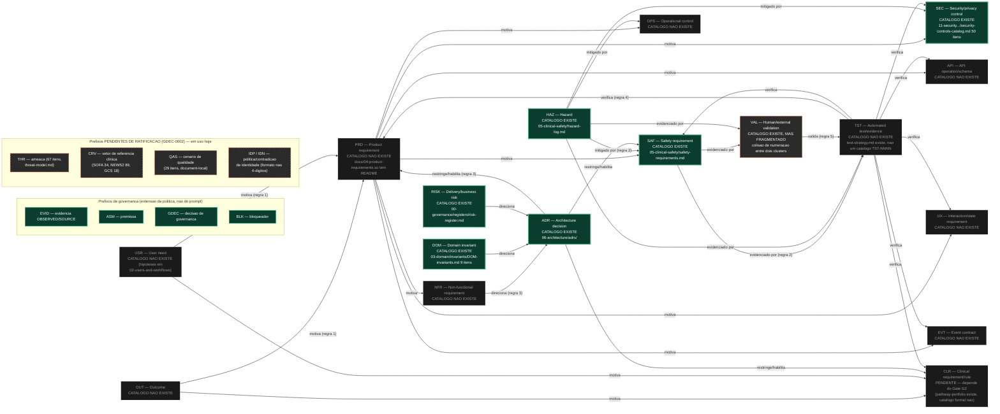

# IntensiCare V2 — Grafo de rastreabilidade (documentação / requisitos / hazards / testes)

**Status: PROPOSAL. Este é um grafo de ESQUEMA (quais tipos de ID podem linkar a quais
outros, e em que direção), não um grafo de INSTÂNCIAS (ID-a-ID reais).** SOURCE
(`traceability-policy.md` §5, "Open items"): *"The reverse-index traceability graph
(prompt §19) does not yet exist; until built, cross-references are maintained by hand
and are therefore subject to drift."* Este documento é precisamente essa lacuna sendo
fechada **no nível de esquema** — ele não gera, nem afirma ter gerado, o grafo de
instâncias completo, que exigiria uma ferramenta de varredura sobre todos os catálogos.

## 1. Legenda

| Marcação | Significado |
|---|---|
| **RATIFICADO** (borda sólida) | Prefixo faz parte da taxonomia §1 de `traceability-policy.md`, sem pendência. |
| **PENDENTE DE RATIFICAÇÃO** (borda tracejada laranja) | Prefixo em uso, mas aguardando `GDEC-0002` (§1.1 da política) para entrar formalmente na taxonomia. |
| **CATÁLOGO EXISTE** (preenchimento verde) | Arquivo/registro que instancia o prefixo já existe no repositório, verificado nesta revisão. |
| **CATÁLOGO NÃO EXISTE** (preenchimento escuro) | Prefixo é citado por outros documentos, mas seu catálogo próprio ainda não foi criado. |

## 2. Diagrama — direção de rastreabilidade entre tipos de ID (esquema, §3 da política)

## 3. Inventário verificado nesta revisão — qual catálogo existe, qual não

| Prefixo | Catálogo existe? | Onde | Contagem observada |
|---|---|---|---|
| `DOM` | **Sim** | `docs/03-domain/invariants/DOM-invariants.md` | 9 (`DOM-0001`–`DOM-0009`) |
| `HAZ` | **Sim** | `docs/05-clinical-safety/hazard-log.md` | dezenas, organizadas por estágio P0-P7 do laço de segurança |
| `ADR` | **Sim** | `docs/06-architecture/adrs/adr-index.md` | 24 IDs reservados; 12 rascunhados; 7 `accepted` (GDEC-0007); próximo livre `ADR-0030` |
| `SEC` | **Sim** | `docs/11-security-privacy-compliance/security-controls-catalog.md` | 50 (`SEC-0001`–`SEC-0050`, verificado por `traceability-policy.md`) |
| `RISK` | **Sim** | `docs/00-governance/registers/risk-register.md` | não recontado nesta revisão |
| `SAF` | **Sim** | `docs/05-clinical-safety/safety-requirements.md` | não recontado nesta revisão |
| `VAL` | **Existe, fragmentado** | `docs/02-users-and-workflows/g1-validation-backlog.md` (43 itens) **e** `docs/05-clinical-safety/pathway-portfolio/*` — dois clusters mintando `VAL-NNNN` sem registro central coordenador | colisão de numeração não descartável (auto-sinalizado por `g1-validation-backlog.md`) |
| `PRD` | **Não** | `docs/04-product-requirements/` só contém `README.md` | 0 |
| `CLR` | **Não como catálogo formal** | `docs/05-clinical-safety/pathway-portfolio/candidate-inventory.md` existe, mas o Gate G2 (portfólio aprovado) segue `OPEN` | 0 candidatos admitidos |
| `NFR`, `API`, `EVT`, `UX`, `OPS`, `TST` | **Não** | Nenhum diretório/arquivo dedicado observado (`docs/09-frontend-ux`, `docs/10-api-events-fhir`, `docs/13-observability-slo` não existem) | 0 |
| `OUT`, `USR` | **Não como catálogo formal** | Hipóteses em `docs/01-vision-and-intended-use/` e `docs/02-users-and-workflows/` — rótulos document-local, sem IDs estáveis atribuídos (`traceability-policy.md` §1.1 nota 6) | não contado |
| `THR` | **Pendente de ratificação, mas em uso** | `docs/11-security-privacy-compliance/threat-model.md` | 67 (`THR-0001`–`THR-0067`) |
| `CRV` | **Pendente de ratificação, mas em uso** | `docs/05-clinical-safety/rule-releases/{sofa,news2,gcs}/` | SOFA 34, NEWS2 89, GCS 18 — namespace de colisão resolvido em 2026-08-15 |
| `QAS` | **Pendente, document-local** | `docs/06-architecture/quality-attributes/quality-attribute-scenarios.md` | 29 |
| `IDP`/`IDN` | **Pendente, formato não ratificado** | `docs/08-interoperability/amh-data/identity-adjudication/` | `IDP-01`–`IDP-12`; `IDN-*` livre |
| `EVID`/`ASM`/`GDEC`/`BLK` | **Sim (extensões de governança, já ratificadas pela própria política)** | `docs/00-governance/registers/` | não recontado nesta revisão |

## 4. O que este diagrama afirma e o que não afirma

**Afirma:**

- A direção de rastreabilidade entre TIPOS de ID (não instâncias) é exatamente a das
  sete regras de `traceability-policy.md` §3.
- Onze dos dezessete prefixos de §1 do prompt **não têm catálogo hoje** — isto é um
  fato verificável por presença/ausência de arquivo, não uma inferência.
- Quatro prefixos (`THR`, `CRV`, `QAS`, `IDP`/`IDN`) estão em uso ativo mas **pendentes
  de ratificação formal** (`GDEC-0002`), com contagens reais citadas por
  `traceability-policy.md` §1.1.
- `VAL` tem uma colisão de numeração não resolvida entre dois clusters de autoria
  independente — sinalizada, não corrigida por este diagrama.

**Não afirma:**

- Que o grafo de INSTÂNCIAS (por exemplo, "`HAZ-0005` → `SAF-0001`, `SAF-0002`...")
  tenha sido gerado — isso exigiria uma ferramenta de varredura que não existe
  (`traceability-policy.md` §5, item aberto).
- Que qualquer PR já cumpra a seção `Traceability:` exigida por `traceability-policy.md`
  §4 — nenhum código, e portanto nenhum PR de implementação, existe ainda.
- Que a lista de prefixos pendentes tenha sido ratificada — permanece
  `PENDING RATIFICATION`, e este diagrama não decide `GDEC-0002`.

## 5. Proveniência

| Elemento | Fonte |
|---|---|
| Taxonomia de 17 prefixos + 4 de governança | `docs/00-governance/traceability-policy.md` §1 |
| As sete regras de vinculação bidirecional | `docs/00-governance/traceability-policy.md` §3 |
| Prefixos pendentes de ratificação, com contagens | `docs/00-governance/traceability-policy.md` §1.1 |
| Requisito de linkagem em PR | `docs/00-governance/traceability-policy.md` §4 |
| "O grafo reverso ainda não existe" | `docs/00-governance/traceability-policy.md` §5 |
| Existência/ausência de cada catálogo (verificação direta de arquivo) | `docs/03-domain/invariants/DOM-invariants.md`; `docs/05-clinical-safety/hazard-log.md`; `docs/06-architecture/adrs/adr-index.md`; `docs/11-security-privacy-compliance/security-controls-catalog.md`; `docs/04-product-requirements/` (só `README.md`); `docs/02-users-and-workflows/g1-validation-backlog.md` |

## 6. O que este diagrama deliberadamente não faz

- Não gera o grafo de instâncias ID-a-ID — permanece trabalho futuro de automação
  (`traceability-policy.md` §5).
- Não ratifica `THR`/`CRV`/`QAS`/`IDP`/`IDN` na taxonomia — isso é `GDEC-0002`,
  decisão humana pendente.
- Não resolve a colisão de numeração `VAL`.
- Não cria nenhum catálogo faltante (`PRD`, `NFR`, `API`, `EVT`, `UX`, `OPS`, `TST`,
  `OUT`, `USR`).
