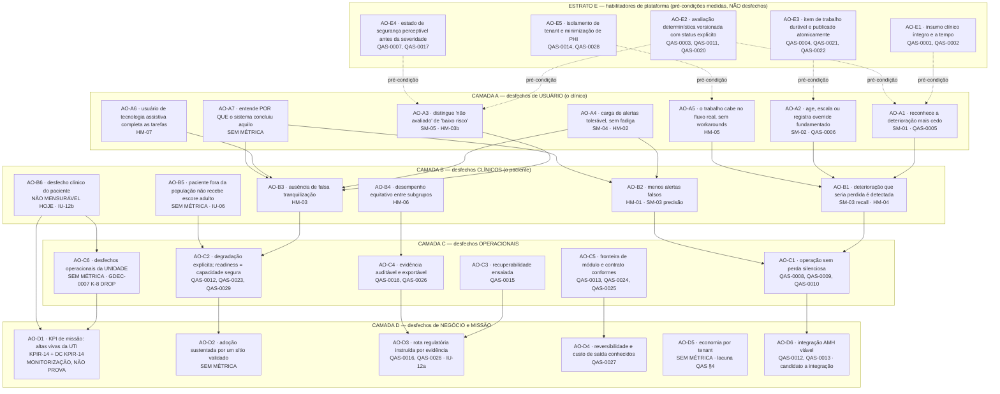

# IntensiCare V2 — Árvore de outcomes

> **STATUS: PROPOSAL — NADA AQUI É ALVO, PROMESSA OU ALEGAÇÃO.**
> **APROVADOR: UNASSIGNED — VALIDATION REQUIRED.**
>
> Este documento **não cria nenhuma métrica nova**. Ele conecta métricas que já
> existem em outros artefatos (`SM-*`, `HM-*`, `QAS-*`, `KPIR-14`) numa árvore de
> desfechos, e registra explicitamente cada nó **sem** métrica associada como uma
> linha `VALIDATION REQUIRED` — em vez de omiti-lo ou de inventar um indicador
> para preencher a lacuna.
>
> Nenhuma seta desta árvore é uma relação causal demonstrada. Toda seta é uma
> **hipótese de contribuição** (INFERENCE), e o documento diz isso em cada
> tabela em vez de deixar a forma de árvore sugerir causalidade.
>
> Nada aqui fecha gate, bloqueador, risco ou hazard. Nada aqui constitui
> alegação de efetividade clínica, conformidade regulatória, segurança ou
> disponibilidade — ver `intended-use-statement.md` IU-12a..IU-12i.

## 0. Como ler este documento

Cada afirmação material carrega exatamente um rótulo de
`../00-governance/evidence-notation.md` §2: **SOURCE**, **OBSERVED**,
**INFERENCE**, **PROPOSAL**, **VALIDATION REQUIRED**. **Nenhuma afirmação deste
documento carrega o rótulo DECIDED.** Onde uma decisão do titular já existe
(GDEC-0007 sobre K-8), o documento **cita** a decisão registrada em
`../00-governance/registers/decision-register.md` em vez de se auto-rotular.

### 0.1 Sobre os rótulos `AO-*` — nota honesta sobre IDs

Os rótulos `AO-xx` abaixo são **rótulos documento-locais, não IDs da taxonomia
de rastreabilidade**.

SOURCE (`../00-governance/traceability-policy.md` §1): `OUT` (Outcome) É um
prefixo ratificado da taxonomia — mas nenhum catálogo de outcomes existe ainda,
e cunhar `OUT-xxxx` aqui arriscaria colisão com o catálogo de requisitos futuro
(`docs/04-product-requirements/`, inexistente), exatamente o risco que
`quality-attribute-scenarios.md` §1.2 registrou ao recusar cunhar `NFR-xxxx`
por conta própria. **PROPOSAL:** quando o catálogo de outcomes existir, cada nó
abaixo é convertido em uma entrada `OUT-xxxx` e este arquivo passa a ser a casa
narrativa da árvore, referenciada por ID. Até lá, `AO-xx` é **pendente de
ratificação em `traceability-policy.md` §1.1**, no mesmo regime dos conjuntos
document-locais `MD`/`MG`/`SPR` já registrados naquela subseção, e não referencia
nada fora deste arquivo.

PREMISSA (reversível, GDEC-0015/0017): os rótulos de nó desta árvore são
`AO-<camada><n>` document-locais, e a árvore é organizada em cinco estratos
(habilitadores, usuário, clínico, operacional, negócio/missão) — as quatro
camadas pedidas mais um estrato de habilitadores separado, porque tratar
pré-condições de plataforma como se fossem desfechos é precisamente o erro que
`quality-attribute-scenarios.md` §5 recusa cometer.

### 0.2 O que significa cada coluna das tabelas

| Coluna | Significado |
|---|---|
| **Nó** | O desfecho, enunciado como estado do mundo, não como funcionalidade. |
| **Métrica associada (ID existente)** | Somente IDs que já existem em outro artefato deste repositório. Nenhum ID novo é cunhado. Vazio = lacuna real, registrada como `VALIDATION REQUIRED`. |
| **Camada** | Estrato da árvore. |
| **O que o moveria** | A condição, o estudo ou o artefato cuja existência mudaria o valor do nó — não uma promessa de que será feito. |
| **Rótulo** | Rótulo epistêmico do nó, proporcional à evidência disponível hoje. |

---

## 1. A árvore

**INFERENCE** (raciocinando de `success-and-harm-metrics.md` §0, §4;
`intended-use-statement.md` IU-02; `quality-attribute-scenarios.md` §1.3): a
cadeia abaixo é a leitura mais parcimoniosa do material existente. Setas cheias
significam *"é hipótese de contribuição para"*; setas tracejadas significam
*"é pré-condição medida de"*. Nenhuma das duas significa *"causa"*.

**INFERENCE — leitura obrigatória do desenho:** a aresta `B6 → D1` é a única que
liga desfecho clínico do paciente ao KPI de missão, e **ambos os nós estão hoje
sem medição** — `AO-B6` é explicitamente não mensurável
(`success-and-harm-metrics.md` §3, linha 2) e `AO-D1` é uma **contagem de
monitorização**, não uma estimativa de efeito (§3 deste documento). Uma árvore
de outcomes cujo topo é uma contagem sem denominador e cuja base clínica é
inmensurável é um retrato honesto da maturidade atual, não um defeito do
desenho.

---

## 2. Tabelas por nó

### 2.1 Estrato E — habilitadores de plataforma

**INFERENCE** (de `quality-attribute-scenarios.md` §1.3, P1–P6): nenhum nó deste
estrato é mensurável hoje; os seis pré-requisitos P1–P6 (necessidades validadas,
portfólio de pathways aprovado, ambiente AMH alcançável, ambiente
production-like, instrumentação, pontos de tempo distintos registrados) estão
todos ausentes. P6 é o mais determinante: sem os instantes distintos persistidos,
os intervalos de QAS-0001..QAS-0006 **não podem sequer ser computados**, nem
reconstruídos depois.

| Nó | Métrica associada (ID existente) | Camada | O que o moveria | Rótulo |
|---|---|---|---|---|
| **AO-E1** — o insumo clínico chega íntegro, atribuível e a tempo; nada é descartado em silêncio | QAS-0001 (latência fonte→aceito), QAS-0002 (completude/perda) | E | Uma via de dados elegível e um ambiente alcançável. Estado factual preservado: **0 vias acionáveis**; **47/47 insumos inelegíveis** na matriz §7.2; `Observation` da AMH **não consumível** para avaliação de UTI acionável; ambiente AMH existe apenas como `dev` (`quality-attribute-scenarios.md` §1.3 P3) | INFERENCE |
| **AO-E2** — cada avaliação é determinística, versionada e carrega status explícito (`valid \| partial \| not_evaluated \| stale \| invalid`) | QAS-0003, QAS-0011 (saúde de bundle/versão de regra), QAS-0020 (replay determinístico) | E | Bundle de regra assinado e carregável, mais os pontos de tempo de DOM-0009 instrumentados (P6) | INFERENCE |
| **AO-E3** — o item de trabalho é durável **e** publicado na mesma transação; nunca um sem o outro | QAS-0004, QAS-0021 (idempotência/concorrência), QAS-0022 (durabilidade precede imediatismo) | E | Publicação transacional implementada e testes de crash-point executados | INFERENCE |
| **AO-E4** — o estado de segurança é perceptível antes da severidade, em toda projeção e estado de UI | QAS-0007 (prevalência e visibilidade), QAS-0017 (estado de segurança precede severidade) | E | Existência do desenho de interação, mais evidência de fatores humanos (a coleta que QAS-0017 associa ao gate G4) | INFERENCE |
| **AO-E5** — isolamento de tenant/encontro em toda camada e PHI minimizada em toda superfície | QAS-0014 (negações cross-tenant), QAS-0028 (minimização de PHI) | E | Testes adversariais por superfície e varredura automatizada de padrões de PHI. Estado factual preservado: **nenhum dado real foi acessado**; todo fixture é sintético (marcação `SYNTH-`) | INFERENCE |

### 2.2 Camada A — desfechos de usuário

**INFERENCE** (de `intended-use-statement.md` IU-12h e `:56` da avaliação
legada): esta camada inteira repousa sobre usuários **não observados**. Nenhum
usuário pretendido de V2 foi observado; a hipótese de papéis
(`../02-users-and-workflows/user-roles-hypotheses.md`) é derivada de
documentação, não de campo.

| Nó | Métrica associada (ID existente) | Camada | O que o moveria | Rótulo |
|---|---|---|---|---|
| **AO-A1** — o clínico responsável toma conhecimento da deterioração mais cedo do que tomaria sem a plataforma | **SM-01** (tempo até reconhecimento); **QAS-0005** (gerado→visível) apenas como proxy interno | A | Um **baseline observacional pré-implantação** (irrecuperável se não capturado antes) + corpus adjudicado retrospectivo definindo o "instante mais precoce detectável" + modo sombra | PROPOSAL |
| **AO-A2** — o clínico age clinicamente ou registra um override fundamentado; reconhecimento não conta como ação | **SM-02**; **QAS-0006** (gerado→reconhecido, propriedade humana e não só de engenharia) | A | Telemetria instrumentada do intervalo interno + inquérito contextual confirmando que a ação registrada corresponde a ação clínica real. IU-09 exige que o override seja **tão fácil quanto a concordância** | PROPOSAL |
| **AO-A3** — o clínico distingue "não avaliado" de "avaliado como baixo risco" sob pressão de tempo | **SM-05** (cobertura de avaliação e fidelidade de estado explícito); **HM-03**(b) (estados não-`valid` renderizados em vocabulário tranquilizador, alvo zero) | A | Invariante DOM-0004 implementado e testado + estudo de fatores humanos medindo *interpretação*, não só renderização. `success-and-harm-metrics.md` SM-05 propõe cindir a métrica na ratificação: a proporção de cobertura é outcome; a contagem de má-renderização é métrica de hazard | PROPOSAL |
| **AO-A4** — a carga de alertas fica dentro de uma banda acordada com clínicos e a fadiga não aumenta | **SM-04** (alertas por paciente-dia, por versão de regra); **HM-02** (fadiga composta) | A | Definição da **banda aceitável** por `AUTH-CLINSAFETY` + medição da carga **total** de alarmes da unidade, não só da fatia de V2 + instrumento de fadiga validado em pt-BR | PROPOSAL |
| **AO-A5** — o trabalho cabe no fluxo real; não surgem workarounds paralelos | **HM-05** (disrupção de fluxo; componente (d) = contagem de workarounds observados) | A | Inquérito contextual e time-motion, antes e depois, mais observação de passagem de plantão. **INFERENCE:** workaround é o sinal mais barato e mais alto desta árvore e é invisível à telemetria — nenhum sistema instrumenta a lista de papel que o substituiu | PROPOSAL |
| **AO-A6** — o usuário de tecnologia assistiva completa as mesmas tarefas do laço de segurança | **HM-07** (exclusão por acessibilidade, medida por tarefa e não por taxa de aprovação de regra automática) | A | Avaliação baseada em tarefa com usuários reais de tecnologia assistiva. IU-12g: **nenhuma alegação de conformidade WCAG é feita** | PROPOSAL |
| **AO-A7** — o clínico entende *por que* a avaliação concluiu o que concluiu, a ponto de poder discordar de forma fundamentada | **nenhuma** — `SM-*`/`HM-*`/`QAS-*` medem se a explicação **existe** e é rastreável (QAS-0019, IU-09), nunca se ela é **compreendida** | A | Um estudo de compreensão da explicação, com cenários em que o sistema está errado, degradado ou desatualizado (`../02-users-and-workflows/user-research-plan.md` §3). Sem esse estudo, "explicável" é uma propriedade do artefato, não do clínico | **VALIDATION REQUIRED** |

### 2.3 Camada B — desfechos clínicos

| Nó | Métrica associada (ID existente) | Camada | O que o moveria | Rótulo |
|---|---|---|---|---|
| **AO-B1** — deterioração que teria passado despercebida é reconhecida e tratada | **SM-03** (recall); **HM-04** (perdas, reportadas **por modo de falha**: regra não disparou / dado não chegou / item não entregue / item não visto / paciente fora do escopo) | B | Corpus adjudicado pré-registrado e cego + modo sombra. **INFERENCE** (de SM-03): pós-implantação o recall é confundido pelo próprio efeito do tratamento — o modo sombra é a **única** fase em que ele é mensurável sem contaminação | PROPOSAL |
| **AO-B2** — o clínico recebe menos alertas falsos por paciente-dia | **HM-01** (falsos positivos, por versão de regra); **SM-03** (precisão) | B | A mesma adjudicação de AO-B1 — são duas leituras de uma só adjudicação. **VALIDATION REQUIRED** herdado: "ausência de ação clinicamente apropriada" precisa ser adjudicada, nunca inferida da dispensa do clínico | PROPOSAL |
| **AO-B3** — nenhum paciente é despriorizado por causa de uma tela tranquilizadora | **HM-03** (viés de automação e falsa tranquilização, componentes (a)–(d)) | B | Vigilância prospectiva de incidentes + revisão estruturada de casos + invariantes automatizadas para o componente (b). **INFERENCE** (de HM-03): é o desfecho mais importante e o menos provável de ser coletado — o alerta falso se anuncia, a falsa tranquilização não gera evento nenhum | PROPOSAL |
| **AO-B4** — o desempenho não é materialmente pior para nenhum subgrupo | **HM-06** (SM-03, HM-01 e HM-04 desagregados, com desagregação pré-registrada) | B | Pré-registro dos subgrupos + resolução da base legal para processar os atributos necessários (`AUTH-PRIVACY-LEGAL` com `AUTH-CLINSAFETY`). **INFERENCE** herdado: minimização de dados e monitorização de equidade puxam em sentidos opostos e isso precisa ser resolvido deliberadamente | PROPOSAL |
| **AO-B5** — um paciente fora da população aprovada nunca recebe um escore adulto renderizado como resultado válido | **nenhuma métrica de outcome**. Coberto **parcialmente** por SM-05 e QAS-0007 (o estado explícito), mas o *acerto do limite populacional* não tem métrica | B | IU-06 é uma **decisão bloqueante** aberta (pediátrico/neonatal, e o que fazer com idade ausente/conflitante), não uma métrica. Enquanto a decisão não existir, não há o que medir — e a fronteira precisa ser **imposta no comportamento do sistema**, não apenas declarada em prosa | **VALIDATION REQUIRED** |
| **AO-B6** — desfecho clínico do paciente (mortalidade, tempo de permanência, readmissão em UTI) | **nenhuma** — `success-and-harm-metrics.md` §3 linha 2 registra que qualquer métrica de desfecho clínico exige estudo prospectivo, aprovação ética e um sítio, e **nenhum dos três existe** | B | Um sítio identificado, um protocolo aprovado e um plano de monitorização de segurança. IU-12b: **nenhuma alegação de efetividade clínica é feita** e nenhuma será feita a partir deste documento | **VALIDATION REQUIRED** |

### 2.4 Camada C — desfechos operacionais

**INFERENCE** (de `clinical-kpi-review.md` §4.5 e GDEC-0007 K-8): esta camada
tem duas naturezas distintas e o documento não as funde. AO-C1..AO-C5 são
desfechos de **operação da plataforma**, e têm IDs de métrica (`QAS-*`). AO-C6 é
o desfecho de **operação da unidade** (permanência, ocupação, admissões) e **não
tem nenhum ID de métrica**, porque os cinco macro-nomes legados que ocupariam
esse lugar foram **DROP definitivo** por decisão registrada.

| Nó | Métrica associada (ID existente) | Camada | O que o moveria | Rótulo |
|---|---|---|---|---|
| **AO-C1** — a operação corre sem perda, duplicação ou divergência silenciosa entre lanes | **QAS-0008** (lag de fila e backlog de replay), **QAS-0009** (lag e reconstrutibilidade de projeção), **QAS-0010** (divergência de reconciliação) | C | Instrumentação P5/P6 e um job de reconciliação cuja própria adequação seja medida (QAS-0010 conta divergências descobertas por humano antes do job — indicador antecedente de detecção inadequada) | INFERENCE |
| **AO-C2** — toda degradação é explícita no seu nível e visível a quem ela afeta; readiness reporta capacidade segura, não vivacidade de processo | **QAS-0012** (disponibilidade de conector), **QAS-0023** (modo degradado explícito), **QAS-0029** (readiness = capacidade segura) | C | Injeção de falhas por nível + um ambiente production-like. P4 registra esse ambiente como **ausente do lado AMH e indeciso do lado V2** | INFERENCE |
| **AO-C3** — a recuperação é comprovada por ensaio, não estimada | **QAS-0015** (backup, integridade de restore, RPO/RTO medidos em ensaios) | C | Ensaios de restore verificados por alguém diferente de quem implementou a migração (`../00-governance/decision-rights.md` §3, par 6), com continuidade da cadeia de auditoria atravessando o restore | INFERENCE |
| **AO-C4** — a evidência necessária a uma revisão de incidente ou a uma aprovação é completa, reproduzível e à prova de adulteração | **QAS-0016** (integridade de exportação de evidência), **QAS-0026** (evidência de release como saída do produto) | C | Um pipeline que monta o bundle — QAS-0026 conta bundle parcial como **ausente**, e mede quantos itens são atestados à mão quando deveriam ser automáticos | INFERENCE |
| **AO-C5** — fronteiras de módulo e contratos externos não derivam sem que o build falhe | **QAS-0013** (deriva de contrato de conector), **QAS-0024** (conformidade de fronteira de módulo, bloqueante e não consultiva), **QAS-0025** (conformidade a padrões com evidência) | C | Checks bloqueantes no CI com fixture deliberadamente violador provando que o check dispara, e contratos pinados para comparar. IU-12e: **nenhuma alegação FHIR/HL7 é feita** | INFERENCE |
| **AO-C6** — desfechos operacionais da **unidade**: tempo de permanência, taxa de ocupação, admissões | **nenhuma** — os cinco macro-nomes legados (`obitos`, `tempo_permanencia`, `tx_mortalidade`, `tx_ocupacao`, `admissao`) são **DROP definitivo** por GDEC-0007 (K-8, modificação do titular); nenhum sucessor foi definido | C | Uma definição mensurável nova, com fonte revisável, aprovada por `AUTH-CLINSAFETY` — os cinco nomes foram largados justamente por seguirem **sem fonte revisável** (Tasy SOURCE NOT LOCATED) e sem valor clínico mensurável. Registrar a lacuna aqui é o oposto de reabri-la | **VALIDATION REQUIRED** |

### 2.5 Camada D — desfechos de negócio e missão

| Nó | Métrica associada (ID existente) | Camada | O que o moveria | Rótulo |
|---|---|---|---|---|
| **AO-D1** — **KPI de missão: altas vivas da UTI** | **KPIR-14** (contagem absoluta), **sempre** com as duas figuras companheiras em igual proeminência (altas totais no período; óbitos no período) e com **`DC(KPIR-14)`** (episódios com âncora de alta ou disposição vivo/morto ausente ou inválida, por motivo) | D | Fechamento das duas sub-decisões abertas de KPIR-14 por `AUTH-CLINSAFETY` — (1) tratamento de transferência para outra UTI; (2) janela de de-duplicação de readmissão — mais uma âncora de alta **documentada** (nunca timestamp administrativo, de faturamento ou de gestão de leitos). Ver §3 | **MONITORIZAÇÃO DE MISSÃO** — a manutenção do KPI e do nome são DECIDED em GDEC-0007 (K-8); os detalhes numéricos/procedimentais permanecem VALIDATION REQUIRED |
| **AO-D2** — um sítio validado adota e continua usando a plataforma no fluxo real | **nenhuma** | D | Um sítio identificado. `success-and-harm-metrics.md` §3 linha 3 registra que **nenhum sítio foi identificado ou contatado**; sem sítio, adoção não é uma métrica baixa, é uma métrica inexistente | **VALIDATION REQUIRED** |
| **AO-D3** — a rota regulatória é instruída por evidência real em vez de por declaração | **QAS-0016**, **QAS-0026** (a evidência que instruiria a rota) | D | Uma hipótese de classificação regulatória (saída "R" do SPARK, inexistente) e assessoria jurídica nomeada. IU-12a: **nenhuma classificação regulatória foi determinada** e nenhuma alegação de conformidade é feita | **VALIDATION REQUIRED** |
| **AO-D4** — decisões arquiteturais aceitas podem ser revertidas a um custo conhecido | **QAS-0027** (reversibilidade e custo de saída) | D | Documentar, por decisão aceita, o caminho de reversão, os ativos encalhados e se a reversão já foi ensaiada — QAS-0027 observa que em geral não foi, **e saber disso é o ponto**. Coerente com o regime vigente de premissas reversíveis (GDEC-0015/0017) | INFERENCE |
| **AO-D5** — o custo por tenant e a economia de operação são conhecidos | **nenhuma** — `quality-attribute-scenarios.md` §4 declara carga/soak/capacidade e economia por tenant como lacuna deliberada, de outro especialista | D | Uma decisão de plataforma (ADR-0019) e um modelo de custo. Registrado para que a ausência seja explícita e não silenciosa | **VALIDATION REQUIRED** |
| **AO-D6** — a integração com a plataforma de dados AMH é viável para avaliação de UTI acionável | **QAS-0012** (disponibilidade de conector), **QAS-0013** (deriva de contrato) | D | Estado factual preservado e inalterado por este documento: o achado permanece **candidato a integração**; `Observation` da AMH **não é consumível** para avaliação de UTI acionável; **0 vias acionáveis**; **47/47 insumos inelegíveis**; ambiente apenas `dev`. IU-12d: **nenhuma alegação de compatibilidade AMH é feita** | INFERENCE / **VALIDATION REQUIRED** para as camadas 2–4 de evidência |

---

## 3. K-8 / KPIR-14 — monitorização de missão **não é** prova de efetividade

> **ESTA É A DISTINÇÃO MAIS FÁCIL DE PERDER DESTE DOCUMENTO E A MAIS CARA DE
> PERDER.**

**SOURCE** (`../00-governance/registers/decision-register.md`, GDEC-0007, ponto
K-8; e `../05-clinical-safety/pathway-portfolio/clinical-kpi-review.md` §3
KPIR-14): dos seis macro-nomes legados, cinco são DROP definitivo e apenas
`vidas_salvas` foi mantido — **como nome de missão e cultura, decidido pelo
titular** — com uma definição mensurável **inteiramente nova**: `KPIR-14 —
Altas vivas da UTI`, contagem de episódios de UTI encerrados em alta com vida no
período. Nada da fórmula legada do Tasy foi importado.

**SOURCE** (`clinical-kpi-review.md` §3, KPIR-14, "Honesty note"), citação
literal da definição: *"contagem de altas vivas — não é atribuição causal de
vidas salvas pelo sistema."*

**INFERENCE** — o que isso significa nesta árvore, operacionalmente:

| KPIR-14 **é** | KPIR-14 **não é** |
|---|---|
| Uma **contagem** de um desfecho clínico ocorrido (alta com vida da UTI). | Uma taxa, uma proporção, uma razão — de nada, em nenhuma leitura. |
| Um indicador de **monitorização de missão institucional**, exibido com as duas figuras companheiras e com `DC(KPIR-14)` em igual proeminência. | Uma **estimativa de efeito**, um contrafactual, ou uma comparação com baseline, mortalidade esperada ou taxa pré-V2. |
| O topo da árvore no sentido de *para onde a instituição olha*. | O topo da árvore no sentido de *o que a plataforma provou fazer*. **Esse nó é `AO-B6`, e `AO-B6` não é mensurável hoje.** |
| Compatível com IU-12b, porque não alega efetividade. | Utilizável, exibível ou citável como evidência de que o sistema "salvou" o número contado. |

**INFERENCE — por que a árvore precisa dizer isso em vez de apenas ligar os
nós:** uma árvore de outcomes cria, pela própria forma, a sugestão de que o nó
de cima é *produzido* pelos de baixo. Aplicada a `AO-D1`, essa sugestão vira
exatamente a alegação causal que a definição de KPIR-14 proíbe. As arestas
`C6 → D1` e `B6 → D1` do §1 são, portanto, arestas de **contexto de leitura**, e
não de contribuição demonstrada — e ambas partem de nós hoje sem medição.

**INFERENCE** — o mesmo padrão de falha da avaliação legada se aplica aqui: o
problema nunca foi a ausência de métricas, e sim a presença de métricas **não
medidas** lidas como conquistas (`success-and-harm-metrics.md` §0). KPIR-14 é o
candidato mais provável a sofrer essa leitura, porque tem o nome mais
mobilizador do repositório.

**VALIDATION REQUIRED** — permanecem abertas, por `AUTH-CLINSAFETY`, as duas
sub-decisões de KPIR-14 (transferência para outra UTI; janela de de-duplicação
de readmissão). Até que fechem, KPIR-14 só pode ser computado e exibido com as
duas lacunas divulgadas ao lado, nunca com um default silencioso — e a ameaça de
*transfer-out gaming* registrada na própria definição é a razão explícita de
nenhum default ter sido adotado.

---

## 4. Nós sem métrica — lacunas registradas, não omitidas

**PROPOSAL** — regra herdada de `success-and-harm-metrics.md` §0, regra 3: uma
métrica que hoje não pode ser medida é **registrada como não mensurável, não
omitida**. Esta seção consolida todas as lacunas da árvore num só lugar, para
que a contagem de nós sem métrica seja visível de uma vez.

| Nó | Camada | Natureza da lacuna | Quem a fecharia | Rótulo |
|---|---|---|---|---|
| **AO-A7** — compreensão da explicação pelo clínico | A | Existe métrica de *rastreabilidade* da explicação (QAS-0019), não de *compreensão* | `AUTH-UX` com `AUTH-CLINSAFETY`, via estudo de compreensão com cenários errados/degradados | VALIDATION REQUIRED |
| **AO-B5** — acerto do limite populacional | B | O item aberto é uma **decisão** (IU-06), não uma métrica; a fronteira precisa ser imposta em comportamento | `AUTH-INTENDED-USE` + `AUTH-CLINSAFETY` | VALIDATION REQUIRED |
| **AO-B6** — desfecho clínico do paciente | B | Exige estudo prospectivo, aprovação ética e sítio — nenhum existe | `AUTH-CLINSAFETY` + `AUTH-PRIVACY-LEGAL` + sítio identificado | VALIDATION REQUIRED |
| **AO-C6** — desfechos operacionais da unidade | C | Os cinco macro-nomes candidatos foram DROP definitivo (GDEC-0007 K-8); nenhum sucessor definido | `AUTH-CLINSAFETY`, se e quando houver fonte revisável | VALIDATION REQUIRED |
| **AO-D2** — adoção sustentada | D | Nenhum sítio identificado ou contatado | `AUTH-PRODUCT` + identificação de sítio | VALIDATION REQUIRED |
| **AO-D3** — rota regulatória | D | Nenhuma classificação regulatória determinada; a saída "R" do SPARK não existe | `AUTH-PRIVACY-LEGAL` + `AUTH-CLINSAFETY` + assessoria jurídica nomeada | VALIDATION REQUIRED |
| **AO-D5** — economia por tenant | D | Lacuna declarada em `quality-attribute-scenarios.md` §4, de outro especialista | `AUTH-OPERATIONS` + modelo de custo, após ADR-0019 | VALIDATION REQUIRED |

**INFERENCE:** sete dos trinta nós desta árvore (5 habilitadores + 7 de usuário +
6 clínicos + 6 operacionais + 6 de negócio) não têm métrica com ID existente, e
cinco dos sete estão nas duas camadas mais altas (clínica e negócio).
Isso não é um defeito da síntese — é a forma da maturidade atual vista de cima:
a plataforma tem métricas candidatas densas onde ela se **observa a si mesma**
(`QAS-*`) e lacunas onde ela precisaria **observar o mundo** (paciente, unidade,
sítio, adoção).

---

## 5. A árvore não se lê nó a nó — pareamentos antigaming

**SOURCE** (`success-and-harm-metrics.md` §4): cada métrica de sucesso deve ser
reportada com a métrica de dano com que ela pode ser burlada; reportar uma sem a
outra é um **defeito de reporte**. Aplicado à árvore, isso significa que subir um
nó não é mérito se o nó pareado desceu.

| Nó da árvore | Métrica de sucesso | Como o nó pode ser burlado | Nó/métrica de dano que precisa ser lido junto |
|---|---|---|---|
| AO-A1 reconhecimento mais cedo | SM-01 | Alertando mais cedo e mais vezes sobre evidência mais fraca | AO-B2/HM-01, AO-A4/HM-02, AO-A4/SM-04 |
| AO-A2 ação | SM-02 | Contando reconhecimento como ação; incentivando dispensa reflexa | AO-A4/HM-02, AO-B3/HM-03 |
| AO-B1 detecção (recall) | SM-03 | Baixando limiares | AO-B2/HM-01, AO-A4/SM-04 |
| AO-B2 precisão | SM-03 | Suprimindo casos incertos; avaliando só o paciente-tempo fácil | AO-B1/HM-04, AO-A3/SM-05 |
| AO-A4 carga de alertas (para baixo) | SM-04 | Supressão, cooldowns, no-fire silencioso | AO-B1/HM-04, AO-B3/HM-03 |
| AO-A3 cobertura de avaliação | SM-05 | Coagindo dado incompleto para `valid` | AO-B3/HM-03 — e a proibição absoluta de coerção de dado ausente/inválido a zero, normal ou no-fire silencioso |
| AO-D1 altas vivas da UTI | KPIR-14 | Inflação sem denominador; *transfer-out gaming*; dupla contagem de readmissão | As **duas figuras companheiras** e **`DC(KPIR-14)`**, obrigatórias em igual proeminência — não são um adorno da definição, são o mecanismo antigaming dela |

---

## 6. O que este documento deliberadamente não faz

- **Não cria nenhuma métrica.** Todo ID citado já existe em outro artefato deste
  repositório; onde não existe, o nó fica vazio e rotulado `VALIDATION REQUIRED`.
- **Não define nenhum limiar, alvo, banda ou percentil.** Definir limiar é
  decisão de segurança clínica reservada a `AUTH-CLINSAFETY`.
- **Não afirma causalidade.** As arestas são hipóteses de contribuição; a única
  cadeia que ligaria a plataforma a desfecho de paciente passa por `AO-B6`, que
  não é mensurável hoje.
- **Não fecha gate, bloqueador, risco nem hazard**, e não presume aprovação
  humana de nada.
- **Não altera nenhum estado factual.** Permanecem, como registrados: **0 vias
  acionáveis**; **47/47 insumos inelegíveis**; `Observation` da AMH **não
  consumível**; compatibilidade = **candidato a integração**; safety case = **M0**;
  **nenhum dado real acessado**.

---

## 7. Referências cruzadas

- `success-and-harm-metrics.md` — SM-01..SM-05, HM-01..HM-07, §3 (não mensuráveis), §4 (pareamentos).
- `intended-use-statement.md` — IU-02 (o laço de segurança que delimita a árvore), IU-06 (decisão bloqueante de população), IU-09/IU-10 (fronteira consultiva), IU-12a..IU-12i (alegações não feitas).
- `non-intended-uses.md` — NIU-05 (MCP/IA não é fonte de verdade clínica), NIU-06 (não é gestão de desempenho), NIU-07 (uso secundário).
- `../06-architecture/quality-attributes/quality-attribute-scenarios.md` — QAS-0001..QAS-0029, §1.2 (nota de IDs), §1.3 (P1–P6), §4 (lacunas declaradas).
- `../05-clinical-safety/pathway-portfolio/clinical-kpi-review.md` — §3 KPIR-14, §4.5, §8 K-8.
- `../00-governance/registers/decision-register.md` — GDEC-0007 (K-8), GDEC-0015 e GDEC-0017 (regime de premissas reversíveis).
- `../00-governance/traceability-policy.md` §1 e §1.1 — taxonomia de IDs e extensões pendentes de ratificação.
- `../02-users-and-workflows/user-research-plan.md` e `g1-validation-backlog.md` — os estudos de que quase toda a camada A depende.
- `../03-domain/status-dimensions.md` — o vocabulário de estado que AO-A3 e AO-E4 medem.
