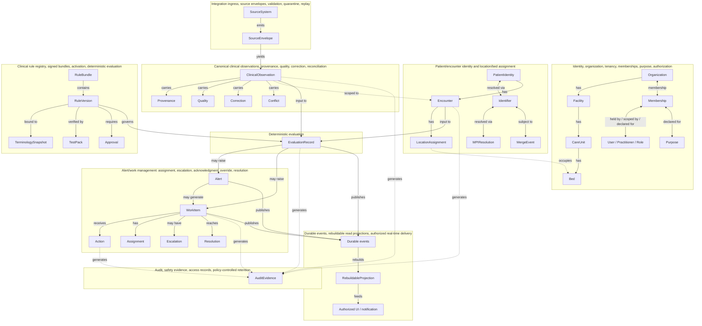

# IntensiCare V2 — Conceptual Domain Model

## Scope and status

This document renders the conceptual data model given verbatim in
`INTENSICARE_V2_ORCHESTRATOR_PROMPT.md` §9.3 as prose and as a Mermaid diagram. It is a
**conceptual model** — entities and their relationships — not a physical entity-
relationship diagram: it defines no tables, columns, keys, indexes, data types, or
storage technology. Every entity name below corresponds to a term defined in
`glossary.md`; where a name introduced only by §9.3 (e.g., `LocationAssignment`,
`RuleBundle`, `EvaluationRecord`, `AuditEvidence`) is not itself one of §8's required
glossary terms, it is still defined here because it is load-bearing for the relationships
that *are* required terms.

All content is **PROPOSAL**, drafted for Wave 1 (SPARK / domain modeling) and intended as
direct input to the candidate-architecture ADR engineer (Wave 2), who is expected to
ratify, refine, or replace elements of this model through ADRs — per §10, the ADR program
must resolve "canonical observation, provenance, quality, correction, and time model"
(ADR item 5), among others. Nothing here selects a physical schema or technology.

## How to read the diagram

The Mermaid diagram groups entities into clusters that correspond to §9.2's *initial
bounded contexts* (which the prompt explicitly says should **not** be split into network
services by default — they are module boundaries inside one deployable application, not
services). Cross-cluster arrows show the relationships named in §9.3's conceptual data
model block, each carrying the same relationship word or symbol used in the source text
(e.g., `→`, `↔`) rendered as a labeled edge.

Legend: solid arrows (`-->`) denote a direct structural or produces/consumes
relationship named in §9.3; dashed arrows (`-.->`) denote scoping/ownership or audit-
generation relationships that hold across essentially every entity but are drawn
selectively to keep the diagram legible. `<-->` denotes the bidirectional associations
§9.3 wrote using `↔`.

## Entity clusters in prose

### 1. Tenancy and location hierarchy (`Organization → Facility → CareUnit → Bed`)

An `Organization` owns one or more `Facility` entities; each `Facility` contains one or
more `CareUnit`s; each `CareUnit` contains one or more `Bed`s. This is a strict
containment hierarchy conceptually — no entity in this chain is shared across two parents
in the baseline model. See `glossary.md` for the Organization/Tenant distinction, which
this diagram does not resolve (Tenant is the enforced ownership boundary; it is not drawn
as a separate box here because §9.3 does not model it as a boxed entity — it is instead
the cross-cutting invariant DOM-0001 that every other entity in this diagram must respect).

### 2. Membership (`Organization ↔ Membership ↔ User/Practitioner/Role/Purpose`)

`Membership` is the bidirectional join between an `Organization` and the combination of a
`User`/`Practitioner`, their `Role`, and their `Purpose` for access. Membership is how the
"Identity, organization, tenancy, memberships, purpose, and authorization" bounded context
(§9.2) grants scoped access — it is a precondition for any Action recorded elsewhere in
the model (BC7), and every Membership-scoped action must still resolve to `AuditEvidence`
(BC8).

### 3. Patient identity and encounter (`PatientIdentity ↔ Identifier ↔ MPIResolution/MergeEvent`; `PatientIdentity → Encounter → LocationAssignment`)

A `PatientIdentity` is associated with one or more `Identifier`s (source-system-specific
identifiers); the linkage between Identifiers and a single resolved PatientIdentity is
established through `MPIResolution`, and any subsequent determination that identities
should be merged or split is recorded as a `MergeEvent`. A `PatientIdentity` has one or
more `Encounter`s; each `Encounter` has one or more `LocationAssignment`s, each of which
associates the Encounter with a `Bed` at a point in time (drawn with a dashed line above
since `LocationAssignment`'s occupancy of a `Bed` is a cross-cluster reference, not a
containment relationship). See `glossary.md`'s *Admission*, *Transfer*, and *Discharge*
entries for the events that create and mutate `LocationAssignment`s over an Encounter's
life.

### 4. Integration ingress and canonical observations (`SourceSystem → SourceEnvelope → ClinicalObservation`; `ClinicalObservation → Provenance/Quality/Correction/Conflict`)

A `SourceSystem` (e.g., an external clinical data platform) emits `SourceEnvelope`s — the
durable, as-received wrapper defined in `glossary.md`. Each `SourceEnvelope` yields zero,
one, or more `ClinicalObservation`s, each of which is scoped to an `Encounter` (dashed
line) and each of which carries its own `Provenance` (lineage), `Quality` (source and V2
quality state — see `status-dimensions.md`), `Correction` (explicit supersession, when
applicable), and `Conflict` (unresolved disagreement, when applicable). This cluster is
governed by DOM-0002 (one clinical fact, one immutable provenance chain) and DOM-0009
(never invent a source timestamp).

### 5. Rule registry (`RuleBundle → RuleVersion/TerminologySnapshot/TestPack/Approval`)

A `RuleBundle` (the enduring named container for a `Pathway`'s logic) contains one or more
`RuleVersion`s. Each `RuleVersion` is bound to exactly one `TerminologySnapshot` (the
terminology/value-set state it was authored and tested against), is verified by a
`TestPack` (reference vectors, boundary cases, and the replay corpus), and requires an
`Approval` record (per §6.4's release-package requirements, referenced here only insofar
as it shapes this conceptual model — the release-package content itself is out of this
document's scope). This cluster is governed by DOM-0003 (deterministic, versioned,
replayable evaluation).

### 6. Evaluation (`Encounter + Observations + RuleVersion → EvaluationRecord`)

An `EvaluationRecord` is produced by combining a specific `Encounter`'s state, its known
`ClinicalObservation`s as of a given instant, and a specific `RuleVersion`. This is the
single point in the model where clinical logic is actually applied; its output status
vocabulary is defined in `status-dimensions.md` and is never invented ad hoc by any other
part of the system.

### 7. Alert/work management (`EvaluationRecord → Alert/WorkItem → Action/Assignment/Escalation/Resolution`)

An `EvaluationRecord` may raise an `Alert` and/or a `WorkItem` (see `glossary.md`'s
three-way Alert/WorkItem/Notification disambiguation — Notification is not drawn in this
cluster because it belongs structurally to BC9, downstream of durable events). An `Alert`
may generate a `WorkItem`. A `WorkItem` receives `Action`s over its lifecycle, has an
`Assignment`, may have one or more `Escalation`s, and reaches a `Resolution`. (Additional
lifecycle concepts named in the glossary — `Acknowledgment`, `Override`, `Suppression` —
are specific kinds of `Action` against a `WorkItem`/`Alert` and are not separately boxed
in this diagram to keep it legible; they inherit the same audit and command-invariant
treatment as any other Action.) This cluster is governed by DOM-0004 (no silent no-fire),
DOM-0005 (idempotent, concurrency-safe, authorized, audited, transactional commands), and
DOM-0007 (explicit degraded mode).

### 8. Audit (`Every read/change/decision/action → AuditEvidence`)

Every read, change, decision, and action anywhere in the model produces `AuditEvidence`.
This is drawn selectively (from `Encounter`, `ClinicalObservation`, `EvaluationRecord`,
`WorkItem`, and `Action`) to represent the pattern without duplicating an edge from every
single entity — in the conceptual model, the relationship is universal, per DOM-0001 and
DOM-0005: audit is one of the layers across which tenant/encounter ownership is invariant,
and every authorized command must produce audit evidence in the same transaction as its
effect.

### 9. Durable events, projections, and delivery (`Durable events → RebuildableProjection → Authorized UI/notification`)

`EvaluationRecord`s, `Alert`s, and `WorkItem`s publish durable events. `RebuildableProjection`s
are built from those durable events (and only from them — never from a real-time channel
directly), and authorized UI/notification delivery is fed exclusively from those
projections. This cluster is governed by DOM-0006 (durability precedes immediacy: no
real-time delivery may exist that is not first durably and replayably persisted).

## What this document deliberately does not decide

- No physical schema, table, column, key, or index.
- No database or messaging technology (per non-negotiable constraints on technology
  selection, out of this document's decision authority).
- No precise `WorkItem`/`Alert` state-machine transition rules (owned by the Alert
  work-management engineer).
- No Tenant/Organization cardinality resolution against AMH's tenant grain (owned by the
  AMH tenant-and-identity adjudication analyst).
- No decision on whether `Episode` (glossary) is a first-class persisted aggregate; it is
  intentionally absent from this diagram because §9.3 does not box it.
- No consent/purpose enforcement mechanics (owned by privacy/legal and authorization
  engineering).

## Handoff note

This model is the direct evidence input for the candidate-architecture ADR engineer's
Wave 2 work, in particular ADR program items 3 (tenant/organization/facility and
resource-ownership model), 4 (patient/encounter/MPI identity and merge/unmerge handling),
5 (canonical observation, provenance, quality, correction, and time model), 7 (rule bundle
format, signing, approval, activation, rollback, retirement), 8 (evaluation-status
semantics and score/pathway completeness/freshness), and 9 (alert/work state machine,
concurrency, idempotency, audit, escalation timers) — referenced here for traceability
only; ratifying those ADRs is explicitly out of this document's scope.
