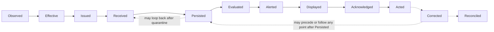

# IntensiCare V2 — Time Semantics

## Status

All content is **PROPOSAL**. This document defines the distinct clinical time points
IntensiCare V2 must be able to represent and keep separate, and states the non-negotiable
preservation rule that governs all of them. It does not select a physical timestamp
representation, database type, or clock-synchronization technology.

## Why time semantics are a first-class domain concern

A clinical fact, an evaluation, and an alert are each associated with more than one
meaningful instant, and those instants frequently differ — sometimes by seconds,
sometimes by hours or days (e.g., batch-sourced laboratory data). Collapsing these
distinct instants into a single "timestamp" per fact would make it impossible to answer
questions that are safety-critical in an ICU decision-support platform: *when did this
actually happen to the patient*, versus *when did IntensiCare become aware of it*, versus
*when did a human see it and act*. `INTENSICARE_V2_ORCHESTRATOR_PROMPT.md` §9.3
enumerates the required distinct time points and the preservation rule that governs them:

> "Model all clinical instants in UTC while preserving original offset, precision, source
> value, received time, and relevant timezone. Keep observed, effective, issued, received,
> persisted, evaluated, alerted, displayed, acknowledged, acted, corrected, and
> reconciled times distinct."

## The distinct clinical time points

Each time point below is defined as a **PROPOSAL** — a conceptual meaning constructed to
fit the entities in `conceptual-model.md`, since the orchestrator prompt names each time
point but does not itself define them individually. Order in this list follows §9.3's
enumeration order, not necessarily chronological order (see "Ordering is not guaranteed"
below).

| # | Time point | Definition (PROPOSAL) | Typically associated entity |
|---|---|---|---|
| 1 | **Observed** | The real-world clinical instant when the underlying physiological event or measurement act occurred (e.g., when a vital sign was actually measured at the bedside, or a specimen was drawn), as best known from the source. | `ClinicalObservation` |
| 2 | **Effective** | The clinical instant to which the fact is asserted to apply — may equal Observed time, or may represent a distinct clinically relevant instant (e.g., a lab result's effective time can differ from the specimen collection instant). | `ClinicalObservation` |
| 3 | **Issued** | The instant the source system formally issued, verified, or finalized the fact (e.g., a laboratory result being released/verified by the source lab system). | `SourceSystem` / `ClinicalObservation` |
| 4 | **Received** | The instant IntensiCare's integration boundary received the `SourceEnvelope` containing the fact. | `SourceEnvelope` |
| 5 | **Persisted** | The instant the fact was durably written to IntensiCare's system of record. Distinct from Received: receipt can precede durable persistence (e.g., across a quarantine/validation step per the "Integration ingress, source envelopes, validation, quarantine, and replay" bounded context). | `SourceEnvelope` → `ClinicalObservation` |
| 6 | **Evaluated** | The instant a `RuleVersion` was applied to produce an `EvaluationRecord` using the fact. | `EvaluationRecord` |
| 7 | **Alerted** | The instant an `Alert`/`WorkItem` was durably created or published as a result of an `EvaluationRecord`. | `Alert` / `WorkItem` |
| 8 | **Displayed** | The instant the fact, evaluation, or alert was rendered to an authorized human via a `RebuildableProjection`/UI. | `RebuildableProjection` → UI |
| 9 | **Acknowledged** | The instant an authorized human recorded acknowledgment of an `Alert`/`WorkItem`. | `WorkItem` (`Action`) |
| 10 | **Acted** | The instant an authorized human's `Action` (resolution, override, escalation, assignment, suppression) was recorded against a `WorkItem`. | `WorkItem` (`Action`) |
| 11 | **Corrected** | The instant a `Correction` was recorded, superseding an earlier value for the same clinical fact. | `ClinicalObservation` (`Correction`) |
| 12 | **Reconciled** | The instant a reconciliation process confirmed or settled a fact's or a population's status between two representations (e.g., operational vs. analytical, or after a downtime/backfill episode). | `ClinicalObservation` / population-level |

## Ordering is not guaranteed

These twelve time points are listed in a natural narrative order, but IntensiCare V2 must
not assume they arrive or are recorded in that order, or that any two are ever equal
by construction:

- **Late/batch arrival:** Issued time can precede Received time by hours (batch feeds);
  Observed/Effective time can precede Received time by an even larger, source-dependent
  margin.
- **Out-of-order correction:** Corrected time can occur long after Acted time — a value a
  clinician already acted on may later be corrected, and the system must be able to show
  what was known *at* Acted time, not silently rewrite history (DOM-0002, DOM-0003).
  Reconciled time may follow Corrected time by an arbitrary interval, particularly for
  analytical-lane reconciliation.
  
  
- **Persisted may lag Received:** if a `SourceEnvelope` is received but quarantined
  pending validation, Persisted time (as a canonical `ClinicalObservation`) can be
  materially later than Received time — the gap itself is meaningful operational
  information (see `status-dimensions.md` and DOM-0007 on explicit degraded states).
- **Evaluated is always relative to what was Persisted as of that instant:** an
  `EvaluationRecord`'s determinism (DOM-0003) depends on binding Evaluated time to the
  exact set of facts Persisted as of that instant — a later Correction or newly Persisted
  fact does not retroactively change a past `EvaluationRecord`; it can only trigger a new
  Evaluation.

The diagram shows the *typical* narrative path (solid arrows) plus two dashed
relationships that are explicitly **not guaranteed to be forward-only**: a Correction can
be recorded at any point after Persisted time, including after Alerted, Displayed,
Acknowledged, or Acted time, and Reconciliation can occur at any later point still. No
component may assume this diagram's left-to-right order as a hard sequencing guarantee.

## The preservation rule (§9.3)

> "Model all clinical instants in UTC while preserving original offset, precision, source
> value, received time, and relevant timezone."

This means every one of the twelve time points above, when persisted, must retain **all**
of the following alongside its normalized UTC instant:

1. **Original offset** — the timezone offset as recorded at the source (e.g., `-03:00`
   for Brasília time), independent of any UTC normalization performed for internal
   comparison/ordering.
2. **Precision** — the granularity the source actually provided (e.g., date-only,
   minute-level, or sub-second), never silently upgraded to a false precision by
   normalization.
3. **Source value** — the raw, as-received timestamp string/value, unmodified, alongside
   any derived UTC instant.
4. **Received time** — itself one of the twelve time points (see table row 4) and also
   part of the preserved metadata set for every other time point, since Received time is
   what establishes when IntensiCare became responsible for the fact.
5. **Relevant timezone** — the identified timezone (not merely a numeric offset, where
   determinable) associated with the source, to correctly handle daylight-saving or
   regional timezone-rule questions if they ever arise.

Internal comparison, ordering, freshness-window evaluation, and replay all operate on the
normalized UTC instant; but the original value, offset, precision, and timezone must
remain retrievable and auditable for every time point, not merely for Observed/Effective
time.

## The non-negotiable rule: never invent a source timestamp

`INTENSICARE_V2_ORCHESTRATOR_PROMPT.md` §3, non-negotiable rule 8, states:

> "Never invent a source timestamp. Preserve the original value, timezone/offset,
> precision, received time, and quality state."

This rule is **non-negotiable** — it is one of the orchestrator prompt's numbered rules
that binds every specialist and every future implementer, not a proposal this document
can weaken or reinterpret. Its consequences for this document's time model:

- If a source genuinely did not provide a value for one of the twelve time points (most
  commonly Observed, Effective, or Issued time for legacy or partially structured feeds),
  IntensiCare V2 must represent that absence **explicitly** — never default it to
  Received time, Persisted time, "now," or any other nearby instant that would make the
  fact look more precisely timed than it actually is.
- An explicitly absent time point is a data-quality/completeness signal in its own right
  and must be visible to evaluation and to the clinician-facing UI (see DOM-0004: missing
  data must never be coerced to normal, and DOM-0007: degraded states must be explicit),
  not silently absorbed into whichever time point happens to be available.
- "Quality state," named in rule 8 alongside the preserved timestamp metadata, is the
  source data-quality dimension defined in `status-dimensions.md` — it must be preserved
  and remain visibly attached to the time point/fact it describes, and must never be
  inferred purely from the presence or absence of a timestamp.

This rule and its consequences are captured as a permanent, verifiable domain invariant:
see `invariants/DOM-invariants.md`, entry **DOM-0009**.

## Cross-references

- `glossary.md` — defines the entities (`ClinicalObservation`, `SourceEnvelope`,
  `EvaluationRecord`, `Alert`, `WorkItem`, `Correction`, `Reconciliation`, `Freshness`,
  `Staleness`) that these time points attach to.
- `conceptual-model.md` — shows where in the entity model each time point's owning
  entity sits.
- `status-dimensions.md` — the source data-quality dimension referenced by rule 8's
  "quality state," kept independent of V2 evaluation status per DOM-0008.
- `invariants/DOM-invariants.md` — DOM-0002 (immutable provenance/corrections),
  DOM-0003 (deterministic/replayable evaluation), DOM-0004 (no silent coercion),
  DOM-0008 (independent status dimensions), and DOM-0009 (never invent a timestamp) all
  depend on the time semantics defined here.

## What this document deliberately does not decide

- No timestamp storage type, precision limit, or database/technology choice.
- No clock-synchronization or NTP/drift-handling implementation.
- No per-source-system mapping of which time points a specific AMH or HL7 v2 feed
  actually provides — that is the AMH clinical-signal contract engineer's and the HL7 v2
  interface-conformance engineer's evidence-gathering task, feeding the pathway-to-source
  eligibility matrix (§7.2), which is out of this document's evidence scope.
- No freshness-window values per pathway (owned by clinical pathway owners and the
  clinical-pathway portfolio optimizer).
