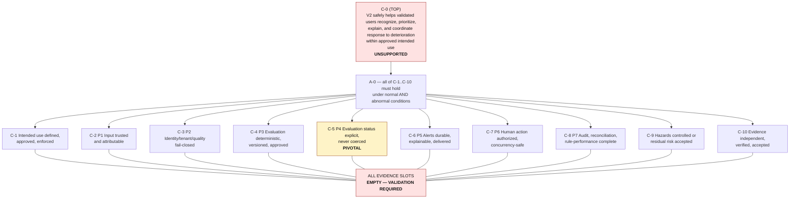

# IntensiCare V2 — Safety Case Skeleton (argument only, evidence EMPTY)

> **This document is not a safety case.** Every evidence slot below is `EMPTY —
> VALIDATION REQUIRED`. An argument with no evidence supports nothing. Publishing this
> structure does not raise assurance; it makes the absence of assurance countable.

## 0. The predecessor's lesson, stated up front

SOURCE (`INTENSICARE_TECHNICAL_ASSESSMENT.md:461-465`):

> "The repository contains a hazard log, design mitigations, clinical rule references, a
> clinical sign-off artifact, test vectors, and regulatory planning. This is substantially
> better than undocumented clinical logic. **It is not yet a closed safety case:** several
> high-severity hazards remain open, mitigation code and tests are incomplete, the
> validating person/institution is not independently evidenced, and
> retrospective/prospective performance is pending."

SOURCE (`:469-478`): the same repository documented hazard `HAZ-030` requiring
`not evaluated` for missing input — and returned numeric `0` from all four scorers with
all clinical inputs absent, persisted it, and let it drive a `normal` bed state.

INFERENCE, and the governing constraint on this document: **legacy's safety evidence was
promising and did not constitute a closed safety case.** V2 must therefore never treat the
existence of a hazard log, a sign-off artifact, or this skeleton as assurance. Assurance is
the *filled evidence slot plus the independent accepter's judgement* — nothing else.

## 1. Notation

| Element | Meaning |
|---|---|
| `C-n` | **Claim** — a proposition asserted about the system |
| `A-n` | **Argument** — why the sub-claims, if true, would support the parent claim |
| `E-n` | **Evidence** — an artifact that would substantiate a claim |
| `EMPTY` | No evidence exists. **VALIDATION REQUIRED.** |
| `PARTIAL` | Some evidence exists and is insufficient — must state what is missing |
| **Defeater** | A stated condition that would break the argument; recorded because an argument that names no defeater has not been examined |

Evidence-slot status vocabulary: `EMPTY` · `PLANNED` · `COLLECTED` · `INDEPENDENTLY VERIFIED` ·
`ACCEPTED (name, date)`. **Only `ACCEPTED` supports a claim.** No slot below is above `EMPTY`.

## 2. Top claim

> ### C-0
> **IntensiCare V2 safely helps validated users recognize, prioritize, explain, and
> coordinate response to clinically relevant deterioration within its approved intended
> use, in the validated care setting and population.**

**Status: UNSUPPORTED.** No sub-claim below has accepted evidence.

### Scope conditions on C-0 (each currently unestablished)

| Condition | Status |
|---|---|
| "approved intended use" exists and has a named human approver | **VALIDATION REQUIRED** — `PROMPT:248`; no intended-use statement exists in this repository |
| "validated users" — who monitors, acts, escalates, closes — is established | **VALIDATION REQUIRED** — `PROMPT:253-262`; `LEGACY-TA:1000` records this as an open question |
| "validated care setting and population" (adult/paediatric/neonatal; ICU/step-down/ward/RRT) | **VALIDATION REQUIRED** — `PROMPT:256-257`; `LEGACY-TA:997` |
| "safely" is defined by harm metrics agreed with clinical governance | **VALIDATION REQUIRED** — `PROMPT:213` |

INFERENCE: **C-0 cannot even be evaluated until these four are closed.** A safety case
whose top claim has an undefined scope is not conservative — it is meaningless. This is
the first blocker for G1.

### Explicit non-claims (recorded so they cannot be inferred later)

C-0 does **not** claim: clinical effectiveness; improved patient outcomes; regulatory
compliance or approval; that the system is a substitute for clinical judgement; that
alerting is complete (no missed deterioration); or AMH compatibility. Each of those
requires its own evidence and named approval (`PROMPT:123`, `PROMPT:1061`).

## 3. Top-level argument

> ### A-0
> C-0 holds **if and only if** all of the following hold simultaneously:
> 1. the intended use is defined, approved, and enforced (C-1);
> 2. each stage of the safety loop behaves correctly under normal **and** abnormal
>    conditions (C-2 … C-8);
> 3. every identified hazard is controlled or has formally accepted residual risk (C-9);
> 4. the evidence for 1–3 is independently produced, verified, and accepted (C-10).

**Defeaters of A-0 (any one breaks the whole argument):**
- **D-0.1** — A stage behaves correctly on the happy path only. SOURCE `PROMPT:45`: the
  loop must be demonstrated "under normal, missing, stale, duplicate, delayed, conflicting,
  corrected, unauthorized, disconnected, and partially failed conditions."
- **D-0.2** — Evidence exists but was produced or accepted by the same party that built the
  control (`PROMPT:200`; `LEGACY-TA:465`).
- **D-0.3** — A gate passed while validating zero cases (HAZ-0031; `LEGACY-TA:584`).
- **D-0.4** — A claim is supported by a document rather than by executed evidence
  (`safety-plan.md` §6.2).
- **D-0.5** — The intended use silently expanded after the evidence was collected
  (HAZ-0036; `PROMPT:127`).

---

## 4. Sub-claims by safety-loop stage

Loop stages per `PROMPT:33-45`. Each sub-claim lists the hazards it must defeat, the
`SAF` controls that would defeat them, and the evidence slots — **all EMPTY**.

### C-1 — Intended use is defined, approved, and enforced at runtime
*Hazards:* HAZ-0036, HAZ-0035(scope), HAZ-0030
*Controls:* SAF-0035, SAF-0020, SAF-0031

| Evidence slot | Would be | Status |
|---|---|---|
| E-1.1 Approved intended-use and non-intended-use statement with named approver | Human-approved document | **EMPTY — VALIDATION REQUIRED** |
| E-1.2 Population/setting exclusion enforcement tests (out-of-population → `not_evaluated`) | Automated test | **EMPTY** |
| E-1.3 Advisory-boundary human-factors evidence (users do not read output as directive) | Simulation study | **EMPTY — VALIDATION REQUIRED** |
| E-1.4 Non-actioning-by-default mode evidence | Automated test + config audit | **EMPTY** |

**Defeater D-1.1:** an approved intended use exists on paper but no runtime check enforces
population/setting boundaries.

---

### C-2 — Clinical input is trusted, attributable, and complete-or-declared-incomplete (loop stage P1)
*Hazards:* HAZ-0007, HAZ-0009, HAZ-0010, HAZ-0011, HAZ-0012, HAZ-0026, HAZ-0032, HAZ-0038, HAZ-0039
*Controls:* SAF-0010, SAF-0011, SAF-0012, SAF-0013, SAF-0014, SAF-0028, SAF-0033

| Evidence slot | Would be | Status |
|---|---|---|
| E-2.1 Ingest conformance suite (duplicate / delayed / reordered / replayed / lost / corrected) | Automated scenario matrix | **EMPTY** |
| E-2.2 Timestamp-preservation tests incl. absent/malformed/ambiguous source times | Automated test | **EMPTY** |
| E-2.3 Clock-skew and DST (`America/Sao_Paulo`) test results | Automated test | **EMPTY** |
| E-2.4 Terminology/unit conformance incl. unknown-code quarantine | Conformance run | **EMPTY** |
| E-2.5 Measured source fitness: population, null distribution, coverage, referential gaps | Measured report vs pinned AMH commit | **EMPTY — VALIDATION REQUIRED** |
| E-2.6 Durable-acceptance boundary proof (ack only after persistence) | Crash-point test | **EMPTY** |

**Defeater D-2.1:** conformance is demonstrated against a mock rather than a representative
external system (`PROMPT:746`; `LEGACY-TA:600`: "Existing mocks do not establish fidelity").
**Defeater D-2.2:** schema presence is offered in place of populated-data evidence
(`PROMPT:414`; `PROMPT:103`).

---

### C-3 — Identity, encounter, tenant, provenance and quality are validated fail-closed (loop stage P2)
*Hazards:* HAZ-0001, HAZ-0002, HAZ-0003, HAZ-0004, HAZ-0008, HAZ-0013, HAZ-0014, HAZ-0027, HAZ-0040, **HAZ-0045**, **HAZ-0047** (acrescentados 2026-08-15; HAZ-0047 também toca C-8 — auditoria e retenção)
*Controls:* SAF-0007, SAF-0008, SAF-0009, SAF-0029, SAF-0032; **+ SAF-0042** (telemetria de anomalia de identidade — `DET` e **somente** `DET`, compensatório e explicitamente insuficiente)

| Evidence slot | Would be | Status |
|---|---|---|
| E-3.1 Adversarial cross-tenant test results | Automated adversarial suite | **EMPTY** |
| E-3.2 Storage-level ownership constraint evidence (schema + isolation tests) | Migration/persistence test | **EMPTY** |
| E-3.3 Fail-closed behaviour on missing/mismatched tenant, purpose, consent | Negative test | **EMPTY** |
| E-3.4 Merge/unmerge replay scenario results | Scenario suite | **EMPTY** |
| E-3.5 AMH tenant/MPI contradiction record with an approved decision | Human decision (ADR-006 / ADR-039 / ADR-041 / FHIR-IG) | **EMPTY — VALIDATION REQUIRED**, blocked per `PROMPT:438-451` |
| E-3.6 DQ↔evaluation-status mapping matrix, tested | Matrix + test | **EMPTY** |
| E-3.7 Independent penetration-test acceptance | Human acceptance, verifier ≠ implementer | **EMPTY — VALIDATION REQUIRED** |
| E-3.8 Detecção de par de identidade errado **a montante**: **SAF-0042** implementado e verificado (os cinco sinais, com anomalias plantadas), **mais** taxa de falso-positivo **medida** — a do índice cross-PJ, fornecida por quem o opera, **e** a do próprio detector, antes de qualquer exposição a clínico (limite 3 de SEC-0057: um limiar não calibrado troca HAZ-0045 por HAZ-0016), **mais** o instrumento entre controladores que o parecer OS-16 cobra (R-a6) | Telemetria V2 + medição AMH + instrumento contratual | **EMPTY — VALIDATION REQUIRED** (acrescentado 2026-08-15 com HAZ-0045; SAF-0042 escrito em 2026-08-15 — **um requisito escrito não move este slot**) |
| E-3.9 Semântica de aplicação do tombstone de *erasure* determinada por `AUTH-PRIVACY-LEGAL`, **e** prova de que a aplicação alcança **todas** as cópias (projeções, caches, cache de `resolve`, índices, exports, telemetria) **sem** destruir registro clínico nem trilha de auditoria de paciente sob cuidado | Determinação jurídica nomeada + suíte de propagação + teste negativo de não-destruição | **EMPTY — VALIDATION REQUIRED** (acrescentado 2026-08-15 com HAZ-0047; bloqueado em `BLK-0004`, `AUTH-PRIVACY-LEGAL` UNASSIGNED) |

**Defeater D-3.1:** authorization is enforced in application code while the data model
still permits unowned rows (`LEGACY-TA:305`, `LEGACY-TA:632`).
**Defeater D-3.2 (acrescentado 2026-08-15, HAZ-0045):** a V2 valida a **forma** do `ref` de
sujeito e não tem, por construção, como validar sua **correção** — a barreira decisiva fica
**fora** da fronteira da V2, num índice que a V2 não hospeda e cuja decisão de pareamento não
observa. Consequência para o argumento: **C-3 não pode ser sustentada por evidência
exclusivamente interna à V2.** Por mais completa que seja a suíte adversarial de E-3.1–E-3.3,
sem E-3.8 a sub-alegação permanece indemonstrável para a classe de falha em que o insumo chega
correto pelo contrato e errado pelo fato.
**Defeater D-3.3 (acrescentado 2026-08-15, HAZ-0047):** a propagação do tombstone de *erasure*
é demonstrada em teste e, em produção, **uma cópia não enumerada** — um cache, uma projeção,
um export, um sink de telemetria dentro da retenção — permanece. Uma prova de propagação vale
exatamente para o conjunto de cópias que **alguém se lembrou de listar**, e o inventário de
cópias não é ele próprio verificado por nada. O simétrico também derruba C-3: uma aplicação
ampla o bastante para alcançar tudo alcança **também** o registro clínico e a trilha de
auditoria de um paciente sob cuidado. **Enquanto `AUTH-PRIVACY-LEGAL` estiver `UNASSIGNED`
(`BLK-0004`), nenhuma das duas metades tem critério de correção** — e um teste sem critério de
correção não é evidência.

---

### C-4 — Evaluation is deterministic, versioned, approved, and replayable (loop stage P3)
*Hazards:* HAZ-0019, HAZ-0020, HAZ-0021, HAZ-0036
*Controls:* SAF-0019, SAF-0020, SAF-0021, SAF-0003, SAF-0035

| Evidence slot | Would be | Status |
|---|---|---|
| E-4.1 Signed rule bundle with content hash, evidence links, and independent clinical approver | Release artifact | **EMPTY — VALIDATION REQUIRED** (clinical approval) |
| E-4.2 Deterministic replay corpus (same inputs + bundle → identical record) | Replay test | **EMPTY** |
| E-4.3 Clinical reference vectors including **no-fire reasons** | Vector pack | **EMPTY** |
| E-4.4 Mutation-testing results for the safety kernel | Mutation report | **EMPTY** |
| E-4.5 Single-active-version and rollback/kill-switch drill | Multi-instance drill | **EMPTY** |
| E-4.6 Completeness/freshness policy per version, independently ratified | Human approval | **EMPTY — VALIDATION REQUIRED** |

**Defeater D-4.1:** a vector pack that runs zero vectors and reports pass (HAZ-0031;
`LEGACY-TA:584`). **Defeater D-4.2:** the rule author is also the clinical approver
(`PROMPT:199`).

---

### C-5 — Evaluation status is explicit, honest, and never coerced (loop stage P4) — **the pivotal sub-claim**
*Hazards:* HAZ-0005, HAZ-0006, HAZ-0021, HAZ-0039, HAZ-0040
*Controls:* SAF-0001, SAF-0002, SAF-0003, SAF-0004, SAF-0005, SAF-0006, SAF-0032

| Evidence slot | Would be | Status |
|---|---|---|
| E-5.1 **Absent-input probe** over every value-producing function/endpoint/projection, run as a blocking gate | Automated suite (`safety-plan.md` §5.1 item 4) | **EMPTY** |
| E-5.2 Type/schema evidence that an unstatused clinical value is unconstructible | Static/type test | **EMPTY** |
| E-5.3 Aggregate monotonicity property test (an unevaluated member never improves a roll-up) | Property test | **EMPTY** |
| E-5.4 Freshness boundary tests per input concept | Boundary test | **EMPTY** |
| E-5.5 UI evidence that every status is visibly distinct and non-color-only | Component + a11y test | **EMPTY** |
| E-5.6 Clinician comprehension evidence for `partial` / `not_evaluated` / `stale` | Simulation study | **EMPTY — VALIDATION REQUIRED** |
| E-5.7 Ratified evaluation-status semantics | Human approval of `evaluation-status-semantics.md` | **EMPTY — VALIDATION REQUIRED** |

INFERENCE: C-5 is the sub-claim on which C-0 most directly depends, because its failure is
the failure that *already happened* (`LEGACY-TA:469-478`) and because it is invisible — a
wrong `normal` produces no error, no exception, and no alert. **C-5 must not be argued from
code review alone; E-5.1 is mandatory and mechanical.**

INFERENCE (acrescentado 2026-08-15, pt-BR/DEC-G0-10): o **ADR-0005** (`proposed`) propõe, em
**M7** (não-coerção) e **M4** (duas dimensões independentes com falha fechada), exatamente as
cláusulas que tornariam HAZ-0005 estruturalmente impossível, e o `hazard-log.md` passou a
registrar esse vínculo. **Nenhum *slot* E-5.x avança por causa disso, e nenhum deve avançar.**
Um ADR proposto — com duas condições de aceitação ainda **ABERTAS** (C3: a matriz M4 é
*placeholder*; C5: sem ambiente para inspecionar a *lane*) e uma hipótese **UNTESTED** (H3) —
é a **intenção** de uma barreira, não a barreira. Promover qualquer *slot* acima de `EMPTY`
com base nele seria **D-9.1** em ação, e D-9.1 é o *defeater* que este produto **já
materializou uma vez**: o legado documentou `HAZ-030` exigindo `not evaluated` e mesmo assim
retornou zero.

**Defeater D-5.1:** status is present in the domain model but lost in a projection, cache,
export, or UI cell. **Defeater D-5.2:** clinicians see the status and do not act on it —
i.e. E-5.6 fails even though E-5.1–E-5.5 pass.

---

### C-6 — Warranted alerts are durable, explainable, and actually reach a responsible human (loop stage P5)
*Hazards:* HAZ-0015, HAZ-0016, HAZ-0017, HAZ-0018, HAZ-0022, HAZ-0030, HAZ-0041, **HAZ-0046** (acrescentado 2026-08-15)
*Controls:* SAF-0015, SAF-0016, SAF-0018, SAF-0022, SAF-0025, SAF-0031, SAF-0038, **SAF-0005, SAF-0034** (via HAZ-0046)

| Evidence slot | Would be | Status |
|---|---|---|
| E-6.1 Durable-before-visible crash-point tests | Automated test | **EMPTY** |
| E-6.2 Measured generated→committed→delivered→displayed→acknowledged latency and loss | Synthetic probe SLI | **EMPTY — VALIDATION REQUIRED** (production-like environment) |
| E-6.3 "Generated but never displayed" monitor with demonstrated detection | Operational evidence | **EMPTY** |
| E-6.8 Spoofed-notification test: a fabricated alert is unverifiable against the durable record and resolves to nothing | Automated test + human-factors check | **EMPTY** (added 2026-08-15 with HAZ-0041) |
| E-6.4 Suppression audit and escalation-breakthrough tests | Scenario test | **EMPTY** |
| E-6.5 Alert-burden measurement (alerts per patient-day, per shift) against a ratified budget | Measured study | **EMPTY — VALIDATION REQUIRED** |
| E-6.6 Explanation quality: inputs, missing inputs, source time, rule version, rationale | Human-factors evidence | **EMPTY — VALIDATION REQUIRED** |
| E-6.7 Latency budget vs. measured lane capability per pathway | Measured comparison | **EMPTY** — currently contradicted by `LEGACY-TA:231,239` and `PROMPT:95`; **desde 2026-08-15 há um caso concreto e quantificado** — janela de 1 h da `RULE-NEWS2-0100` × canal FHIR não-near-real-time (`vital-signs-decision/pacote-decisao-c1-sinais-vitais.md` §4/O1 risco 2), *"inteiramente não medido"* |
| E-6.9 Rótulo de limitação institucional (*"registro limitado a esta instituição"*) presente em **toda** superfície que exiba registro de paciente, perceptível **sem depender de cor** e anunciado a tecnologia assistiva — **e compreendido**: cenário simulado que meça se o clínico lê a fragmentação **como fragmentação** e não como ausência de história | Teste de componente + a11y + estudo de compreensão (item de validação G1/G4 exigido por `ADR-0004` §6.2) | **EMPTY — VALIDATION REQUIRED** (acrescentado 2026-08-15 com HAZ-0046) |

**Defeater D-6.1:** delivery is measured at the server and not at the clinician's display
(`LEGACY-TA:560`: no SLI measured generated-to-visible latency or missed display).
**Defeater D-6.2:** the alert arrives correctly but too late for the clinical window
(HAZ-0030) — a correct system that is architecturally too slow still fails C-0.
**Defeater D-6.3 (acrescentado 2026-08-15, HAZ-0046):** o rótulo de limitação institucional
existe na tela e o clínico **não o incorpora à decisão** — o requisito vinculante da ata AQ-1
é satisfeito na letra e o dano permanece intacto. É o mesmo modo de falha de **D-5.2**,
transposto do *status de avaliação* para o *escopo do registro*; por isso E-6.9 exige
**medição de compreensão**, e não apenas a presença do componente. Presença do rótulo não é
evidência de que a completude longitudinal deixou de ser presumida.

---

### C-7 — Human action is authorized, attributed, concurrency-safe, and unambiguous (loop stage P6)
*Hazards:* HAZ-0023, HAZ-0024, HAZ-0033, HAZ-0037, HAZ-0018
*Controls:* SAF-0017, SAF-0018, SAF-0024, SAF-0034, SAF-0007

| Evidence slot | Would be | Status |
|---|---|---|
| E-7.1 Concurrency race tests (two clinicians, same alert) | Property test | **EMPTY** |
| E-7.2 Idempotent-command retry tests | Automated test | **EMPTY** |
| E-7.3 Clinically ratified state machine: transitions, roles, timers, handoff | Human approval | **EMPTY — VALIDATION REQUIRED** (`LEGACY-TA:717`) |
| E-7.4 Partial-group-action behaviour at API and UI | Scenario test | **EMPTY** |
| E-7.5 Accessibility validation with representative assistive technology | Manual + automated | **EMPTY — VALIDATION REQUIRED** |
| E-7.6 Shift-handover and downtime responsibility evidence | Simulation + runbook exercise | **EMPTY — VALIDATION REQUIRED** |

**Defeater D-7.1:** the state machine is technically correct but does not match how
responsibility actually transfers at handover — a design that is safe in code and unsafe in
the unit.

---

### C-8 — Audit, reconciliation, and rule-performance feedback are complete and tamper-evident (loop stage P7)
*Hazards:* HAZ-0034, HAZ-0035, HAZ-0025, HAZ-0008, HAZ-0042
*Controls:* SAF-0023, SAF-0024, SAF-0033, SAF-0036, SAF-0039, SAF-0014

| Evidence slot | Would be | Status |
|---|---|---|
| E-8.1 Audit completeness per state transition and per read | Automated test | **EMPTY** |
| E-8.2 Tamper-evidence and evidence-export integrity | Automated test | **EMPTY** |
| E-8.3 Executed restore drill with measured RTO/RPO, **from the isolated immutable copy** | Operational drill | **EMPTY — VALIDATION REQUIRED** |
| E-8.4 Post-downtime reconciliation report showing no silent loss | Operational evidence | **EMPTY** |
| E-8.5 Rule-performance surveillance (sensitivity, specificity, PPV, NPV, override rate, alert burden, subgroup calibration) | Measured study | **EMPTY — VALIDATION REQUIRED** (biostatistician) |

**Defeater D-8.1:** rule-performance feedback is computed from an incomplete audit record
and misdirects future clinical change (HAZ-0035).

---

### C-9 — Every identified hazard is controlled, or its residual risk is formally accepted
*Controls:* the whole hazard log; SAF-0030, SAF-0037

| Evidence slot | Would be | Status |
|---|---|---|
| E-9.1 Hazard log with every row at `VERIFIED` or `RESIDUAL-RISK ACCEPTED` | Register state | **EMPTY** — all **47** rows are `OPEN` (44 do ciclo 0 + HAZ-0045/HAZ-0046/HAZ-0047 cunhados em 2026-08-15). **O contador subiu, não desceu:** um ciclo de trabalho que acrescenta hazards e não fecha nenhum afasta este *slot* do preenchimento, e é assim que deve aparecer |
| E-9.2 Residual-risk acceptance records (named human, date, rationale, review trigger) | Human decisions | **EMPTY — VALIDATION REQUIRED** |
| E-9.3 Threat-model P0/P1 findings closed or accepted | Wave 2 output + security acceptance | **EMPTY — VALIDATION REQUIRED.** The *input* now exists — `docs/11-security-privacy-compliance/threat-model.md` (THR-0001..THR-0067, 27 rated P0 and 39 P1) — and its THR↔HAZ links are integrated into the hazard log. **Zero findings are closed or accepted**, so this slot does not advance: the slot asks for closure/acceptance, not for the model. |
| E-9.4 Per-pathway hazard rows (false-positive/false-negative harm, alert burden, subgroup risk) | Portfolio output (G2) | **PARTIAL** — the portfolio-*level* portion is integrated (HAZ-0043, HAZ-0044, plus PH-11 mapped to HAZ-0036). The **per-pathway** portion remains EMPTY and cannot be filled until pathways are admitted at G2; candidates PH-01..PH-09 are staged in `pathway-portfolio/candidate-inventory.md` §5. See `hazard-log.md` §4 gap G-2 |
| E-9.5 Post-architecture SWIFT re-run against the ratified V2 design | Analysis | **EMPTY** — gap G-3 |
| E-9.6 Common-cause / barrier-independence analysis for S4–S5 hazards | Analysis | **EMPTY** — owed before G6 |

**Defeater D-9.1:** a hazard is closed because a mitigating document exists rather than an
executed test or a named acceptance — the exact legacy failure (`safety-plan.md` §6.2).

**Nota de defeito declarado (2026-08-15, pt-BR/DEC-G0-10) — RESOLVIDO, e substituído por uma
lacuna diferente e maior.** A versão anterior desta nota registrava que **HAZ-0045 estava sem
filho `SAF`** (defeito de análise, `safety-plan.md` §8). **Isso foi fechado no mesmo dia:**
`SAF-0042` foi escrito, e o triângulo `HAZ-0045 ↔ SAF-0042 ↔ SEC-0057` está fechado, sem
referência pendurada. **O que ficou no lugar é pior, e não deve ser lido como progresso:**

1. **HAZ-0045 (S5) não satisfaz a regra de barreira única** de `safety-plan.md` §6.4, e
   **nenhum controle da V2 pode fazê-la satisfazer**, porque a barreira preventiva pertence à
   governança do índice do ADR-043 e ao parecer jurídico da OS-16 — fora desta organização de
   software. SAF-0042 é `DET` e **somente** `DET`, por desenho. A exceção está declarada em
   `safety-requirements.md` §I. **Escrever o requisito tornou a lacuna precisa; não a reduziu.**
2. **HAZ-0047 tem filhos `SAF`, mas nenhum define a semântica de aplicação** do tombstone de
   *erasure* — isso é determinação de `AUTH-PRIVACY-LEGAL` (`UNASSIGNED`, `BLK-0004`), e
   nenhum agente pode autorá-la sem fabricar uma decisão jurídica.

**Consequência para C-9:** a cadeia hazard → controle → evidência deixou de estar *rompida* e
passou a estar **completa e insuficiente** — que é um estado mais honesto e não mais
tranquilizador. E-9.1 continua `EMPTY`.

---

### C-10 — The evidence is independently produced, verified, and accepted
*Controls:* SAF-0037, SAF-0030

| Evidence slot | Would be | Status |
|---|---|---|
| E-10.1 Named Clinical Safety Owner, Independent Safety-Case Accepter, Residual-Risk Acceptance Authority | Human appointments | **EMPTY — VALIDATION REQUIRED**; all roles UNASSIGNED |
| E-10.2 Implementer≠accepter record for every control, machine-checked | Evidence-table constraint | **EMPTY** |
| E-10.3 Blocking-gate configuration audit (no advisory safety gate) | Automated assertion | **EMPTY** |
| E-10.4 Brazilian regulatory-applicability determination | Legal/regulatory counsel | **EMPTY — VALIDATION REQUIRED** (`safety-plan.md` §9) |
| E-10.5 Release evidence bundle with artifact digests, bundle hashes, migrations, traceability snapshot | Release artifact | **EMPTY** |

**Defeater D-10.1:** a sign-off artifact exists but the validating person/institution is not
independently evidenced — SOURCE `LEGACY-TA:465`, i.e. *this defeater has already
materialised once in this product's history.*

---

## 5. Argument map

## 6. Maturity ladder and gate mapping

PROPOSAL — the safety case advances through these states; it is currently at **M0**.

| State | Meaning | Gate |
|---|---|---|
| **M0 — structure only** | Claims and argument exist; evidence EMPTY. **Current state.** | — |
| M1 — scoped | Intended use, users, setting, population approved, so C-0 is evaluable | G1 |
| M2 — argued | Every sub-claim has named evidence slots with owners and dates | G2/G3 |
| M3 — evidenced (partial) | Deterministic/automated evidence collected; human/empirical still open | G4/G5 |
| M4 — pilot-ready | High-severity hazards controlled+verified or residual risk formally accepted; threat-model P0/P1 closed or accepted; tenant isolation adversarially evidenced; privacy/legal approved | **G6** |
| M5 — accepted for pilot | Independent accepter judges the argument supported for supervised pilot | G8 pilot |
| M6 — accepted for production | Staged validation, measured performance, rollback authority demonstrated | G8 production |

INFERENCE: **nothing produced in Wave 1 can advance the case beyond M0**, because M1
requires a human intended-use approval that does not exist.

## 7. Standing prohibitions on this document

1. No agent may mark an evidence slot `ACCEPTED`.
2. No agent may promote the maturity state.
3. No agent may remove a defeater; a defeater is retired only by evidence plus an
   accepter's judgement, and the retirement must be recorded with its rationale.
4. This skeleton must never be cited as evidence that V2 is safe. It is a register of
   what is unknown.
