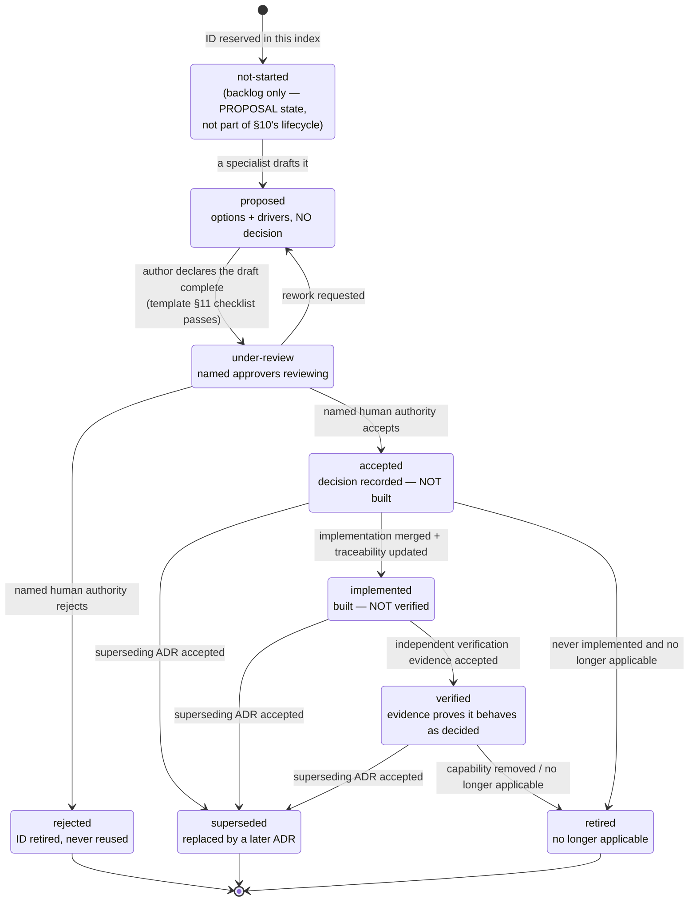
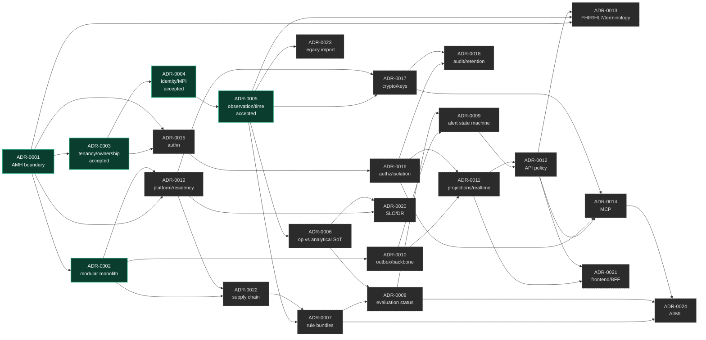

# Índice e Ciclo de Vida de ADR — IntensiCare V2

> Traduzido EN→pt-BR em 2026-08-15 (GDEC-0008 item 8, tranche 2); original EN preservado no histórico git.

**Status: PROPOSAL.** Este índice reserva os 24 IDs de ADR exigidos pelo
`INTENSICARE_V2_ORCHESTRATOR_PROMPT.md` §10 (linhas 636–660), define o ciclo de vida a
partir da §10 linha 618, e registra a estrutura de dependência, gate, e fase entre eles.

**Nada neste arquivo é, em si, uma decisão.** Dezesseis ADRs estão redigidas.
**`ADR-0001`, `ADR-0003`, `ADR-0004`, `ADR-0005`, `ADR-0009`, `ADR-0010` e `ADR-0011`
foram ACEITAS pelo titular (rodaquino-OMNI) em 2026-08-15 na sessão de decisão
`GDEC-0008` (item 4;
`../../00-governance/registers/decision-register.md`)** — aceito não significa
implementado nem verificado. `ADR-0001` é aceita com a formulação própria do titular,
**"a V2 SEMPRE consome dados da AMH; nunca ingestão direta"**, superando as opções
redigidas onde for mais estrita; ver seu §5.0 para a nota de composição obrigatória
sobre sua interação com o item 2 de `GDEC-0008` (C-1 = O3). A *direção* da `ADR-0004`
foi decidida pelo titular em 2026-08-15 e sua ADR redigida agora também está aceita
(§5.0) — ver
`../../00-governance/registers/g0-resolucoes-2026-08-15.md`; sua reconciliação C2
contra o registro de adjudicação foi executada em 2026-08-15 (seu §5.5). `ADR-0002`
permanece `proposed` e não registra nenhuma decisão. `ADR-0006` (fonte de verdade
operacional-versus-analítica e reconciliação) **permanece `proposed`, não decidida** —
`GDEC-0008` item 4 a exclui explicitamente. O ciclo 1 (2026-08-15) redigiu `ADR-0007`,
`ADR-0008` e as cinco novas ADRs clínicas `ADR-0025`–`ADR-0029`; todas as sete foram
**aceitas pelo revisor clínico nomeado em 2026-08-15 (GDEC-0007)** — cláusulas adiadas
(custódia de chave da ADR-0022, licenciamento SNOMED, metas numéricas) permanecem
abertas conforme registrado em cada ADR. Da onda de runtime/entrega (2026-08-15) —
`ADR-0006`, `ADR-0009`, `ADR-0010`, `ADR-0011` — três (`ADR-0009`, `ADR-0010`,
`ADR-0011`) estão aceitas conforme acima; apenas `ADR-0006` permanece proposta e
pendente. **Resumo: das oito ADRs do ciclo 2 redigidas em 2026-08-15 (`ADR-0001`,
`ADR-0003`–`ADR-0006`, `ADR-0009`–`ADR-0011`), sete estão aceitas (`GDEC-0008`) e uma
(`ADR-0006`) permanece proposta, aguardando revisão.**
Os treze IDs de piso restantes estão `not-started`: o ID e o tópico estão reservados,
nenhuma minuta existe, e nenhuma posição é implicada pela reserva.

**Política de idioma (SOURCE: DEC-G0-10, 2026-08-15).** Material produzido a partir de
2026-08-15 é redigido em **pt-BR**. `ADR-0003`, `ADR-0004` e `ADR-0005` estão, portanto,
em pt-BR. `ADR-0001` e `ADR-0002` foram traduzidas retroativamente para pt-BR na
tranche 2 (2026-08-15, GDEC-0008 item 8) — o corpo EN original de cada uma permanece
preservado no histórico git para auditabilidade do diff; `ADR-template.md` permanece
em inglês como corpus válido do ciclo 0, pendente de tranche futura.
Tradução retroativa: DECIDIDA SIM (GDEC-0008 item 8, 2026-08-15), executada em tranches — tranche 1 (ADR-0027/0028) concluída; tranche 2 (ADR-0001/0002 + este índice) concluída; backlog restante: corpus forense da revisão legada (tranche 3).

Este arquivo é a **fonte única de verdade para o próximo número disponível do prefixo
`ADR`** (`docs/00-governance/traceability-policy.md` §2 regra 4). Próximo ID livre:
**ADR-0030**.

---

## 1. Arquivos neste diretório

| Arquivo | Propósito | Status |
|---|---|---|
| [`ADR-template.md`](./ADR-template.md) | Conjunto de campos obrigatórios e regras de autoria per §10 | PROPOSAL |
| [`adr-index.md`](./adr-index.md) | Este arquivo — ciclo de vida, backlog, grafo de dependência | PROPOSAL |
| [`ADR-0001-amh-platform-boundary.md`](./ADR-0001-amh-platform-boundary.md) | Opções para a fronteira de plataforma AMH (§7.3) — **pt-BR** (traduzido 2026-08-15, GDEC-0008 item 8, tranche 2) | **accepted** (2026-08-15, GDEC-0008) |
| [`ADR-0002-modular-monolith-and-extraction-criteria.md`](./ADR-0002-modular-monolith-and-extraction-criteria.md) | Baseline de monolito modular e critérios de extração de serviço (§9.1 princípio 8) — **pt-BR** (traduzido 2026-08-15, GDEC-0008 item 8, tranche 2) | proposed |
| [`ADR-0003-tenancy-organizacao-facility-propriedade-de-recurso.md`](./ADR-0003-tenancy-organizacao-facility-propriedade-de-recurso.md) | Grão de tenant, hierarquia org/facility/unit/bed, invariância de propriedade de recurso (§10 item 3) — **pt-BR** | **accepted** (2026-08-15, GDEC-0008) |
| [`ADR-0004-identidade-paciente-encontro-mpi.md`](./ADR-0004-identidade-paciente-encontro-mpi.md) | Identidade de paciente/encounter/MPI, identificador de fronteira, semântica de merge/unmerge (§7.4) — **pt-BR** | **accepted** (2026-08-15, GDEC-0008); direção decidida em 2026-08-15; reconciliação C2 executada em 2026-08-15 |
| [`ADR-0005-modelo-canonico-observacao-proveniencia-qualidade-correcao-tempo.md`](./ADR-0005-modelo-canonico-observacao-proveniencia-qualidade-correcao-tempo.md) | Modelo canônico de observação: proveniência, dimensões de qualidade, correção, tempo (§10 item 5) — **pt-BR** | **accepted** (2026-08-15, GDEC-0008) |
| [`ADR-0006-fonte-de-verdade-operacional-analitica-e-reconciliacao.md`](./ADR-0006-fonte-de-verdade-operacional-analitica-e-reconciliacao.md) | Fonte de verdade operacional × analítica, precedência/conflito/correção/replay/reconciliação; alegação Gold/Athena como hipótese com método (§10 item 6) — **pt-BR** | proposed (2026-08-15) |
| [`ADR-0007-rule-bundle-format-signing-approval-activation-rollback-retirement.md`](./ADR-0007-rule-bundle-format-signing-approval-activation-rollback-retirement.md) | Ciclo de vida de rule-bundle; codifica estruturalmente autor ≠ aprovador (§6.4, §10 item 7) — **pt-BR** | **accepted** (2026-08-15, GDEC-0007) |
| [`ADR-0008-evaluation-status-and-completeness-freshness-semantics.md`](./ADR-0008-evaluation-status-and-completeness-freshness-semantics.md) | Semântica de status de avaliação em cinco estados; política de escore parcial (§10 item 8) — **pt-BR**, acoplada à ADR-0026 | **accepted** (2026-08-15, GDEC-0007) |
| [`ADR-0009-maquina-de-estados-alerta-item-de-trabalho.md`](./ADR-0009-maquina-de-estados-alerta-item-de-trabalho.md) | Máquina de estados de alerta/item de trabalho: concorrência, idempotência, auditoria, timers de escalada; supressão jamais oculta no-fire (§10 item 9) — **pt-BR** | **accepted** (2026-08-15, GDEC-0008) |
| [`ADR-0010-backbone-transacao-outbox-eventos-garantias-de-entrega.md`](./ADR-0010-backbone-transacao-outbox-eventos-garantias-de-entrega.md) | Backbone transação/outbox/eventos: at-least-once, ordenação por escopo, replay, crash-points, DLQ visível; classes de transporte sem seleção (§10 item 10) — **pt-BR** | **accepted** (2026-08-15, GDEC-0008) |
| [`ADR-0011-projecoes-de-leitura-e-entrega-tempo-real-autorizada.md`](./ADR-0011-projecoes-de-leitura-e-entrega-tempo-real-autorizada.md) | Projeções rebuildáveis e gateway tempo-real com autorização por push, cursores, filas limitadas, reconciliação por polling (§10 item 11) — **pt-BR** | **accepted** (2026-08-15, GDEC-0008) |
| [`ADR-0025-score-version-and-variant-selection-policy.md`](./ADR-0025-score-version-and-variant-selection-policy.md) | Edições canônicas de escore (NEWS2/MEWS/SOFA/qSOFA) + vigilância de atualização — **pt-BR** | **accepted** (2026-08-15, GDEC-0007) |
| [`ADR-0026-missing-input-clinical-policy-per-score-class.md`](./ADR-0026-missing-input-clinical-policy-per-score-class.md) | Política clínica de insumo ausente por classe de escore — **pt-BR**, acoplada à ADR-0008 | **accepted** (2026-08-15, GDEC-0007) |
| [`ADR-0027-age-and-population-gating-enforcement.md`](./ADR-0027-age-and-population-gating-enforcement.md) | Enforcement de gating etário/populacional (fail-closed; VAL-0006/0007) — **pt-BR** (traduzido 2026-08-15, GDEC-0008 item 8, tranche 1) | **accepted** (2026-08-15, GDEC-0007) |
| [`ADR-0028-sedation-and-neuro-assessment-confounding-policy.md`](./ADR-0028-sedation-and-neuro-assessment-confounding-policy.md) | Confundimento de sedação/avaliação neurológica; gating de GCS NT/avaliabilidade — **pt-BR** (traduzido 2026-08-15, GDEC-0008 item 8, tranche 1) | **accepted** (2026-08-15, GDEC-0007) |
| [`ADR-0029-pt-br-clinical-terminology-validation-process.md`](./ADR-0029-pt-br-clinical-terminology-validation-process.md) | Processo de validação de terminologia clínica pt-BR (prompt §11) — **pt-BR** | **accepted** (2026-08-15, GDEC-0007) |

---

## 2. Ciclo de vida

SOURCE (`INTENSICARE_V2_ORCHESTRATOR_PROMPT.md` §10, linha 618):

> Crie um índice e ciclo de vida de ADR: `proposed → under-review → accepted/rejected →
> implemented → verified → superseded/retired`. "Aceito" não significa implementado;
> "implementado" não significa verificado.

> **Nota de tradução.** O diagrama Mermaid acima é preservado intacto no idioma
> original (rótulos e IDs de nó fazem parte da sintaxe do diagrama), per a regra
> vinculante desta tarefa de preservar blocos de código/diagrama. Sua tradução em
> prosa: `not_started` = "não iniciado" (backlog apenas — estado PROPOSAL, não parte
> do ciclo de vida da §10); `proposed` = "proposto" (opções + direcionadores, SEM
> decisão); `under_review` = "em revisão" (aprovadores nomeados revisando);
> `accepted` = "aceito" (decisão registrada — NÃO construído); `rejected` =
> "rejeitado" (ID aposentado, nunca reutilizado); `implemented` = "implementado"
> (construído — NÃO verificado); `verified` = "verificado" (evidência prova que se
> comporta como decidido); `superseded` = "superseded" (substituído por uma ADR
> posterior); `retired` = "retired" (não mais aplicável).

### 2.1 Definições de estado e quem pode transicionar

| Estado | Significado | Quem pode entrar neste estado | Regra rígida |
|---|---|---|---|
| `not-started` | ID e tópico reservados neste índice; nenhuma minuta existe. **PROPOSAL — este estado é um acréscimo deste programa de ADR, não um dos estados da §10.** Ele existe para que os 24 IDs exigidos possam ser reservados sem implicar nenhuma minuta ou posição. | Engenheiro do programa de ADR (apenas índice) | Reservar um ID não é um compromisso com nenhuma resposta |
| `proposed` | Uma minuta completa existe per o template. Apenas opções e direcionadores. | Qualquer agente especialista dentro de seu `write_scope` | **Nenhum agente pode ir além deste estado** (`docs/00-governance/decision-rights.md` §1.2) |
| `under-review` | Os aprovadores nomeados estão revisando ativamente. | O titular da ADR (um papel humano) | Exige aprovadores nomeados; uma revisão sem revisor nomeado não é uma revisão |
| `accepted` | A autoridade nomeada decidiu. | Apenas a autoridade decisora em `decision-rights.md` §2 | **Aceito ≠ implementado.** Nenhum código, schema, ou infraestrutura existe em virtude da aceitação |
| `rejected` | A autoridade nomeada recusou a proposta. | Apenas a autoridade decisora | O ID é aposentado, nunca reutilizado (`traceability-policy.md` §2 regra 2) |
| `implemented` | A decisão está construída e mergeada, com rastreabilidade atualizada. | Implementador + revisor | **Implementado ≠ verificado.** Nenhuma alegação de evidência é feita por este estado |
| `verified` | Evidência independente demonstra que o sistema construído se comporta como decidido. | O verificador independente, nunca o implementador (`decision-rights.md` §3) | Autoverificação é proibida |
| `superseded` | Uma ADR posterior aceita a substitui, total ou parcialmente. | Autoridade decisora da ADR que a supersede | Ambas as ADRs registram a relação (`supersedes` / `superseded_by`) |
| `retired` | Não mais aplicável (capacidade removida, escopo descartado). | O titular da ADR com a autoridade decisora | A aposentadoria exige uma razão, não silêncio |

### 2.2 Regras de transição

1. **Uma transição por mudança.** Nunca avance dois estados em uma única edição; cada
   transição precisa de sua própria evidência e sua própria entrada em
   `status_history`.
2. **Nenhuma autoaprovação.** O autor de uma ADR não pode ser um aprovador dela
   (`decision-rights.md` §3). O implementador não pode ser seu verificador.
3. **Nenhum agente escreve `accepted` ou posterior.** Um agente que acredita que uma
   ADR está pronta escreve `under-review` no máximo, e apenas quando um titular humano
   foi nomeado.
4. **Silêncio não é consentimento** (`evidence-notation.md` §2 regra 3, restatada em
   `decision-rights.md` §1.4). Uma ADR `proposed` não se torna aceita pela idade.
5. **Um gate bloqueado permanece bloqueado.** Um gate listado na coluna "bloqueia gate"
   abaixo não pode fechar enquanto sua ADR estiver em qualquer estado anterior a
   `accepted`. `accepted` sozinho não fecha um gate que também exige evidência
   `verified` — ver as próprias condições do gate no prompt.
6. **O status aqui e no arquivo da ADR precisam corresponder.** Uma divergência é um
   defeito bloqueante de revisão.

---

## 3. Backlog — as 24 ADRs exigidas

SOURCE (`INTENSICARE_V2_ORCHESTRATOR_PROMPT.md` §10, linhas 636–660): "No mínimo,
resolva ADRs para:" — os vinte e quatro tópicos abaixo, na própria ordem do prompt. A
atribuição de ID `ADR-000N ↔ item N da §10` é uma PROPOSAL deste programa (o prompt
numera os tópicos mas não atribui IDs de ADR); é escolhida para que o mapeamento seja
verificável de relance.

Significado das colunas:

- **Bloqueia gate** — o stage gate que não pode fechar enquanto esta ADR estiver não
  resolvida (INFERENCE, a partir das condições de gate no prompt §5–§15 e a tabela de
  fase na §17).
- **Fase mais cedo** — a fase mais cedo da §17 na qual a evidência necessária para
  decidi-la poderia existir. Isto não é um cronograma; é uma declaração de
  pré-requisito.
- **Titular decisor** — `UNASSIGNED` para todas as 24. A autoridade decisora
  *candidata* é um ID de papel de `docs/00-governance/authority-model.md`, proposto per
  `decision-rights.md` §2, e não é uma atribuição.

| ID | §10 | Tópico | Status | Bloqueia gate | Fase mais cedo | Titular decisor | Autoridade candidata (PROPOSAL) |
|---|---|---|---|---|---|---|---|
| [ADR-0001](./ADR-0001-amh-platform-boundary.md) | 1 | Fronteira de plataforma pretendida com a AMH-data | **accepted** (2026-08-15, GDEC-0008) — formulação do titular: "a V2 SEMPRE consome dados da AMH; nunca ingestão direta" | G3 | 3 | **rodaquino-OMNI** | `AUTH-DATA-PLATFORM` + `AUTH-AMH-OWNER` (conjunta) — ambas detidas por rodaquino-OMNI per DEC-G0-04 |
| [ADR-0002](./ADR-0002-modular-monolith-and-extraction-criteria.md) | 2 | Monolito modular e critérios de extração de serviço | **proposed** | G4 | 4 | UNASSIGNED | `AUTH-PRODUCT` + `AUTH-OPERATIONS` |
| [ADR-0003](./ADR-0003-tenancy-organizacao-facility-propriedade-de-recurso.md) | 3 | Modelo de tenant / organização / facility e propriedade de recurso | **accepted** (2026-08-15, GDEC-0008) — grão A (CNPJ raiz 1:1) + enforcement E-c (defesa em profundidade) | G3, G6 | 3 | **rodaquino-OMNI** | `AUTH-DATA-PLATFORM` + `AUTH-SECURITY` — ambas detidas por rodaquino-OMNI per DEC-G0-04/DEC-G0-02 |
| [ADR-0004](./ADR-0004-identidade-paciente-encontro-mpi.md) | 4 | Identidade de paciente/encounter/MPI, identificador de fronteira e tratamento de merge/unmerge | **accepted** (2026-08-15, GDEC-0008); direção decidida em 2026-08-15; reconciliação C2 executada — ver seu §5.5 | G3 | 3 | **rodaquino-OMNI** | `AUTH-DATA-PLATFORM` + `AUTH-AMH-OWNER` — ambas detidas por rodaquino-OMNI per DEC-G0-04 |
| [ADR-0005](./ADR-0005-modelo-canonico-observacao-proveniencia-qualidade-correcao-tempo.md) | 5 | Modelo canônico de observação, proveniência, qualidade, correção, e tempo | **accepted** (2026-08-15, GDEC-0008) — opção A (fato imutável append-only), minuta M1–M10 | G3, G4 | 3 | **rodaquino-OMNI** | `AUTH-DATA-PLATFORM` + `AUTH-CLINSAFETY` — ambas detidas por rodaquino-OMNI per DEC-G0-04/GDEC-0003 |
| [ADR-0006](./ADR-0006-fonte-de-verdade-operacional-analitica-e-reconciliacao.md) | 6 | Fonte de verdade operacional versus analítica e reconciliação | **proposed** (2026-08-15) | G3 | 3 | UNASSIGNED | `AUTH-DATA-PLATFORM` + `AUTH-CLINSAFETY` |
| [ADR-0007](./ADR-0007-rule-bundle-format-signing-approval-activation-rollback-retirement.md) | 7 | Formato de rule bundle, assinatura, aprovação, ativação, rollback, aposentadoria | **accepted** (2026-08-15, GDEC-0007) | G2, G6 | 2 | rodaquino-OMNI (cláusulas clínicas, GDEC-0003); cláusulas de segurança UNASSIGNED | `AUTH-CLINSAFETY` + `AUTH-SECURITY` |
| [ADR-0008](./ADR-0008-evaluation-status-and-completeness-freshness-semantics.md) | 8 | Semântica de status de avaliação; completude e frescor de escore/via | **accepted** (2026-08-15, GDEC-0007) | G2, G4 | 2 | rodaquino-OMNI (cláusulas clínicas, GDEC-0003) | `AUTH-CLINSAFETY` |
| [ADR-0009](./ADR-0009-maquina-de-estados-alerta-item-de-trabalho.md) | 9 | Máquina de estados de alerta/item de trabalho, concorrência, idempotência, auditoria, timers de escalada | **accepted** (2026-08-15, GDEC-0008) — Q1-A (máquina única de WorkItem) + Q2-A (concorrência otimista) | G4 | 4 | **rodaquino-OMNI** (cláusulas clínicas, GDEC-0003) | `AUTH-CLINSAFETY` + `AUTH-UX` — cláusulas de UX UNASSIGNED, não fechadas por esta aceitação |
| [ADR-0010](./ADR-0010-backbone-transacao-outbox-eventos-garantias-de-entrega.md) | 10 | Backbone de transação/outbox/evento e garantias de entrega | **accepted** (2026-08-15, GDEC-0008) — opção A (outbox transacional + relay) | G4, G7 | 4 | **rodaquino-OMNI** | `AUTH-PRODUCT` + `AUTH-OPERATIONS` — ambas detidas por rodaquino-OMNI per DEC-G0-01/DEC-G0-06 |
| [ADR-0011](./ADR-0011-projecoes-de-leitura-e-entrega-tempo-real-autorizada.md) | 11 | Projeções de leitura e entrega em tempo real autorizada | **accepted** (2026-08-15, GDEC-0008) — opção A (projeções server-side + gateway realtime autorizado) | G4 | 4 | **rodaquino-OMNI** | `AUTH-PRODUCT` + `AUTH-SECURITY` — ambas detidas por rodaquino-OMNI per DEC-G0-01/DEC-G0-02 |
| ADR-0012 | 12 | Versionamento de API, modelo de erro, idempotência, paginação, política de compatibilidade | not-started | G4 | 4 | UNASSIGNED | `AUTH-PRODUCT` |
| ADR-0013 | 13 | Perfis FHIR R4/SMART, HL7 v2, terminologia, e writeback | not-started | G5 | 5 | UNASSIGNED | `AUTH-DATA-PLATFORM` + `AUTH-CLINSAFETY` |
| ADR-0014 | 14 | Exposição MCP, classes de ferramenta permitidas, confirmação humana, política de PHI | not-started | G5, G6 | 5 | UNASSIGNED | `AUTH-SECURITY` + `AUTH-PRIVACY-LEGAL` + `AUTH-CLINSAFETY` |
| ADR-0015 | 15 | Modelo de autenticação/sessão e identidade máquina-a-máquina | not-started | G5, G6 | 5 | UNASSIGNED | `AUTH-SECURITY` |
| ADR-0016 | 16 | Autorização e enforcement de isolamento de tenant | not-started | G6 | 5 | UNASSIGNED | `AUTH-SECURITY` |
| ADR-0017 | 17 | Criptografia / gestão de chave e tradeoffs de PHI pesquisável | not-started | G6 | 5 | UNASSIGNED | `AUTH-SECURITY` + `AUTH-PRIVACY-LEGAL` |
| ADR-0018 | 18 | Integridade de auditoria, retenção, legal hold, correção, exportação de evidência | not-started | G6 | 5 | UNASSIGNED | `AUTH-PRIVACY-LEGAL` + `AUTH-SECURITY` |
| ADR-0019 | 19 | Plataforma de implantação, ambientes, residência de dado, fronteiras de rede | not-started | G6, G8 | 5 | UNASSIGNED | `AUTH-OPERATIONS` + `AUTH-PRIVACY-LEGAL` |
| ADR-0020 | 20 | Observabilidade, SLOs, prontidão, modos degradados, backup, restore, DR | not-started | G8 | 5 | UNASSIGNED | `AUTH-OPERATIONS` |
| ADR-0021 | 21 | Estratégia de frontend/BFF e de contrato gerado | not-started | G4 | 4 | UNASSIGNED | `AUTH-UX` + `AUTH-PRODUCT` |
| ADR-0022 | 22 | Build, dependência, assinatura de artefato, e estratégia de software-supply-chain | not-started | G7, G8 | 0 (seed) / 6 (completo) | UNASSIGNED | `AUTH-SECURITY` + `AUTH-OPERATIONS` |
| ADR-0023 | 23 | Política de importação legada e abordagem de migração | not-started | G1, G7 | 1 | UNASSIGNED | `AUTH-PRODUCT` + `AUTH-CLINSAFETY` |
| ADR-0024 | 24 | Exclusão de IA/ML ou inclusão governada, se aplicável | not-started | G2, G6 | 2 | UNASSIGNED | `AUTH-CLINSAFETY` + `AUTH-SECURITY` + `AUTH-PRIVACY-LEGAL` |

**Vinte e quatro é um piso, não um teto.** SOURCE (prompt §10, linha 636): "No mínimo,
resolva ADRs para". Novas ADRs tomam IDs a partir de ADR-0025 em diante. Tópicos
candidatos adicionais já visíveis a partir da evidência da Onda 1 são listados na §6.

### 3.1 ADRs clínicas do ciclo 1 além do piso (ADR-0025–ADR-0029)

Mintadas em 2026-08-15 sob a diretriz de conteúdo clínico do ciclo 1; todas
**aceitas** (2026-08-15, GDEC-0007) — titular decisor para cláusulas clínicas:
rodaquino-OMNI (GDEC-0003). A coluna "§10" é `—` porque essas ADRs estendem o piso, em
vez de instanciá-lo.

| ID | §10 | Tópico | Status | Bloqueia gate | Fase mais cedo | Titular decisor | Autoridade candidata (PROPOSAL) |
|---|---|---|---|---|---|---|---|
| [ADR-0025](./ADR-0025-score-version-and-variant-selection-policy.md) | — | Política de versão/variante de escore e vigilância de atualização | **accepted** (2026-08-15, GDEC-0007) | G2 | 2 | rodaquino-OMNI (GDEC-0003) | `AUTH-CLINSAFETY` |
| [ADR-0026](./ADR-0026-missing-input-clinical-policy-per-score-class.md) | — | Política clínica de insumo ausente por classe de escore (acoplada à ADR-0008) | **accepted** (2026-08-15, GDEC-0007) | G2, G4 | 2 | rodaquino-OMNI (GDEC-0003) | `AUTH-CLINSAFETY` |
| [ADR-0027](./ADR-0027-age-and-population-gating-enforcement.md) | — | Enforcement de gating etário/populacional (fail-closed) | **accepted** (2026-08-15, GDEC-0007) | G1, G2 | 2 | rodaquino-OMNI (GDEC-0003) | `AUTH-CLINSAFETY` + `AUTH-INTENDED-USE` |
| [ADR-0028](./ADR-0028-sedation-and-neuro-assessment-confounding-policy.md) | — | Política de confundimento de sedação/avaliação neurológica (GCS NT/avaliabilidade) | **accepted** (2026-08-15, GDEC-0007) | G2 | 2 | rodaquino-OMNI (GDEC-0003) | `AUTH-CLINSAFETY` |
| [ADR-0029](./ADR-0029-pt-br-clinical-terminology-validation-process.md) | — | Processo de validação de terminologia clínica pt-BR | **accepted** (2026-08-15, GDEC-0007) | G4 | 2 | rodaquino-OMNI (GDEC-0003) | `AUTH-CLINSAFETY` + `AUTH-UX` |

---

## 4. Dependências

### 4.1 Tabela de dependências

"Depende de" significa: a ADR dependente não pode razoavelmente ser **aceita** antes
que o pré-requisito seja aceito, porque o pré-requisito fixa um insumo que a
dependente consome. Todas as entradas são INFERENCE deste programa, derivadas das
seções do prompt citadas no tópico de cada ADR; são uma ordenação proposta, não um
cronograma.

| ID | Depende de | Alimenta | Base para a dependência |
|---|---|---|---|
| ADR-0001 | — (apenas evidência: camadas do Gate G3, dono AMH) | 0002, 0003, 0004, 0005, 0006, 0013, 0015, 0019 | A fronteira fixa o que a V2 possui, hospeda, e pelo que é responsável (§7.3) |
| ADR-0002 | 0001 (apenas a opção (b) a altera materialmente) | 0010, 0011, 0019, 0021, 0022 | A unidade de implantação molda o backbone, as projeções, a plataforma, o supply chain (§9.1 p8) |
| ADR-0003 | 0001 | 0004, 0011, 0015, 0016, 0017, 0018 | O grão de tenant precisa corresponder à fronteira; o grão da AMH é CNPJ raiz (§7.4, evidência 7) |
| ADR-0004 | 0001, 0003 (**redigida antes de ambas** — ver nota abaixo) | 0005, 0009, 0013, 0015, 0016, 0018 | A identidade é escopada por tenant. A contradição de seis vias ADR-006/039/041/IG/043/042 **foi adjudicada em 2026-08-15** e a ADR-0004 registra o modelo resultante |
| ADR-0005 | 0003, 0004 | 0006, 0007, 0008, 0010, 0013, 0017, 0018, 0023 | Fatos canônicos precisam de um dono, um sujeito, e um tenant antes de terem uma forma (§9.3) |
| ADR-0006 | 0001, 0005 | 0008, 0010, 0020 | Regras de precedência/conflito/replay pressupõem a fronteira e o modelo de fato (§7.3) |
| ADR-0007 | 0005, 0022 | 0008, 0024 | Bundles carregam snapshots de terminologia e exigem assinatura de artefato (§6.4, §15.1) |
| ADR-0008 | 0005, 0006, 0007 | 0009, 0011, 0021 | A semântica de status depende de qualidade de fato, fonte de verdade, e versionamento de regra (§7.6) |
| ADR-0009 | 0008, 0010 | 0011, 0012, 0021 | Estados de alerta consomem status de avaliação e exigem publicação transacional (DOM-0005) |
| ADR-0010 | 0002, 0005 | 0009, 0011, 0020 | A forma do backbone segue a unidade de implantação e o modelo de fato durável (§9.1 p6) |
| ADR-0011 | 0010, 0016 | 0012, 0021 | Projeções são reconstruídas a partir de eventos duráveis e precisam ser escopadas por autorização (§9.4) |
| ADR-0012 | 0009, 0011 | 0013, 0014, 0021 | O contrato público expõe a máquina de estados e as projeções (§12.1) |
| ADR-0013 | 0001, 0005, 0012 | 0023 | Perfis se vinculam ao modelo canônico e às obrigações de interoperabilidade da fronteira (§12.2) |
| ADR-0014 | 0012, 0016, 0017 | — | MCP reutiliza identidade, autorização, e política de PHI de primeira parte (§12.4) |
| ADR-0015 | 0001, 0003 | 0014, 0016, 0021 | A autenticação precisa corresponder ao mecanismo AMH implantado (contradição C-2) e ao grão de tenant |
| ADR-0016 | 0003, 0015 | 0011, 0014, 0018 | O enforcement pressupõe modelo de propriedade e contexto de identidade confiável (§7.4) |
| ADR-0017 | 0005, 0019 | 0014, 0018 | A gestão de chave está vinculada à residência e às necessidades de pesquisabilidade do modelo de fato (§13) |
| ADR-0018 | 0005, 0016, 0017 | 0020, 0023 | A integridade de auditoria depende do modelo de fato, do enforcement, e da custódia de chave (§13) |
| ADR-0019 | 0001, 0002 | 0017, 0020, 0022 | Plataforma/residência segue a fronteira e a unidade de implantação (§9.4, §15.2) |
| ADR-0020 | 0006, 0019, metas de atributo de qualidade (G1) | — | SLOs precisam de necessidades validadas e uma plataforma para medir (§15.3) |
| ADR-0021 | 0011, 0012 | — | O contrato de UI é gerado a partir de, ou validado contra, o contrato de API (§11) |
| ADR-0022 | 0002, 0019 | 0007, 0020 | Build/assinatura segue a unidade de implantação e a plataforma; bundles precisam de assinatura (§15.1) |
| ADR-0023 | 0005, política de governança `legacy-import-policy.md` | 0013, 0018 | A importação mira o modelo canônico sob uma política de importação aceita (§3 regras 3–5) |
| ADR-0024 | 0007, 0008, 0014 | — | Qualquer ML governado fica ao lado do kernel determinístico e dentro da política de MCP/PHI (§12.4, §14) |

### 4.2 Grafo de dependência

> **Nota de tradução.** O diagrama Mermaid acima é preservado intacto no idioma
> original (rótulos e IDs de nó fazem parte da sintaxe do diagrama), per a regra
> vinculante desta tarefa de preservar blocos de código/diagrama; os rótulos de nó são
> descrições curtas em inglês do próprio tópico de cada ADR (por exemplo, "AMH
> boundary" = fronteira AMH; "modular monolith" = monolito modular; "tenancy/ownership"
> = tenancy/propriedade; "identity/MPI" = identidade/MPI), já expandidas em prosa nas
> tabelas §3 e §3.1 acima.

### 4.3 Observação de caminho crítico

INFERENCE (a partir da §4.1 e do dossiê da Onda 1): **ADR-0001 é o nó mais a montante**
— oito ADRs dependem dela diretamente e todas as demais dependem dela transitivamente,
exceto a ADR-0023. É também a ADR cujas condições de aceitação estão menos sob o
controle da V2: `docs/08-interoperability/amh-data/compatibility-finding.md` §5
registra que seis das oito condições exigidas para mudar o achado de compatibilidade
AMH exigem um ato do dono da AMH ou um ambiente AMH.

**Consequência para o sequenciamento (PROPOSAL):** um plano que serializa todo o
trabalho de arquitetura atrás da aceitação da ADR-0001 vai estagnar em uma dependência
externa. A alternativa não é aceitar a ADR-0001 cedo — isso é proibido sem evidência do
Gate G3 — mas desenhar as ADRs dependentes de modo que suas opções permaneçam abertas
sob toda opção da ADR-0001, e registrar aquela exigência explicitamente em cada uma.
Esta é uma proposta de agendamento para o orquestrador, não uma decisão.

**Atualização (GDEC-0008, 2026-08-15):** a proibição acima vincula agentes, não a
autoridade humana nomeada — o titular aceitou a ADR-0001 por decisão escrita
(GDEC-0008 item 4), com sua própria formulação superando as opções redigidas onde for
mais estrita (§5.0). As camadas de evidência do Gate G3 permanecem não satisfeitas; a
aceitação não as fecha (`compatibility-finding.md` §5 ainda se sustenta) — decidido ≠
implementado ≠ verificado.

---

## 5. Mapa de gate

Quais ADRs cada gate está aguardando (INFERENCE, a partir das condições de gate no
prompt):

| Gate | Prompt § | ADRs que precisam estar resolvidas antes que possa fechar |
|---|---|---|
| G0 — autoridade e acesso | §5 | nenhuma (artefatos de governança, não ADRs) — mas o CI seed da ADR-0022 é esperado na fase 0 |
| G1 — problema e uso pretendido | §5 | ADR-0023 (qual material legado pode informar o uso pretendido) |
| G2 — portfólio de vias | §6 | ADR-0007, ADR-0008, ADR-0024 |
| G3 — compatibilidade AMH | §7 | ADR-0001, ADR-0003, ADR-0004, ADR-0005, ADR-0006 |
| G4 — coerência UX/domínio/API | §11 | ADR-0002, ADR-0009, ADR-0010, ADR-0011, ADR-0012, ADR-0021 |
| G5 — conformidade de conector | §12 | ADR-0013, ADR-0014, ADR-0015 |
| G6 — design de segurança/security | §13 | ADR-0003, ADR-0007, ADR-0014, ADR-0015, ADR-0016, ADR-0017, ADR-0018, ADR-0019, ADR-0024 |
| G7 — primeira fatia vertical segura | §14 | ADR-0010, ADR-0022, ADR-0023 |
| G8 — piloto e produção | §15 | ADR-0019, ADR-0020, ADR-0022 |

**Lembrete (SOURCE, prompt §10 linha 618):** uma ADR `accepted` não satisfaz um gate
que exige comportamento demonstrado. G3, G5, G6, G7 e G8 todos exigem evidência além da
aceitação; vários exigem um ambiente similar-a-produção que
`compatibility-finding.md` §4.4 registra como **atualmente inexistente do lado AMH**.

---

## 6. ADRs adicionais candidatas (não reservadas, não numeradas)

PROPOSAL — tópicos que a evidência da Onda 1 sugere que podem precisar de sua própria
ADR além das vinte e quatro da §10. Listados para que não se percam; **nenhum ID é
mintado para eles**, porque mintar implicaria um compromisso que este programa não tem
autoridade para fazer.

| Tópico candidato | Por que pode ser necessário | Evidência |
|---|---|---|
| Sourcing de sinal clínico não-AMH (gateway de dispositivo / HL7 v2 / EHR-direto) | A AMH não fornece vitais ou labs numéricos populados no commit fixado; se as vias aprovadas precisarem deles, a fonte precisa vir de algum lugar | `compatibility-finding.md` §3 |
| Autoridade de tempo e política de clock-skew | DOM-0009 proíbe inventar timestamps; o desvio entre fonte, AMH, e V2 não é medido | DOM-0009; prompt §7.1 |
| ~~Estratégia de linguagem clínica e localização pt-BR~~ **mintada como ADR-0029** (2026-08-15) | O prompt §11 exige validação de linguagem clínica pt-BR e uma estratégia de localização | prompt §11; §3.1 acima |
| Estratégia de dado sintético e fixture de teste | O prompt §3 regra 12 proíbe PHI em desenvolvimento; o corpus de fixture é, ele mesmo, um artefato governado | prompt §3 r12, §14 |
| Propriedade do procedimento clínico de modo degradado e downtime | DOM-0007 exige degradação explícita em cinco níveis; o procedimento operacional não é uma escolha apenas de engenharia | DOM-0007; prompt §15.3 |
| Emenda a `traceability-policy.md` §1 para acrescentar um prefixo de cenário de atributo de qualidade | Cenários de atributo de qualidade hoje carregam rótulos locais ao documento porque nenhuma taxonomia de prefixo os cobre | `../quality-attributes/quality-attribute-scenarios.md` §1.2 |

---

## 7. Itens em aberto para o orquestrador

1. **Titulares decisores existem a partir de 2026-08-15, e um humano detém sete
   deles.** DEC-G0-01 até DEC-G0-08 atribuem `AUTH-PRODUCT`, `AUTH-SECURITY` (apenas
   fase de projeto), `AUTH-DATA-PLATFORM`, a autoridade do lado AMH, `AUTH-UX` e
   `AUTH-OPERATIONS` a rodaquino-OMNI em base interina; `AUTH-PRIVACY-LEGAL` é
   deliberadamente **não** preenchida e é reclassificada para G6/G8 (DEC-G0-03), com o
   desenvolvimento restrito a dado sintético até que exista um parecer jurídico
   brasileiro. A coluna "autoridade candidata" acima, portanto, resolve para um
   humano nomeado em toda linha, exceto as de privacidade/jurídico. **A concentração
   de autoridade é um risco registrado** — ver as notas de integração DEC-G0 e a
   ADR-0004 §11.2. Os pares implementador ≠ verificador permanecem intocados e
   continuam sendo o controle real.
2. **Nenhum prazo de decisão é fixado para nenhuma ADR exceto a ADR-0004**, cuja
   direção foi decidida em 2026-08-15 e cuja aceitação escrita precisa preceder o
   pacote de contrato AMH×IntensiCare v1. O prompt §10 torna "prazo de decisão" um
   campo obrigatório, então toda outra minuta carrega `NÃO DEFINIDO — VALIDAÇÃO
   NECESSÁRIA`: uma lacuna aberta, não um descuido.
3. **ADR-0001 está aceita (2026-08-15, GDEC-0008), mas suas condições de aceitação
   (§5.1) permanecem majoritariamente externas.** Ver §4.3. C1 e C2 agora estão
   fechadas pela própria aceitação; as camadas de evidência do Gate G3, o ambiente AMH
   e as contradições C-1 (vitais)/C-3/C-4 não foram — decidido ≠ implementado ≠
   verificado.
4. **Treze tópicos de piso não têm minuta** (atualizado em 2026-08-15). Sua reserva
   aqui é escrituração. Qualquer alegação de que "o programa de ADR cobre 24 decisões"
   seria falsa: ele *reserva* 24 e *redige* 11 delas (0001, 0002, 0003, 0004, 0005,
   0006, 0007, 0008, 0009, 0010, 0011). **Atualização (GDEC-0008, 2026-08-15):** dessas
   onze, **nove agora estão aceitas** — as duas ADRs de piso 0007/0008 mais as cinco
   ADRs de extensão 0025–0029 (GDEC-0007), e ADR-0001, ADR-0003, ADR-0004, ADR-0005,
   ADR-0009, ADR-0010, ADR-0011 (GDEC-0008 item 4). Apenas **ADR-0002** e **ADR-0006**
   permanecem `proposed`, não decididas.
5. **ADR-0004 foi redigida antes de seus pré-requisitos declarados** (ADR-0001,
   ADR-0003) porque a adjudicação que a desbloqueou aconteceu primeiro. Isto é
   legítimo — a tabela de dependência descreve ordem de *aceitação*, não ordem de
   *redação* — mas a aceitação da ADR-0004 deveria ser reconciliada contra o modelo de
   tenant/propriedade da ADR-0003 quando esta for escrita. **Atualização
   2026-08-15:** a ADR-0003 foi redigida (`proposed`) e carregou esta reconciliação
   como sua própria condição de aceitação C2; a reconciliação C2 da ADR-0004 contra o
   registro de adjudicação foi executada no mesmo dia (ADR-0004 §5.5).
   **Atualização adicional (GDEC-0008, mesmo dia):** tanto a ADR-0003 quanto a
   ADR-0004 agora estão aceitas, cada uma declarando a compatibilidade C2 como fechada
   em seu próprio §5.1.
