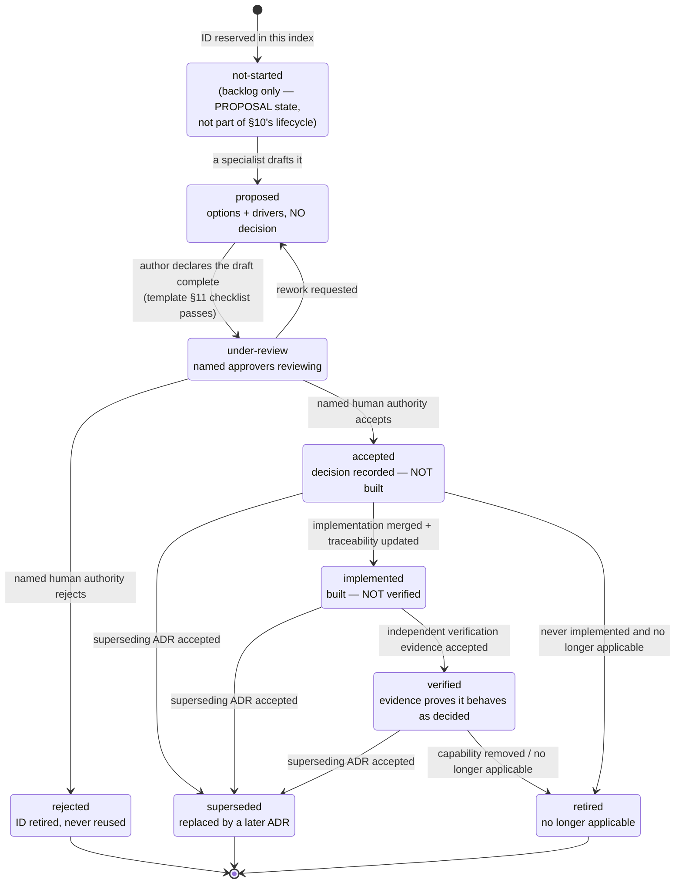
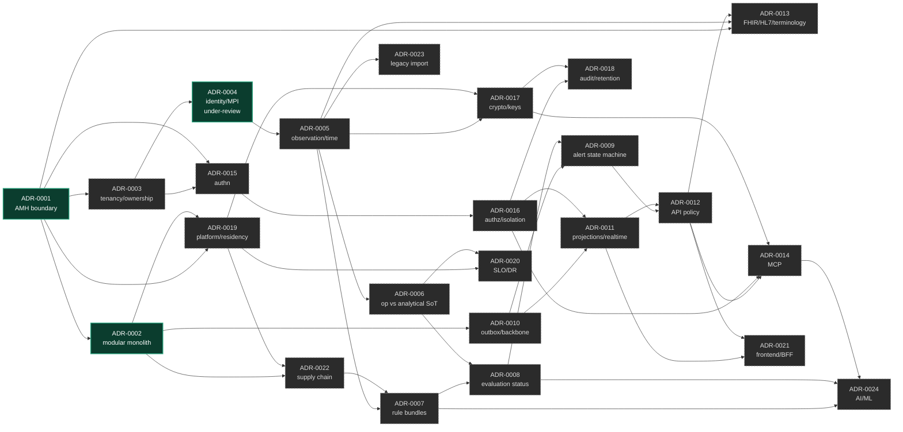

# ADR Index and Lifecycle — IntensiCare V2

**Status: PROPOSAL.** This index reserves the 24 ADR IDs required by
`INTENSICARE_V2_ORCHESTRATOR_PROMPT.md` §10 (lines 636–660), defines the lifecycle from
§10 line 618, and records the dependency, gate, and phase structure between them.

**Nothing in this file is itself a decision.** Three ADRs are drafted. `ADR-0001` and
`ADR-0002` are `proposed` and record no decision. **`ADR-0004` is `under-review`**: its
*direction* was decided by a named human authority (rodaquino-OMNI) on 2026-08-15 and the
written ADR now awaits that authority's acceptance — see
`../../00-governance/registers/g0-resolucoes-2026-08-15.md`. The other twenty-one are
`not-started`: the ID and topic are reserved, no draft exists, and no position is implied
by the reservation.

**Language policy (SOURCE: DEC-G0-10, 2026-08-15).** Material produced from 2026-08-15
onward is written in **pt-BR**. `ADR-0004` is therefore in pt-BR; `ADR-template.md`,
this index, `ADR-0001` and `ADR-0002` remain in English as valid cycle-0 corpus.
Retroactive translation is an open decision of the titular authority.

This file is the **single source of truth for the `ADR` prefix's next-available number**
(`docs/00-governance/traceability-policy.md` §2 rule 4). Next free ID: **ADR-0025**.

---

## 1. Files in this directory

| File | Purpose | Status |
|---|---|---|
| [`ADR-template.md`](./ADR-template.md) | Mandatory field set and authoring rules per §10 | PROPOSAL |
| [`adr-index.md`](./adr-index.md) | This file — lifecycle, backlog, dependency graph | PROPOSAL |
| [`ADR-0001-amh-platform-boundary.md`](./ADR-0001-amh-platform-boundary.md) | Options for the AMH platform boundary (§7.3) | proposed |
| [`ADR-0002-modular-monolith-and-extraction-criteria.md`](./ADR-0002-modular-monolith-and-extraction-criteria.md) | Modular-monolith baseline and service-extraction criteria (§9.1 principle 8) | proposed |
| [`ADR-0004-identidade-paciente-encontro-mpi.md`](./ADR-0004-identidade-paciente-encontro-mpi.md) | Patient/encounter/MPI identity, boundary identifier, merge/unmerge semantics (§7.4) — **pt-BR** | **under-review** (direction decided 2026-08-15) |

---

## 2. Lifecycle

SOURCE (`INTENSICARE_V2_ORCHESTRATOR_PROMPT.md` §10, line 618):

> Create an ADR index and lifecycle: `proposed → under-review → accepted/rejected →
> implemented → verified → superseded/retired`. "Accepted" does not mean implemented;
> "implemented" does not mean verified.

### 2.1 State definitions and who may transition

| State | Meaning | Who may enter this state | Hard rule |
|---|---|---|---|
| `not-started` | ID and topic reserved in this index; no draft exists. **PROPOSAL — this state is an addition by this ADR program, not one of §10's states.** It exists so the 24 required IDs can be reserved without implying any draft or position. | ADR-program engineer (index only) | Reserving an ID is not a commitment to any answer |
| `proposed` | A complete draft exists per the template. Options and drivers only. | Any specialist agent within its write scope | **No agent may go further than this state** (`docs/00-governance/decision-rights.md` §1.2) |
| `under-review` | The named approvers are actively reviewing. | The ADR owner (a human role) | Requires named approvers; a review with no named reviewer is not a review |
| `accepted` | The named authority has decided. | Only the deciding authority in `decision-rights.md` §2 | **Accepted ≠ implemented.** No code, schema, or infrastructure exists by virtue of acceptance |
| `rejected` | The named authority declined the proposal. | Only the deciding authority | The ID is retired, never reused (`traceability-policy.md` §2 rule 2) |
| `implemented` | The decision is built and merged, with traceability updated. | Implementer + reviewer | **Implemented ≠ verified.** No evidence claim is made by this state |
| `verified` | Independent evidence demonstrates the built system behaves as decided. | The independent verifier, never the implementer (`decision-rights.md` §3) | Self-verification is prohibited |
| `superseded` | A later accepted ADR replaces it, wholly or in part. | Deciding authority of the superseding ADR | Both ADRs record the relationship (`supersedes` / `superseded_by`) |
| `retired` | No longer applicable (capability removed, scope dropped). | The ADR owner with the deciding authority | Retirement requires a reason, not silence |

### 2.2 Transition rules

1. **One transition per change.** Never advance two states in a single edit; each
   transition needs its own evidence and its own `status_history` entry.
2. **No self-approval.** The author of an ADR may not be an approver of it
   (`decision-rights.md` §3). The implementer may not be its verifier.
3. **No agent writes `accepted` or later.** An agent that believes an ADR is ready writes
   `under-review` at most, and only when a human owner has been named.
4. **Silence is not consent** (`evidence-notation.md` §2 rule 3, restated in
   `decision-rights.md` §1.4). A `proposed` ADR does not become accepted by age.
5. **A blocked gate stays blocked.** A gate listed in the "blocks gate" column below
   cannot close while its ADR is in any state before `accepted`. `accepted` alone does not
   close a gate that also requires `verified` evidence — see the gate's own conditions in
   the prompt.
6. **Status here and in the ADR file must match.** A divergence is a review-blocking
   defect.

---

## 3. Backlog — the 24 required ADRs

SOURCE (`INTENSICARE_V2_ORCHESTRATOR_PROMPT.md` §10, lines 636–660): "At minimum, resolve
ADRs for:" — the twenty-four topics below, in the prompt's own order. The ID assignment
`ADR-000N ↔ §10 item N` is a PROPOSAL by this program (the prompt numbers the topics but
does not assign ADR IDs); it is chosen so the mapping is verifiable at a glance.

Column meanings:

- **Blocks gate** — the stage gate that cannot close while this ADR is unresolved
  (INFERENCE, from the gate conditions in prompt §5–§15 and the phase table in §17).
- **Earliest phase** — the earliest §17 phase at which the evidence needed to decide it
  could exist. This is not a schedule; it is a prerequisite statement.
- **Decision owner** — `UNASSIGNED` for all 24. The *candidate* deciding authority is a
  role ID from `docs/00-governance/authority-model.md`, proposed per
  `decision-rights.md` §2, and is not an assignment.

| ID | §10 | Topic | Status | Blocks gate | Earliest phase | Decision owner | Candidate authority (PROPOSAL) |
|---|---|---|---|---|---|---|---|
| [ADR-0001](./ADR-0001-amh-platform-boundary.md) | 1 | Intended platform boundary with AMH-data | **proposed** | G3 | 3 | UNASSIGNED | `AUTH-DATA-PLATFORM` + `AUTH-AMH-OWNER` (joint) |
| [ADR-0002](./ADR-0002-modular-monolith-and-extraction-criteria.md) | 2 | Modular monolith and service-extraction criteria | **proposed** | G4 | 4 | UNASSIGNED | `AUTH-PRODUCT` + `AUTH-OPERATIONS` |
| ADR-0003 | 3 | Tenant / organization / facility and resource-ownership model | not-started | G3, G6 | 3 | UNASSIGNED | `AUTH-DATA-PLATFORM` + `AUTH-SECURITY` |
| [ADR-0004](./ADR-0004-identidade-paciente-encontro-mpi.md) | 4 | Patient/encounter/MPI identity, boundary identifier and merge/unmerge handling | **under-review** (2026-08-15) | G3 | 3 | **rodaquino-OMNI** | `AUTH-DATA-PLATFORM` + `AUTH-AMH-OWNER` — both held by rodaquino-OMNI per DEC-G0-04 |
| ADR-0005 | 5 | Canonical observation, provenance, quality, correction, and time model | not-started | G3, G4 | 3 | UNASSIGNED | `AUTH-DATA-PLATFORM` + `AUTH-CLINSAFETY` |
| ADR-0006 | 6 | Operational versus analytical source-of-truth and reconciliation | not-started | G3 | 3 | UNASSIGNED | `AUTH-DATA-PLATFORM` + `AUTH-CLINSAFETY` |
| ADR-0007 | 7 | Rule bundle format, signing, approval, activation, rollback, retirement | not-started | G2, G6 | 2 | UNASSIGNED | `AUTH-CLINSAFETY` + `AUTH-SECURITY` |
| ADR-0008 | 8 | Evaluation-status semantics; score/pathway completeness and freshness | not-started | G2, G4 | 2 | UNASSIGNED | `AUTH-CLINSAFETY` |
| ADR-0009 | 9 | Alert/work state machine, concurrency, idempotency, audit, escalation timers | not-started | G4 | 4 | UNASSIGNED | `AUTH-CLINSAFETY` + `AUTH-UX` |
| ADR-0010 | 10 | Transaction/outbox/event backbone and delivery guarantees | not-started | G4, G7 | 4 | UNASSIGNED | `AUTH-PRODUCT` + `AUTH-OPERATIONS` |
| ADR-0011 | 11 | Read projections and authorized real-time delivery | not-started | G4 | 4 | UNASSIGNED | `AUTH-PRODUCT` + `AUTH-SECURITY` |
| ADR-0012 | 12 | API versioning, error model, idempotency, pagination, compatibility policy | not-started | G4 | 4 | UNASSIGNED | `AUTH-PRODUCT` |
| ADR-0013 | 13 | FHIR R4/SMART, HL7 v2, terminology, and writeback profiles | not-started | G5 | 5 | UNASSIGNED | `AUTH-DATA-PLATFORM` + `AUTH-CLINSAFETY` |
| ADR-0014 | 14 | MCP exposure, permitted tool classes, human confirmation, PHI policy | not-started | G5, G6 | 5 | UNASSIGNED | `AUTH-SECURITY` + `AUTH-PRIVACY-LEGAL` + `AUTH-CLINSAFETY` |
| ADR-0015 | 15 | Authentication/session model and machine-to-machine identity | not-started | G5, G6 | 5 | UNASSIGNED | `AUTH-SECURITY` |
| ADR-0016 | 16 | Authorization and tenant-isolation enforcement | not-started | G6 | 5 | UNASSIGNED | `AUTH-SECURITY` |
| ADR-0017 | 17 | Encryption / key management and searchable-PHI tradeoffs | not-started | G6 | 5 | UNASSIGNED | `AUTH-SECURITY` + `AUTH-PRIVACY-LEGAL` |
| ADR-0018 | 18 | Audit integrity, retention, legal hold, correction, evidence export | not-started | G6 | 5 | UNASSIGNED | `AUTH-PRIVACY-LEGAL` + `AUTH-SECURITY` |
| ADR-0019 | 19 | Deployment platform, environments, data residency, network boundaries | not-started | G6, G8 | 5 | UNASSIGNED | `AUTH-OPERATIONS` + `AUTH-PRIVACY-LEGAL` |
| ADR-0020 | 20 | Observability, SLOs, readiness, degraded modes, backup, restore, DR | not-started | G8 | 5 | UNASSIGNED | `AUTH-OPERATIONS` |
| ADR-0021 | 21 | Frontend/BFF and generated-contract strategy | not-started | G4 | 4 | UNASSIGNED | `AUTH-UX` + `AUTH-PRODUCT` |
| ADR-0022 | 22 | Build, dependency, artifact-signing, and software-supply-chain strategy | not-started | G7, G8 | 0 (seed) / 6 (full) | UNASSIGNED | `AUTH-SECURITY` + `AUTH-OPERATIONS` |
| ADR-0023 | 23 | Legacy import policy and migration approach | not-started | G1, G7 | 1 | UNASSIGNED | `AUTH-PRODUCT` + `AUTH-CLINSAFETY` |
| ADR-0024 | 24 | AI/ML exclusion or governed inclusion, if applicable | not-started | G2, G6 | 2 | UNASSIGNED | `AUTH-CLINSAFETY` + `AUTH-SECURITY` + `AUTH-PRIVACY-LEGAL` |

**Twenty-four is a floor, not a ceiling.** SOURCE (prompt §10, line 636): "At minimum,
resolve ADRs for". New ADRs take IDs from ADR-0025 onward. Candidate additional topics
already visible from Wave-1 evidence are listed in §6.

---

## 4. Dependencies

### 4.1 Dependency table

"Depends on" means: the dependent ADR cannot reasonably be **accepted** before the
prerequisite is accepted, because the prerequisite fixes an input the dependent one
consumes. All entries are INFERENCE by this program, derived from the prompt sections
cited in each ADR's topic; they are a proposed ordering, not a schedule.

| ID | Depends on | Feeds | Basis for the dependency |
|---|---|---|---|
| ADR-0001 | — (evidence only: Gate G3 layers, AMH owner) | 0002, 0003, 0004, 0005, 0006, 0013, 0015, 0019 | The boundary fixes what V2 owns, hosts, and is accountable for (§7.3) |
| ADR-0002 | 0001 (only option (b) materially changes it) | 0010, 0011, 0019, 0021, 0022 | Deployment unit shapes the backbone, projections, platform, supply chain (§9.1 p8) |
| ADR-0003 | 0001 | 0004, 0011, 0015, 0016, 0017, 0018 | Tenant grain must match the boundary; AMH's grain is root CNPJ (§7.4, evidence 7) |
| ADR-0004 | 0001, 0003 (**drafted ahead of both** — see note below) | 0005, 0009, 0013, 0015, 0016, 0018 | Identity is scoped by tenant. The ADR-006/039/041/IG/043/042 six-way contradiction **was adjudicated 2026-08-15** and ADR-0004 records the resulting model |
| ADR-0005 | 0003, 0004 | 0006, 0007, 0008, 0010, 0013, 0017, 0018, 0023 | Canonical facts need an owner, a subject, and a tenant before they have a shape (§9.3) |
| ADR-0006 | 0001, 0005 | 0008, 0010, 0020 | Precedence/conflict/replay rules presuppose the boundary and the fact model (§7.3) |
| ADR-0007 | 0005, 0022 | 0008, 0024 | Bundles carry terminology snapshots and require artifact signing (§6.4, §15.1) |
| ADR-0008 | 0005, 0006, 0007 | 0009, 0011, 0021 | Status semantics depend on fact quality, source-of-truth, and rule versioning (§7.6) |
| ADR-0009 | 0008, 0010 | 0011, 0012, 0021 | Alert states consume evaluation status and need transactional publication (DOM-0005) |
| ADR-0010 | 0002, 0005 | 0009, 0011, 0020 | Backbone shape follows the deployment unit and the durable fact model (§9.1 p6) |
| ADR-0011 | 0010, 0016 | 0012, 0021 | Projections are rebuilt from durable events and must be authorization-scoped (§9.4) |
| ADR-0012 | 0009, 0011 | 0013, 0014, 0021 | The public contract exposes the state machine and projections (§12.1) |
| ADR-0013 | 0001, 0005, 0012 | 0023 | Profiles bind to the canonical model and the boundary's interop obligations (§12.2) |
| ADR-0014 | 0012, 0016, 0017 | — | MCP reuses first-party identity, authorization, and PHI policy (§12.4) |
| ADR-0015 | 0001, 0003 | 0014, 0016, 0021 | Auth must match the deployed AMH mechanism (contradiction C-2) and tenant grain |
| ADR-0016 | 0003, 0015 | 0011, 0014, 0018 | Enforcement presupposes ownership model and trusted identity context (§7.4) |
| ADR-0017 | 0005, 0019 | 0014, 0018 | Key management is bound to residency and the fact model's searchability needs (§13) |
| ADR-0018 | 0005, 0016, 0017 | 0020, 0023 | Audit integrity depends on the fact model, enforcement, and key custody (§13) |
| ADR-0019 | 0001, 0002 | 0017, 0020, 0022 | Platform/residency follows the boundary and the deployment unit (§9.4, §15.2) |
| ADR-0020 | 0006, 0019, quality-attribute targets (G1) | — | SLOs need validated needs and a platform to measure on (§15.3) |
| ADR-0021 | 0011, 0012 | — | The UI contract is generated from or validated against the API contract (§11) |
| ADR-0022 | 0002, 0019 | 0007, 0020 | Build/signing follows the deployment unit and platform; bundles need signing (§15.1) |
| ADR-0023 | 0005, governance `legacy-import-policy.md` | 0013, 0018 | Import targets the canonical model under an accepted import policy (§3 rules 3–5) |
| ADR-0024 | 0007, 0008, 0014 | — | Any governed ML sits beside the deterministic kernel and inside MCP/PHI policy (§12.4, §14) |

### 4.2 Dependency graph

### 4.3 Critical-path observation

INFERENCE (from §4.1 and the Wave-1 dossier): **ADR-0001 is the single most upstream
node** — eight ADRs depend on it directly and every other ADR depends on it transitively
except ADR-0023. It is also the ADR whose acceptance conditions are least under V2's
control: `docs/08-interoperability/amh-data/compatibility-finding.md` §5 records that six
of the eight conditions required to change the AMH compatibility finding require an
AMH-owner act or an AMH environment.

**Consequence for sequencing (PROPOSAL):** a plan that serializes all architecture work
behind ADR-0001's acceptance will stall on an external dependency. The alternative is not
to accept ADR-0001 early — that is prohibited without Gate G3 evidence — but to design the
dependent ADRs so their options remain open under every ADR-0001 option, and to record
that requirement explicitly in each. This is a scheduling proposal for the orchestrator,
not a decision.

---

## 5. Gate map

Which ADRs each gate is waiting on (INFERENCE, from the gate conditions in the prompt):

| Gate | Prompt § | ADRs that must be resolved before it can close |
|---|---|---|
| G0 — authority and access | §5 | none (governance artifacts, not ADRs) — but ADR-0022 seed CI is expected in phase 0 |
| G1 — problem and intended use | §5 | ADR-0023 (what legacy material may inform intended use) |
| G2 — pathway portfolio | §6 | ADR-0007, ADR-0008, ADR-0024 |
| G3 — AMH compatibility | §7 | ADR-0001, ADR-0003, ADR-0004, ADR-0005, ADR-0006 |
| G4 — UX/domain/API coherence | §11 | ADR-0002, ADR-0009, ADR-0010, ADR-0011, ADR-0012, ADR-0021 |
| G5 — connector conformance | §12 | ADR-0013, ADR-0014, ADR-0015 |
| G6 — safety/security design | §13 | ADR-0003, ADR-0007, ADR-0014, ADR-0015, ADR-0016, ADR-0017, ADR-0018, ADR-0019, ADR-0024 |
| G7 — first safe vertical slice | §14 | ADR-0010, ADR-0022, ADR-0023 |
| G8 — pilot and production | §15 | ADR-0019, ADR-0020, ADR-0022 |

**Reminder (SOURCE, prompt §10 line 618):** an `accepted` ADR does not satisfy a gate that
requires demonstrated behavior. G3, G5, G6, G7 and G8 all require evidence beyond
acceptance; several require a production-like environment that
`compatibility-finding.md` §4.4 records as **not currently existing on the AMH side**.

---

## 6. Candidate additional ADRs (not reserved, not numbered)

PROPOSAL — topics that Wave-1 evidence suggests may need their own ADR beyond §10's
twenty-four. Listed so they are not lost; **no IDs are minted for them**, because minting
implies a commitment this program has no authority to make.

| Candidate topic | Why it may be needed | Evidence |
|---|---|---|
| Non-AMH clinical-signal sourcing (device gateway / HL7 v2 / EHR-direct) | AMH provides no populated vitals or numeric labs at the pinned commit; if approved pathways need them, the source must come from somewhere | `compatibility-finding.md` §3 |
| Time authority and clock-skew policy | DOM-0009 forbids inventing timestamps; skew between source, AMH, and V2 is unmeasured | DOM-0009; prompt §7.1 |
| pt-BR clinical language and localization strategy | Prompt §11 requires pt-BR clinical language validation and a localization strategy | prompt §11 |
| Synthetic-data and test-fixture strategy | Prompt §3 rule 12 forbids PHI in development; the fixture corpus is itself a governed artifact | prompt §3 r12, §14 |
| Degraded-mode and downtime clinical procedure ownership | DOM-0007 requires explicit degradation at five levels; the operational procedure is not an engineering-only choice | DOM-0007; prompt §15.3 |
| Amendment of `traceability-policy.md` §1 to add a quality-attribute-scenario prefix | Quality-attribute scenarios currently carry document-local labels because no taxonomy prefix covers them | `../quality-attributes/quality-attribute-scenarios.md` §1.2 |

---

## 7. Open items for the orchestrator

1. **Decision owners exist as of 2026-08-15, and one human holds seven of them.** DEC-G0-01
   through DEC-G0-08 assign `AUTH-PRODUCT`, `AUTH-SECURITY` (design-phase only),
   `AUTH-DATA-PLATFORM`, the AMH-side authority, `AUTH-UX` and `AUTH-OPERATIONS` to
   rodaquino-OMNI on an interim basis; `AUTH-PRIVACY-LEGAL` is deliberately **not** filled
   and is reclassified to G6/G8 (DEC-G0-03), with development restricted to synthetic data
   until a Brazilian legal opinion exists. The "candidate authority" column above therefore
   resolves to a named human for every row except the privacy/legal ones. **Authority
   concentration is a recorded risk** — see the DEC-G0 integration notes and ADR-0004 §11.2.
   The implementer ≠ verifier pairs are untouched and remain the real control.
2. **No decision deadline is set for any ADR except ADR-0004**, whose direction was decided
   2026-08-15 and whose written acceptance must precede the AMH×IntensiCare v1 contract
   package. Prompt §10 makes `decision deadline` a mandatory field, so every other draft
   carries `UNSET — VALIDATION REQUIRED`: an open gap, not an oversight.
3. **ADR-0001's acceptance conditions are still mostly external.** See §4.3. Two of its
   twelve conditions moved on 2026-08-15 (C2 closed, C1 partially closed); the Gate G3
   evidence layers, the AMH environment and the contradictions C-1/C-3/C-4 did not.
4. **Twenty-one topics have no draft.** Their reservation here is bookkeeping. Any claim
   that "the ADR program covers 24 decisions" would be false: it *reserves* 24 and
   *drafts* 3 — of which **none is accepted**.
5. **ADR-0004 was drafted ahead of its stated prerequisites** (ADR-0001, ADR-0003) because
   the adjudication that unblocked it happened first. This is legitimate — the dependency
   table describes *acceptance* order, not drafting order — but ADR-0004's acceptance
   should be reconciled against ADR-0003's tenant/ownership model when that is written.
