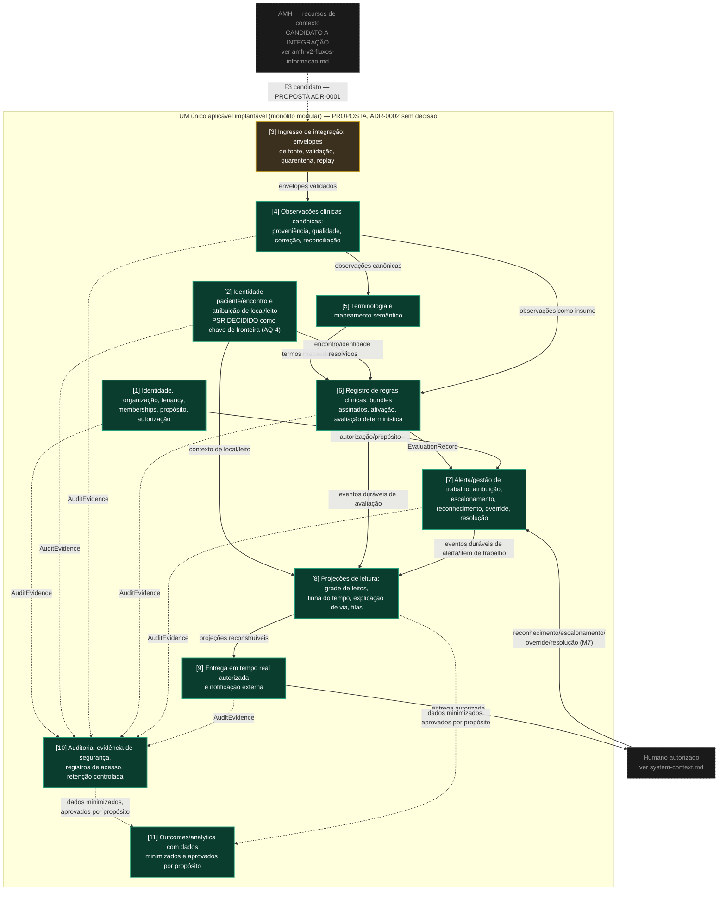

# IntensiCare V2 — Mapa de contextos delimitados e dependência de módulos

**Status: PROPOSAL.** Este diagrama renderiza os onze contextos delimitados candidatos
do prompt §9.2 como **módulos dentro de UMA única aplicação implantável** (monólito
modular por padrão — princípio §9.1.8), com a direção de dependência entre eles. Ele
**não decide** extração de serviços: [ADR-0002](../adrs/ADR-0002-modular-monolith-and-extraction-criteria.md)
(monólito modular e critérios de extração) permanece `proposed`, sem decisão. Nenhuma
fronteira de rede é implicada por uma seta neste diagrama.

## 1. Como ler

- Uma seta **A → B** significa "A depende de B" (A importa/consome a API de módulo de
  B), nunca uma chamada de rede — todos os módulos vivem no mesmo processo/implantável
  por padrão (§9.1.8).
- `DOM-0001` (posse de tenant/encontro) é um invariante **transversal**: toda seta deve
  preservá-lo através de identidade, armazenamento, cache, evento, consulta, assinatura
  e auditoria — não é desenhado como módulo porque não é um contexto delimitado, é uma
  restrição que atravessa todos eles.
- A numeração `[N]` de cada módulo corresponde à posição na lista do prompt §9.2.

## 2. Diagrama

## 3. Direção de dependência e por que cada seta existe

| De | Para | Por que (fonte) |
|---|---|---|
| Ingresso [3] | Observações canônicas [4] | `SourceEnvelope → yields → ClinicalObservation` (`conceptual-model.md` cluster 4) |
| Observações [4] | Terminologia [5] | Observação precisa de mapeamento semântico antes de ser insumo de regra (`RuleVersion → bound to → TerminologySnapshot`) |
| Terminologia [5] + Identidade/encontro [2] + Observações [4] | Registro de regras [6] | `Encounter + Observations + RuleVersion → EvaluationRecord` (`conceptual-model.md` cluster 6; §9.3) |
| Registro de regras [6] (via EvaluationRecord) | Alerta/trabalho [7] | `EvaluationRecord → may raise → Alert/WorkItem` (§9.3) |
| Identidade/org/tenancy [1] | Alerta/trabalho [7] | Toda ação (`Action`) requer `Membership` válida — precondição de autorização (`conceptual-model.md` cluster 2) |
| Identidade paciente/encontro [2] + Registro de regras [6] + Alerta/trabalho [7] | Projeções [8] | `Durable events → RebuildableProjection` (§9.3; DOM-0006 — durabilidade precede imediatismo) |
| Projeções [8] | Entrega em tempo real [9] | `RebuildableProjection → feeds → Authorized UI/notification` (§9.3) |
| Entrega [9] | Humano | F1 do diagrama de contexto (`system-context.md` §2) |
| Humano | Alerta/trabalho [7] | Reconhecimento/escalonamento/override/resolução — ações de humano autorizado sobre `WorkItem` (`glossary.md` §5) |
| (quase) todos os módulos | Auditoria [10] | "Every read/change/decision/action → AuditEvidence" (§9.3; DOM-0001, DOM-0005) — desenhado seletivamente (mesma prática de `conceptual-model.md`) para manter legibilidade |
| Auditoria [10] + Projeções [8] | Outcomes/analytics [11] | "dados minimizados e aprovados por propósito" (prompt §9.2 item 11) — este módulo **não é desenhado** em `conceptual-model.md`; incluído aqui por ser um dos 11 contextos exigidos pelo §9.2 |
| AMH (externo) | Ingresso [3] | Fluxo F3 candidato do `amh-v2-fluxos-informacao.md` — tracejado porque depende de ADR-0001 |

## 4. O que este diagrama afirma e o que não afirma

**Afirma:**

- Os onze contextos delimitados são **exatamente** os listados no prompt §9.2, sem
  adição nem remoção.
- A direção de dependência entre módulos que **têm** relação explícita em
  `conceptual-model.md` §9.3 é reproduzida fielmente.
- `DOM-0001` (posse de tenant/encontro) é citado como invariante transversal, não como
  módulo — não há contexto delimitado "tenancy enforcement" separado no prompt §9.2.
- O contrato de fronteira com AMH permanece `PROPOSTA` — a seta de ingresso é tracejada.

**Não afirma:**

- Que qualquer módulo tenha sido implementado. Nenhum código existe (ver
  `docs/14-devsecops-and-delivery/ci-policy.md` §1 — nenhum build, nenhum runtime).
- Que a fronteira entre "módulo" e "serviço extraído" seja definitiva — isso é
  precisamente o que `ADR-0002` resolveria, e ele não decidiu nada.
- Que o módulo [11] Outcomes/analytics tenha qualquer mecanismo de minimização/propósito
  desenhado — a frase "dados minimizados e aprovados por propósito" é citada do prompt,
  não especificada aqui.
- Que a dependência de [9] Entrega em tempo real sobre um "gateway autorizado" tenha
  qualquer transporte, protocolo ou vendor escolhido (ADR-0011, não iniciado).

## 5. Proveniência

| Elemento | Fonte |
|---|---|
| Lista dos 11 contextos delimitados | `INTENSICARE_V2_ORCHESTRATOR_PROMPT.md` §9.2 |
| Monólito modular por padrão; extração só via ADR com gatilho quantitativo | `INTENSICARE_V2_ORCHESTRATOR_PROMPT.md` §9.1 princípio 8; §9.2 último parágrafo |
| Relações estruturais entre entidades (base das setas de dependência) | `docs/03-domain/conceptual-model.md` §9.3, clusters BC1-BC9 |
| Monólito modular como ADR sem decisão | `docs/06-architecture/adrs/ADR-0002-modular-monolith-and-extraction-criteria.md` (`status: proposed`) |
| DOM-0001 como invariante transversal | `docs/03-domain/invariants/DOM-invariants.md` DOM-0001 |
| PSR como chave de fronteira decidida | `docs/06-architecture/adrs/ADR-0001-amh-platform-boundary.md` §2.4 R1 |
| Fluxo AMH candidato tracejado | `docs/06-architecture/containers/amh-v2-fluxos-informacao.md` |

## 6. O que este diagrama deliberadamente não faz

- Não decide se algum módulo será extraído como serviço de rede.
- Não escolhe tecnologia de mensageria, banco de dados, ou framework.
- Não define contratos de API entre módulos (matéria de ADR-0012/futuro trabalho de
  API interna).
