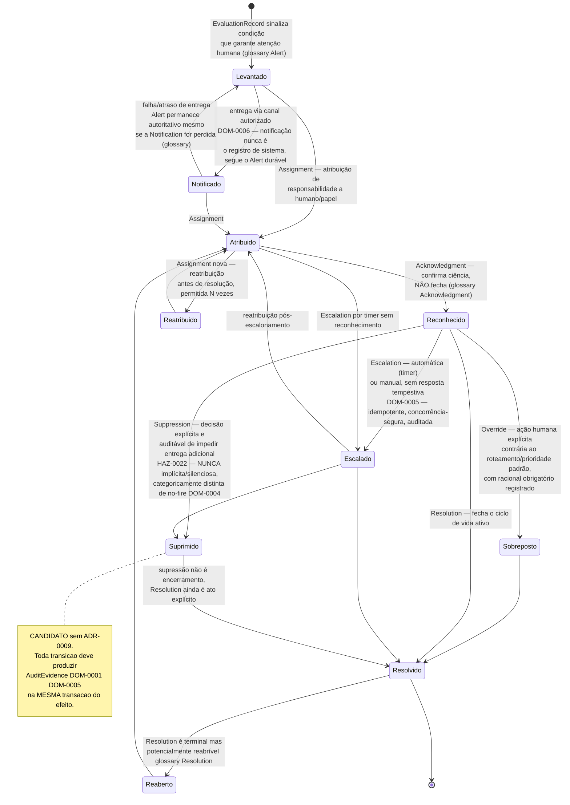

# IntensiCare V2 — Máquina de estados: alerta e ação humana

**Status: PROPOSAL — CANDIDATO, sem ADR próprio.** O prompt §10 item 9 reserva
**`ADR-0009`** exatamente para "alert/work state machine, concurrency, idempotency,
audit, escalation timers" — e `adr-index.md` §1 registra `ADR-0009` como **`not-started`**
(nenhum rascunho existe, nenhuma posição é implícita pela reserva do ID). **Este
diagrama, portanto, não deriva de nenhuma decisão nem de nenhum rascunho de ADR** — é
construído inteiramente a partir de (a) a cadeia de entidades do modelo conceitual
(`conceptual-model.md` cluster 7), (b) as definições de termo em `glossary.md` §5, e
(c) os invariantes de domínio DOM-0004/0005/0006/0007 e o hazard HAZ-0022. **Toda
transição abaixo é candidata — nenhuma foi ratificada, e este diagrama não decide nada
que `ADR-0009` deveria decidir.**

## 1. Legenda

| Marcação | Significado |
|---|---|
| **CANDIDATO** | Estado/transição inferido do modelo conceitual e do glossário — nenhum ADR o decide. |
| ◆ | Cita o invariante DOM/hazard que a transição deve honrar quando implementada. |

## 2. Diagrama

## 3. Estados, sua fonte no glossário e o que cada um proíbe

| Estado (candidato) | Definição-fonte | O que NÃO pode acontecer |
|---|---|---|
| **Levantado** | `Alert` — "registro durável e explicável... produzido quando um `EvaluationRecord` sinaliza uma condição que garante atenção humana" (`glossary.md` §5 *Alert*) | Um Alert nunca é levantado a partir de um status `not_evaluated`/`stale`/`invalid` lido como severidade — a leitura de severidade só é permitida quando o status V2 é `valid`, ou `partial` sob política ratificada (`evaluation-status-semantics.md` §2) |
| **Notificado** | `Notification` — "evento de canal de entrega... nunca é o registro de sistema" (`glossary.md` §5 *Notification*) | Uma Notification perdida/atrasada nunca é tratada como equivalente a um Alert perdido — o registro durável permanece autoritativo (DOM-0006) |
| **Atribuído / Reatribuído** | `Assignment` — "atribuir responsabilidade... pode ser reatribuído múltiplas vezes antes da resolução" (`glossary.md` §5 *Assignment*) | Atribuição não é o mesmo que ciência (`Acknowledgment`) nem que fechamento (`Resolution`) |
| **Reconhecido** | `Acknowledgment` — "confirma ciência, não necessariamente resolve" (`glossary.md` §5 *Acknowledgment*) | Um Work Item reconhecido pode ainda ser escalado, sobreposto ou resolvido — reconhecimento não é estado terminal |
| **Escalado** | `Escalation` — "automática (timer) ou manual... não fecha por si só o Work Item" (`glossary.md` §5 *Escalation*) | Escalonamento muda roteamento/urgência; nunca substitui `Resolution` |
| **Sobreposto** | `Override` — "ação humana explícita contra o roteamento padrão, com racional registrado" (`glossary.md` §5 *Override*) | Distinto de `Suppression`: Override é uma decisão pontual e auditável sobre um item específico, nunca um padrão de silenciamento |
| **Suprimido** | `Suppression` — "prevenir deliberadamente entrega/escalonamento adicional, sempre como decisão explícita e auditável" (`glossary.md` §5 *Suppression*) | **Nunca** implementada como no-fire silencioso — DOM-0004 proíbe que dado ausente/inválido produza ausência de alerta sem traço visível; HAZ-0022 registra o hazard de supressão não visível/auditável |
| **Resolvido / Reaberto** | `Resolution` — "estado terminal, porém potencialmente reaberto" (`glossary.md` §5 *Resolution*) | Resolução é distinta de reconhecimento (ciência) e de supressão (entrega impedida sem necessariamente estar endereçada) |

## 4. O que este diagrama afirma e o que não afirma

**Afirma:**

- Cada estado e transição nomeados aqui tem uma definição-fonte rastreável em
  `glossary.md` §5 ou em um invariante `DOM-xxxx`/hazard `HAZ-xxxx`.
- Nenhum estado permite leitura de severidade fora da regra "safety state precedes
  severity" (prompt §9.1 princípio 1).
- Supressão é sempre um ato explícito e auditável — nunca um caminho para no-fire
  silencioso (DOM-0004, HAZ-0022).

**Não afirma:**

- Que esta seja a máquina de estados final. `ADR-0009` está `not-started`; qualquer
  estado, transição, temporizador de escalonamento, ou regra de concorrência aqui
  desenhada pode ser alterada, dividida ou rejeitada quando esse ADR for redigido e
  decidido.
- Que os temporizadores de escalonamento tenham qualquer valor numérico definido —
  nenhum é proposto aqui.
- Que qualquer transição tenha sido implementada. Nenhum código de gestão de
  alerta/trabalho existe (`ci-policy.md` §1).
- Que "reabertura" (`Reaberto`) seja uma decisão consolidada — é uma inferência da frase
  "terminal (though potentially reopenable)" do glossário, não uma regra com condições
  de entrada definidas.

## 5. Proveniência

| Elemento | Fonte |
|---|---|
| `ADR-0009` reservado, `not-started` | `docs/06-architecture/adrs/adr-index.md` §1, §3 |
| Cadeia `EvaluationRecord → Alert/WorkItem → Action/Assignment/Escalation/Resolution` | `docs/03-domain/conceptual-model.md` §9.3, cluster 7 |
| Definições de Alert/Notification/Acknowledgment/Escalation/Assignment/Override/Resolution/Suppression | `docs/03-domain/glossary.md` §5 |
| Durabilidade precede imediatismo (Notification nunca é o registro) | `docs/03-domain/invariants/DOM-invariants.md` DOM-0006 |
| Comandos idempotentes/concorrência-seguros/auditados | `docs/03-domain/invariants/DOM-invariants.md` DOM-0005 |
| Nunca coerção a no-fire silencioso | `docs/03-domain/invariants/DOM-invariants.md` DOM-0004 |
| Supressão deve ser visível/auditável | `docs/05-clinical-safety/hazard-log.md` linha HAZ-0022 |
| Safety state precede severidade | `INTENSICARE_V2_ORCHESTRATOR_PROMPT.md` §9.1 princípio 1 |

## 6. O que este diagrama deliberadamente não faz

- Não decide o modelo de concorrência, os temporizadores de escalonamento, ou a
  política de idempotência — matéria de `ADR-0009`, não iniciado.
- Não nomeia donos de estado nem papéis autorizados a cada transição.
- Não escolhe tecnologia de fila/evento para publicar as transições.
