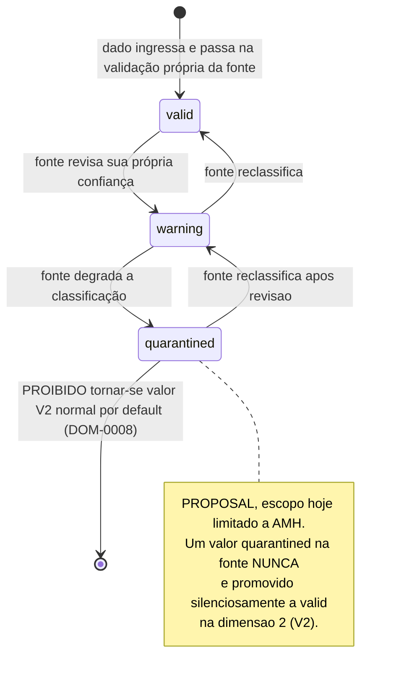
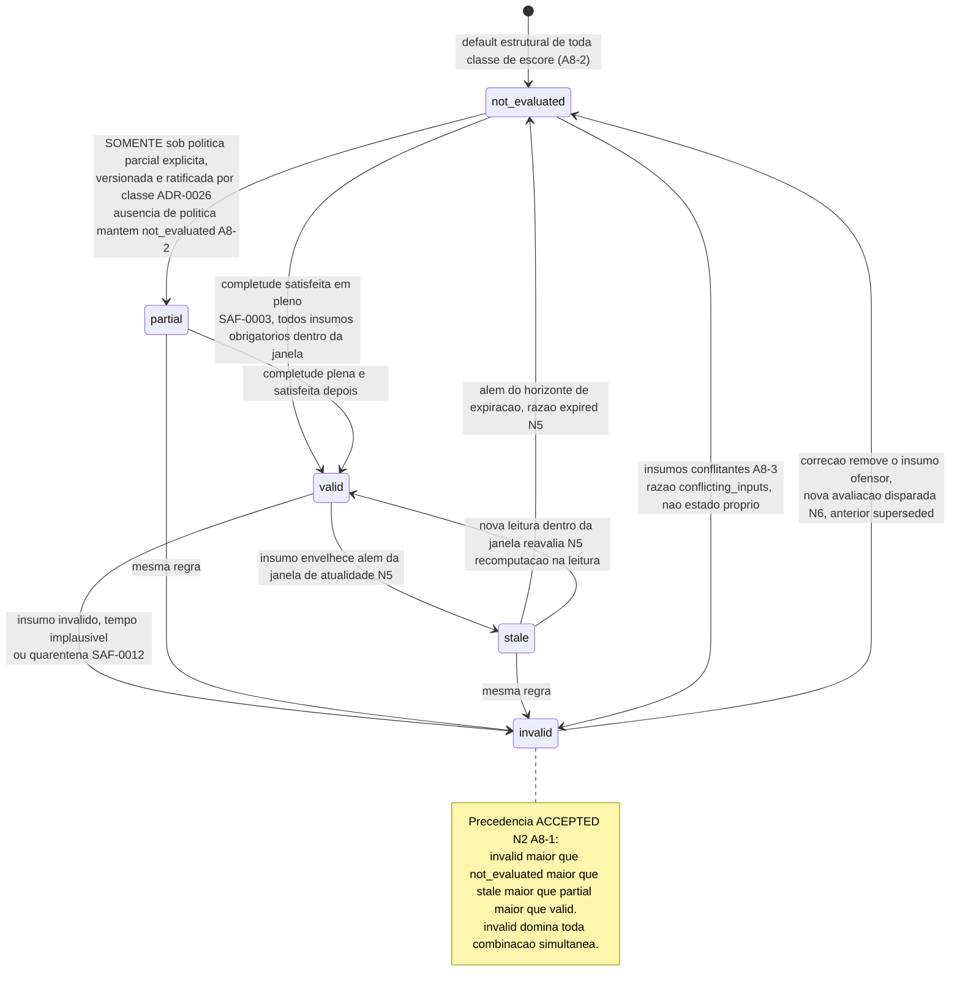

# IntensiCare V2 — Máquina de estados: qualidade de dado (fonte) × status de avaliação (V2)

**Status: PROPOSAL quanto a este artefato; DUAS FONTES DE AUTORIDADE DISTINTAS por
dimensão.** SOURCE (prompt §7.6): *"Keep two independent status dimensions throughout
mapping... Define an explicit mapping matrix but never collapse the dimensions."* Este
diagrama desenha as **duas máquinas separadamente**, nunca uma única máquina combinada
— desenhá-las fundidas seria precisamente o erro que `DOM-0008` proíbe.

| Dimensão | Autoridade normativa | Status |
|---|---|---|
| 1 — Qualidade de dado da fonte (`valid \| warning \| quarantined`, hoje só evidenciada para AMH) | `status-dimensions.md` §Dimension 1 | PROPOSAL — vocabulário observado do lado AMH, não ratificado como modelo geral de "qualquer fonte" |
| 2 — Status de avaliação V2 (`valid \| partial \| not_evaluated \| stale \| invalid`) | [`ADR-0008`](../adrs/ADR-0008-evaluation-status-and-completeness-freshness-semantics.md) | **ACCEPTED (2026-08-15, GDEC-0007)** — a álgebra (precedência, agregação, transições) é decisão do revisor clínico nomeado; os LIMIARES numéricos (janela/horizonte) permanecem `VALIDATION REQUIRED` |
| Matriz de mapeamento entre as duas dimensões | `status-dimensions.md` "Placeholder" | **TODAS AS CÉLULAS TBD — VALIDATION REQUIRED.** Nenhuma célula é preenchida por este diagrama nem por nenhum documento existente |

## 1. Diagrama — Dimensão 1: qualidade de dado da fonte (AMH, hoje)

## 2. Diagrama — Dimensão 2: status de avaliação V2 (ACCEPTED, GDEC-0007)

## 3. A matriz de mapeamento — deliberadamente vazia

SOURCE (`status-dimensions.md` §Placeholder): a matriz é exigida pelo prompt §7.6, mas
seu preenchimento **está fora da autoridade decisória deste documento e deste
diagrama** — pertence conjuntamente ao arquiteto de compatibilidade AMH-dados e a um
engenheiro de segurança nomeado, ambos `UNASSIGNED`.

| Qualidade de fonte ↓ / Status V2 → | `valid` | `partial` | `not_evaluated` | `stale` | `invalid` |
|---|---|---|---|---|---|
| **`valid`** (AMH) | TBD — VALIDATION REQUIRED | TBD — VALIDATION REQUIRED | TBD — VALIDATION REQUIRED | TBD — VALIDATION REQUIRED | TBD — VALIDATION REQUIRED |
| **`warning`** (AMH) | TBD — VALIDATION REQUIRED | TBD — VALIDATION REQUIRED | TBD — VALIDATION REQUIRED | TBD — VALIDATION REQUIRED | TBD — VALIDATION REQUIRED |
| **`quarantined`** (AMH) | TBD — VALIDATION REQUIRED | TBD — VALIDATION REQUIRED | TBD — VALIDATION REQUIRED | TBD — VALIDATION REQUIRED | TBD — VALIDATION REQUIRED |

**Regra de não-default explícita (SOURCE, `status-dimensions.md`):** até que a matriz
seja preenchida e ratificada, nenhuma implementação pode assumir qualquer mapeamento
padrão — em particular, não pode assumir que ausência de mapeamento significa "tratar
como `valid`" ou "herdar o valor AMH inalterado". Uma combinação não mapeada **falha
fechada** para `not_evaluated` ou `invalid` explícito, com razão visível (N3 do
`ADR-0008`), nunca um default silencioso.

## 4. Por que as duas máquinas nunca se fundem

1. **Perguntas diferentes, avaliadores diferentes.** Dimensão 1 responde "a fonte
   confia no que nos enviou?"; dimensão 2 responde "a V2 pode confiar na determinação
   que acabou de computar, agora, para esta via específica?" (`status-dimensions.md`
   §"Why the two dimensions must never be collapsed", item 1).
2. **Um fato fonte-`valid` pode ser V2-`stale` ou V2-insuficiente** — a idade e a
   completude são propriedades de dimensão 2, não herdadas de dimensão 1
   (`status-dimensions.md` item 2).
3. **Um fato fonte-`quarantined` nunca pode se tornar um valor V2 normal por default**
   — é exatamente o tipo de falha que `DOM-0004` (coerção a normal) existe para
   impedir (`status-dimensions.md` item 3; `DOM-invariants.md` DOM-0008).
4. **Evolução independente.** O vocabulário de dimensão 1 pode crescer/mudar por fonte
   (AMH hoje; outras fontes no futuro, cada uma com seu próprio vocabulário); o
   vocabulário de dimensão 2 é fixado pela governança deste programa e não pode ser
   redefinido por este documento (`status-dimensions.md` item 4).
5. **Auditabilidade.** Toda `AuditEvidence` de um `EvaluationRecord` deve poder mostrar
   **ambos** os estados que contribuíram para uma determinação, para que uma revisão de
   incidente distinga "a fonte nos disse que isso era ruim" de "a V2 julgou isso
   insuficiente por razões próprias" (`status-dimensions.md` item 5).

## 5. O que este diagrama afirma e o que não afirma

**Afirma:**

- A álgebra da dimensão 2 (precedência N2, transições N5, correção N6, fallback N9) é
  **decisão aceita** (GDEC-0007, `ADR-0008`) — não proposta pendente.
- A dimensão 1, tal como descrita, é **PROPOSAL** — vocabulário `valid | warning |
  quarantined` observado apenas para AMH, sem generalização ratificada para outras
  fontes futuras.
- A matriz de mapeamento entre as duas dimensões está **inteiramente vazia** — nenhuma
  célula tem valor, nem mesmo um valor proposto.
- Uma combinação não mapeada falha fechada, nunca assume "valid" por omissão.

**Não afirma:**

- Que os limiares numéricos de janela/horizonte de atualidade tenham qualquer valor —
  permanecem `VALIDATION REQUIRED` por insumo e por versão de regra (`ADR-0008` N5).
- Que a dimensão 1 seja definitiva para fontes além de AMH.
- Que qualquer célula da matriz de mapeamento tenha sido decidida, proposta ou sequer
  esboçada.

## 6. Proveniência

| Elemento | Fonte |
|---|---|
| Duas dimensões independentes, nunca colapsadas | `INTENSICARE_V2_ORCHESTRATOR_PROMPT.md` §7.6 |
| Dimensão 1 — definição, escopo AMH-hoje | `docs/03-domain/status-dimensions.md` "Dimension 1" |
| Dimensão 2 — definição, cinco estados | `docs/03-domain/status-dimensions.md` "Dimension 2"; `docs/05-clinical-safety/evaluation-status-semantics.md` §3 |
| Álgebra da dimensão 2 (precedência, agregação, transições, correção, fallback) — ACCEPTED | `docs/06-architecture/adrs/ADR-0008-evaluation-status-and-completeness-freshness-semantics.md` §4.2, §5.0 (GDEC-0007) |
| `partial` só sob política ratificada por classe | `ADR-0008` §5.0 A8-2; `docs/06-architecture/adrs/ADR-0026-missing-input-clinical-policy-per-score-class.md` |
| `conflicted` como razão de `invalid`, não estado próprio | `ADR-0008` §5.0 A8-3 |
| Matriz de mapeamento vazia, sem default silencioso | `docs/03-domain/status-dimensions.md` "Placeholder" |
| DOM-0008 — dimensões independentes | `docs/03-domain/invariants/DOM-invariants.md` DOM-0008 |
| DOM-0004 — nunca coerção a normal | `docs/03-domain/invariants/DOM-invariants.md` DOM-0004 |

## 7. O que este diagrama deliberadamente não faz

- Não preenche nenhuma célula da matriz de mapeamento.
- Não fixa nenhum valor numérico de janela de atualidade ou horizonte de expiração.
- Não generaliza o vocabulário de dimensão 1 para além de AMH.
- Não nomeia donos.
