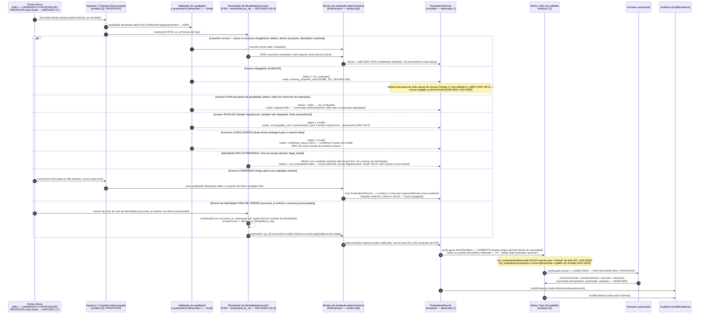

# IntensiCare V2 — Sequência observação → avaliação → alerta, incluindo caminhos de falha

**Status: PROPOSAL quanto à forma de sequência (nenhum componente existe ainda —
`ci-policy.md` §1); as REGRAS de estado que os ramos de falha aplicam são, em sua
maioria, `ACCEPTED` (GDEC-0007, [ADR-0008](../adrs/ADR-0008-evaluation-status-and-completeness-freshness-semantics.md)).**
Onde uma regra é citada como aceita, ela é citada com sua cláusula (`N1`-`N9`); onde a
sequência depende de algo ainda não decidido (fronteira AMH, transporte, canal de
notificação), o passo é rotulado PROPOSTA.

## 1. Por que "caminhos de falha", não apenas o caminho feliz

SOURCE (prompt §1): "Do not expand breadth until this loop is demonstrated end to end
under normal, missing, stale, duplicate, delayed, conflicting, corrected, unauthorized,
disconnected, and partially failed conditions." O ​hazard mais grave já confirmado na
fonte legada — **HAZ-0005** (S5/L4, "Unacceptable") — é exatamente um caminho de falha
tratado como caminho normal: ausência de insumo obrigatório coagida a zero, produzindo
um escore "normal" falso. Este diagrama existe para tornar **irrepresentável** essa
coerção, mostrando cada condição de falha como um ramo com estado terminal explícito,
nunca uma queda silenciosa para o ramo normal.

## 2. Diagrama

## 3. Cada ramo de falha, com sua razão codificada e status resultante

| # | Condição (SOURCE: prompt §1) | Status V2 resultante | Razão codificada (N3) | Regra que impede coerção |
|---|---|---|---|---|
| 1 | **Ausente** | `not_evaluated` | `missing_required_input:<insumo>` | N3, N4; default estrutural (A8-2) |
| 2 | **Stale** (além do horizonte) | `stale` → `not_evaluated` | `expired` | N5 — duas janelas: atualidade e expiração |
| 3 | **Inválido** (unidade, tempo implausível, quarentena) | `invalid` | `unmappable_unit` \| `quarantined_input` | N5 (SAF-0012 quarentena) |
| 4 | **Conflitante** | `invalid` | `conflicting_inputs` | A8-3 (GDEC-0007) — razão, não estado próprio |
| 5 | **Corrigido** | novo `EvaluationRecord`; anterior `superseded` | (não aplicável — é uma transição, não um status terminal) | N6 — imutabilidade, nunca reescrita |
| 6 | **Fora de ordem** | reconstruído via `resolve(ref, as_of)` | (não aplicável — resolução temporal) | Contrato de identidade §3 (ordenação por sujeito, at-least-once) |
| 7 | **Não autorizado** | fail-closed, `not_evaluated`/`invalid` | condição explícita de negação | AQ-6 — sem bypass cross-tenant; DOM-0001 |
| — | **Duplicado / delayed / parcialmente falho** | Cobertos transitivamente por `idempotency_key` (dedup, contrato de identidade §2) e pelas mesmas regras de janela/horizonte (N5) — não desenhados como ramos separados para manter o diagrama legível | — | — |

**Nota de honestidade:** "duplicado" e "delayed" do prompt §1 não recebem ramo próprio
no diagrama porque sua resolução é a mesma máquina de dedup/janela já mostrada (evita
duplicar sete vezes a mesma nota) — mas ambos são citados aqui explicitamente para que
sua cobertura não pareça uma omissão silenciosa.

## 4. O que este diagrama afirma e o que não afirma

**Afirma:**

- Cada uma das dez condições nomeadas pelo prompt §1 (normal, ausente, stale, duplicado,
  delayed, conflitante, corrigido, fora de ordem, não autorizado, desconectado/parcialmente
  falho) tem um destino explícito — nenhuma cai silenciosamente no ramo normal.
- A precedência entre condições simultâneas é a decidida em `ADR-0008` N2 (GDEC-0007):
  `invalid > not_evaluated > stale > partial > valid`.
- `not_evaluated` nunca produz um piso "normal" de leito (N7) — este é o núcleo do que
  HAZ-0005 exige que seja impossível.

**Não afirma:**

- Que qualquer participante do diagrama (Ingresso, ACL, Núcleo de avaliação) exista como
  código — nenhum existe (`ci-policy.md` §1).
- Que o canal de notificação, seu conteúdo, ou se ele pode carregar PHI tenham sido
  decididos — permanece `⚠ UNDECIDED` (ADR-0011/ADR-0019, `system-context.md` F7).
- Que `partial` seja um estado disponível por padrão — só existe sob política ratificada
  por classe de escore (ADR-0026), e o default de toda classe é `not_evaluated`.

## 5. Proveniência

| Elemento | Fonte |
|---|---|
| Laço mínimo de segurança e as dez condições de teste | `INTENSICARE_V2_ORCHESTRATOR_PROMPT.md` §1 |
| Precedência N2, razões N3, agregação N4, transições N5, correção N6, interação com alertas N7, duas dimensões N8, fallback N9 | `docs/06-architecture/adrs/ADR-0008-evaluation-status-and-completeness-freshness-semantics.md` §4.2 (aceito, GDEC-0007) |
| `conflicted` como razão de `invalid`, não estado próprio (A8-3) | `ADR-0008` §5.0 |
| HAZ-0005 (coerção de ausência a zero/normal) | `docs/05-clinical-safety/hazard-log.md` linha HAZ-0005 |
| HAZ-0043 (`not_evaluated` persistente e habituação) | `docs/05-clinical-safety/hazard-log.md` linha HAZ-0043 |
| Contrato de identidade: ordenação, at-least-once, `resolve(ref, as_of)`, fail-closed | `docs/08-interoperability/amh-data/contract-v1/eventos-ciclo-de-vida-identidade.md` §2-§4 |
| Sem bypass cross-tenant (AQ-6) | `docs/08-interoperability/amh-data/identity-adjudication/adjudicacao-decisoes-2026-08-15.md` §2 AQ-6 |
| DOM-0001, DOM-0002, DOM-0003, DOM-0004, DOM-0005, DOM-0009 | `docs/03-domain/invariants/DOM-invariants.md` |
| Canal de notificação sem decisão | `docs/06-architecture/system-context/system-context.md` fluxo F7 |

## 6. O que este diagrama deliberadamente não faz

- Não escolhe transporte, protocolo, banco de dados, ou broker.
- Não fixa os números das janelas de atualidade/horizonte de expiração — permanecem
  `VALIDATION REQUIRED` por insumo e por versão de regra (N5).
- Não decide o canal de notificação nem se PHI pode viajar nele.
