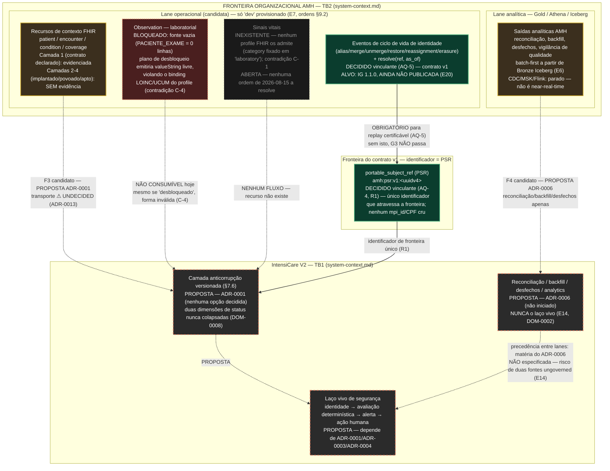

# IntensiCare V2 — Fluxos de informação operacional e analítico AMH/V2

**Status: PROPOSAL — este diagrama é derivado, não decisório.** Ele não escolhe a
fronteira AMH×V2 (matéria do [ADR-0001](../adrs/ADR-0001-amh-platform-boundary.md),
`proposed`, sem decisão registrada); ele **retrata honestamente** o que a evidência
pinada mostra hoje e o que as decisões de 2026-08-15 (AQ-1..AQ-6) fixaram como
restrição de contorno, sem inferir que qualquer lane, contrato ou ambiente existe além
do que está evidenciado.

## 1. Legenda

Reaproveita as convenções de
[`system-context.md`](../system-context/system-context.md) §1:

| Marcação | Significado |
|---|---|
| **PROPOSTA — ADR-0001** (borda tracejada) | Depende da fronteira ainda não decidida. Nenhuma opção (A/B/C/D-1/Z) é assumida. |
| **DECIDIDO** (borda sólida, com cláusula citada) | Restrição vinculante de 2026-08-15 (AQ-4/AQ-5/AQ-6), que qualquer opção de fronteira deve satisfazer — não decide a fronteira em si. |
| **CANDIDATO A INTEGRAÇÃO** | Classificação padrão da relação AMH×V2 até o Gate G3 (`compatibility-finding.md` §7). Nunca "conectado", nunca "compatível". |
| **BLOQUEADO** | Recurso existe na especificação AMH mas não é consumível hoje, com a causa raiz citada. |
| **INEXISTENTE** | Não há evidência de que o recurso exista em nenhuma forma — nem bloqueado, nem degradado: ausente. |

## 2. Diagrama

## 3. O que este diagrama afirma (evidência) e o que não afirma

**Afirma (evidência citada em cada nó):**

- A relação AMH×V2 permanece **candidata a integração**, não demonstrada compatível
  (`compatibility-finding.md` §7; `ADR-0001` E1).
- `Observation` **não é consumível hoje** por nenhuma das duas pernas necessárias
  (laboratorial bloqueada por fonte vazia; forma do desbloqueio viola o profile —
  contradição C-4). Nenhum "Observation desbloqueado" anunciado deve ser lido como
  entrega de números — pode entregar texto livre.
- **Sinais vitais são estruturalmente inexistentes** hoje no lado AMH — não "bloqueados
  temporariamente": o único profile `Observation` fixa `category=laboratory`, então um
  profile de sinal vital exigiria autoria, publicação e povoamento novos. A contradição
  **C-1 permanece aberta** — nenhuma das 21 ordens de serviço de 2026-08-15 a resolve
  (`ordens-de-servico-amh-2026-08-15.md` §9.1).
- A **lane analítica (Gold/Athena/Iceberg) é batch-first e explicitamente não
  near-real-time** (ADR-040 do lado AMH; E6) — ela nunca é o laço vivo de segurança;
  usá-la para avaliação clínica em tempo real seria uma violação de DOM-0002/E14.
- O **PSR (`portable_subject_ref`) é DECIDIDO** (AQ-4, R1) como o único identificador
  de fronteira — nenhum identificador de fonte cru atravessa.
- Os **eventos de ciclo de vida de identidade e `resolve(ref, as_of)` são DECIDIDOS
  vinculantes** (AQ-5) e são pré-condição textual para o Gate G3 — mas o **alvo de
  pinagem (IG 1.1.0) ainda não foi publicado** (E20): a decisão existe, o artefato que
  ela pina não.
- Achado honesto, repetido em cada nó candidato: **candidato a integração**, nunca
  "conectado".

**Não afirma:**

- Que a fronteira A/B/C/D-1/Z tenha sido escolhida — todo nó do lado V2 permanece
  tracejado/UNDECIDED.
- Que qualquer lane operacional near-real-time exista ou tenha sido aprovada para
  construção — ela é uma hipótese em `ADR-0001` §5.2 (P4), condicionada ao Gate G2 e a
  disposição AMH.
- Que a camada anticorrupção (ACL) tenha sido implementada — é um nó conceitual
  (`prompt §7.6`), não um componente existente.

## 4. Proveniência

| Elemento | Fonte |
|---|---|
| Classificação "candidato a integração" | `docs/08-interoperability/amh-data/compatibility-finding.md` §7 |
| Camadas 1-4 de evidência AMH | `docs/08-interoperability/amh-data/four-layer-dossier.md` §0; `ADR-0001` E2 |
| Observation laboratorial bloqueada / contradição C-4 | `compatibility-finding.md` §3.1; `ADR-0001` E3-E4 |
| Sinais vitais estruturalmente ausentes / contradição C-1 | `compatibility-finding.md` §3.2; `ADR-0001` E5, E19; `docs/08-interoperability/amh-data/vital-signs-decision/pacote-decisao-c1-sinais-vitais.md` |
| Lane analítica batch-first, CDC parado | `ADR-0001` E6 |
| PSR decidido (AQ-4, R1) | `docs/08-interoperability/amh-data/identity-adjudication/adjudicacao-decisoes-2026-08-15.md` §2 AQ-4; `ADR-0001` §2.4 R1 |
| Eventos de ciclo de vida + resolve(ref, as_of) decididos (AQ-5) | `docs/08-interoperability/amh-data/contract-v1/eventos-ciclo-de-vida-identidade.md` §3-§4; `ADR-0001` §2.4 R2 |
| IG 1.1.0 alvo não publicado | `ADR-0001` E17, E20 |
| Camada anticorrupção e duas dimensões de status | `INTENSICARE_V2_ORCHESTRATOR_PROMPT.md` §7.6; `docs/03-domain/invariants/DOM-invariants.md` DOM-0008 |
| Fronteira AMH×V2 sem decisão | `docs/06-architecture/adrs/ADR-0001-amh-platform-boundary.md` §5 |

## 5. O que este diagrama deliberadamente não faz

- Não decide a fronteira, o transporte, ou se a lane operacional será construída.
- Não marca nenhum item como `DECIDED` além das cláusulas já registradas como tal em
  `ADR-0001` §2.4 (AQ-3/4/5/6) — citadas aqui, não reafirmadas como nova decisão.
- Não nomeia donos.
