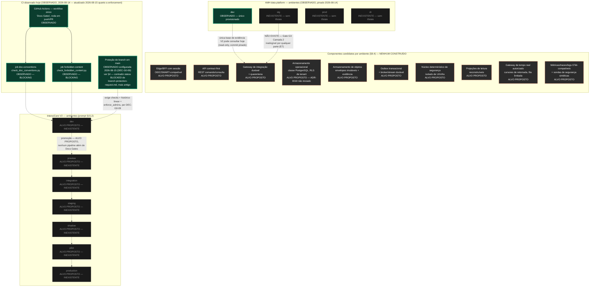

# IntensiCare V2 — Topologia de implantação por ambiente

**Status: PROPOSAL — e a afirmação mais importante deste diagrama é negativa:
NENHUM ambiente da V2 existe.** SOURCE (`docs/14-devsecops-and-delivery/ci-policy.md`
§1-§2, OBSERVED 2026-08-14): a única automação existente neste repositório é o workflow
`Docs Gates` (dois jobs de conformidade documental); **não há build, teste, artefato,
implantação, banco de dados, ou ambiente de qualquer tipo**. Todo elemento abaixo além
do workflow observado é rotulado **ALVO PROPOSTO**, nunca implantado. O lado AMH tem
**apenas `dev` provisionado** — `stg`/`prod`/`dr` não existem e não têm `tfstate`
(`HANDOFF.yaml` `pinned_evidence`; `ADR-0001` E7).

## 1. Legenda

Reaproveita as convenções de `system-context.md` §1, com um marcador adicional:

| Marcação | Significado |
|---|---|
| **OBSERVADO** (borda sólida) | Existe hoje, verificado nesta revisão. |
| **ALVO PROPOSTO** (borda tracejada) | Candidato de `INTENSICARE_V2_ORCHESTRATOR_PROMPT.md` §9.4/§15.2 — nada foi construído, nenhuma tecnologia escolhida. |
| **INEXISTENTE** (preenchimento escuro, tracejado fino) | Nem mesmo um alvo declarado por ADR — ausência simples, registrada para não ser confundida com "não aplicável". |

## 2. Diagrama

## 3. O que este diagrama afirma e o que não afirma

**Afirma (evidência citada em cada nó):**

- **Nenhum ambiente V2 existe** — os sete ambientes nomeados pelo prompt §15.2
  (dev/preview/integration/staging/shadow/pilot/production) são alvo, não realidade.
- **Nenhum dos dez componentes candidatos do §9.4** (edge/BFF, API, gateway de
  integração, armazenamento operacional, armazenamento de objetos, outbox/broker,
  núcleo determinístico, projeções, gateway de tempo real, OTel) foi construído.
- Do lado AMH, **apenas `dev` está provisionado**; `stg`/`prod`/`dr` não têm `tfstate`
  — reconfirmado pelas ordens de serviço de 2026-08-15 (nenhuma ordem cria ambiente).
  Isso torna a condição "ambiente production-like" do Gate G3 **inatingível por
  qualquer parte, com qualquer nível de acesso**, hoje.
- O único CI que existe é o workflow `Docs Gates` com dois jobs bloqueantes.
- **Atualização honesta sobre proteção de branch:** `branch-protection-request.md`
  (datado de 2026-08-14) registra status `BLOCKED` — nenhum agente tem permissão de
  admin. `HANDOFF.yaml`, datado de 2026-08-15, registra `DEC-G0-09`: "CONFIGURADA em
  main... checks doc-conventions + forbidden-content obrigatórios, enforce_admins,
  histórico linear, PR obrigatório." **Isto é uma contradição entre dois documentos-
  fonte** (um mais antigo dizendo bloqueado, um mais novo com decisão humana registrada
  dizendo configurado). Por regra desta tarefa, o decidido prevalece — este diagrama
  reflete a proteção como **configurada**, citando `DEC-G0-09` — mas a contradição em si
  é registrada aqui e no handoff desta tarefa, não resolvida silenciosamente por edição
  de `branch-protection-request.md` (fora do escopo de escrita deste autor).

**Não afirma:**

- Que qualquer plataforma de nuvem, banco de dados, ou vendor tenha sido escolhido —
  `ADR-0019` (plataforma de implantação, ambientes, residência de dados, fronteiras de
  rede) está `not-started`.
- Que a topologia candidata do §9.4 seja a topologia decidida — ela é explicitamente
  "candidata" no próprio texto do prompt, sujeita a ratificação por ADR.
- Que a promoção entre ambientes V2 (dev→preview→...→production) tenha qualquer
  pipeline real — as setas tracejadas marcam apenas a *ordem candidata* do §15.2, não
  um mecanismo existente.

## 4. Proveniência

| Elemento | Fonte |
|---|---|
| Nenhum build/teste/artefato/implantação existe hoje | `docs/14-devsecops-and-delivery/ci-policy.md` §1 |
| Sete ambientes candidatos e o pipeline de 11 passos | `docs/14-devsecops-and-delivery/ci-policy.md` §2; `INTENSICARE_V2_ORCHESTRATOR_PROMPT.md` §15.2 |
| Topologia de runtime candidata (dez componentes) | `INTENSICARE_V2_ORCHESTRATOR_PROMPT.md` §9.4 |
| `ADR-0019` reservado, não iniciado | `docs/06-architecture/adrs/adr-index.md` §3 |
| AMH — apenas `dev` provisionado, sem `stg`/`prod`/`dr`/`tfstate` | `HANDOFF.yaml` `pinned_evidence`; `docs/06-architecture/adrs/ADR-0001-amh-platform-boundary.md` E7, E19 |
| Workflow `Docs Gates`, dois jobs bloqueantes | `docs/14-devsecops-and-delivery/ci-policy.md` §1; `.github/workflows/docs-gates.yml` |
| Proteção de branch — pedido `BLOCKED` (2026-08-14) | `docs/14-devsecops-and-delivery/branch-protection-request.md` §1 |
| Proteção de branch — `DEC-G0-09` configurada (2026-08-15) | `HANDOFF.yaml` `repository_state.branch_protection` |
| Gate G3 "production-like" inatingível hoje | `ADR-0001` C7 |

## 5. O que este diagrama deliberadamente não faz

- Não escolhe nenhuma tecnologia, vendor, ou provedor de nuvem.
- Não decide os limites de residência de dados ou rede.
- Não resolve a contradição de status de proteção de branch entre os dois documentos —
  apenas a registra, seguindo a regra "o decidido prevalece; a contradição vai ao
  handoff" desta tarefa.
