# IntensiCare V2 — System Context, Trust Boundaries, and PHI Flows

**Status: PROPOSAL.** This is a *candidate* context diagram. Every external element is
either evidence-backed and explicitly bounded, or marked **UNDECIDED**. Nothing here
selects a technology, a vendor, a protocol, or a hosting model, and nothing here
constitutes a decision about the AMH boundary — that is [ADR-0001](../adrs/ADR-0001-amh-platform-boundary.md),
which is `proposed` and records no decision.

**Reading rule.** An element drawn on this diagram is **not** an element that exists,
is contracted, or is approved. The diagram's purpose is to make the *unknowns* visible and
countable. Twelve of the elements and flows below are UNDECIDED or UNVALIDATED; that is the
diagram's most important content.

---

## 1. Legend

| Marking | Meaning |
|---|---|
| **UNDECIDED** (dashed border, ⚠) | No decision exists. The element is drawn because the system will need *something* in that position; nothing about its identity, protocol, vendor, or hosting is settled. |
| **UNVALIDATED** (dashed border, ⚠) | The element is a candidate derived from the prompt, not from observed users or a signed contract. Requires Gate G1 (users) or Gate G3 (AMH) validation. |
| **INTEGRATION CANDIDATE** | The AMH relationship's standing classification until Gate G3 (SOURCE: prompt §7.0, §7.5). Not "connected", not "compatible". |
| **READ-ONLY EVIDENCE** | Consulted by humans and agents as evidence during design. **Never** a runtime dependency, never called by the running system. |
| `PHI` / `PHI?` / `no PHI` | Whether the flow is expected to carry protected health information. `PHI?` means undetermined — a gap, not a "no". |

---

## 2. System context diagram

```mermaid
flowchart TB
    classDef person fill:#1d3557,stroke:#a8dadc,stroke-width:2px,color:#ffffff
    classDef system fill:#0b3d2e,stroke:#25a07a,stroke-width:3px,color:#ffffff
    classDef external fill:#3b2f1e,stroke:#c9a227,stroke-width:2px,color:#ffffff
    classDef undecided fill:#2b2b2b,stroke:#e07a5f,stroke-width:2px,stroke-dasharray:6 4,color:#ffffff
    classDef readonly fill:#2f2f3a,stroke:#8d99ae,stroke-width:2px,stroke-dasharray:2 3,color:#dddddd

    subgraph TB3["TRUST BOUNDARY 3 — care-delivery environment / hospital network"]
        direction TB
        U1["UR-02 ICU nurse, bedside<br/>⚠ UNVALIDATED — Gate G1"]:::person
        U2["UR-01 Intensivist / ICU physician<br/>⚠ UNVALIDATED — Gate G1"]:::person
        U3["UR-03 Unit coordinator / charge nurse<br/>⚠ UNVALIDATED — Gate G1"]:::person
        U4["UR-04 Rapid-response team<br/>⚠ UNVALIDATED — in scope? Gate G1"]:::person
        U5["UR-05 Administrator / security / compliance<br/>⚠ UNVALIDATED — Gate G1"]:::person
        U6["UR-08 Assistive-technology user<br/>cross-cutting: any role above<br/>⚠ UNVALIDATED — Gate G1"]:::person
    end

    subgraph TB1["TRUST BOUNDARY 1 — IntensiCare V2 operated boundary"]
        direction TB
        V2["<b>IntensiCare V2</b><br/>clinical decision-support platform<br/>deterministic evaluation, alert/work management,<br/>audit, projections<br/>deployment unit: ⚠ UNDECIDED — ADR-0002<br/>hosting/residency: ⚠ UNDECIDED — ADR-0019<br/>ownership of operational store: ⚠ UNDECIDED — ADR-0001"]:::system
    end

    subgraph TB2["TRUST BOUNDARY 2 — AMH organizational boundary"]
        direction TB
        AMH["AMH data platform<br/><b>INTEGRATION CANDIDATE</b> — not demonstrated compatible<br/>context: patient / encounter / condition / coverage<br/>labs: BLOCKED at pinned commit<br/>vitals: no profile, structurally excluded<br/>only 'dev' provisioned<br/>⚠ boundary UNDECIDED — ADR-0001"]:::external
        AMHAN["AMH analytical outputs<br/>Gold / Athena / Iceberg<br/>reconciliation, backfill, outcomes<br/>⚠ use as a lane: UNDECIDED — ADR-0006"]:::external
    end

    subgraph TB4["TRUST BOUNDARY 4 — third-party / public network"]
        direction TB
        IDP["Identity provider<br/>⚠ UNDECIDED — ADR-0015<br/>OIDC? SMART? mTLS? institutional IdP?<br/>AMH's own auth contract is a 3-way contradiction"]:::undecided
        NOTIF["Notification channels<br/>⚠ UNDECIDED — ADR-0011 / ADR-0019<br/>push? SMS? pager? in-app only?<br/>PHI in a notification body: ⚠ UNDECIDED"]:::undecided
        TERM["Terminology services<br/>LOINC / SNOMED CT / UCUM / value sets<br/>⚠ UNDECIDED — ADR-0013<br/>hosted? embedded snapshot? licensed?"]:::undecided
        SIG["Non-AMH clinical-signal sources<br/>device gateway / HL7 v2 / EHR-direct<br/>⚠ UNDECIDED and CONDITIONAL<br/>drawn only because ADR-0001 option D-1 enumerates it"]:::undecided
    end

    subgraph TB5["DESIGN-TIME ONLY — no runtime path exists or may be created"]
        direction TB
        LEG["Legacy IntensiCare system<br/><b>READ-ONLY EVIDENCE SOURCE</b><br/>risk-informed input, not authority<br/>NOT a runtime dependency<br/>no network path, no data import without<br/>an accepted import decision"]:::readonly
    end

    U1 -->|"F1 view, acknowledge, escalate, resolve<br/>PHI · authenticated · tenant-scoped"| V2
    U2 -->|"F1 same authorized surface"| V2
    U3 -->|"F1 same authorized surface"| V2
    U4 -->|"F1 same authorized surface"| V2
    U5 -->|"F2 administration, membership, config<br/>PHI? · tenant-scoped"| V2
    U6 -.->|"F1 via assistive technology<br/>WCAG 2.2 AA required"| V2

    AMH -->|"F3 clinical + context data<br/>PHI · transport ⚠ UNDECIDED<br/>freshness ⚠ UNMEASURED"| V2
    AMHAN -->|"F4 reconciliation / backfill / outcomes<br/>PHI · batch · ⚠ lane UNDECIDED"| V2
    V2 -.->|"F5 optional evaluation / alert-outcome writeback<br/>PHI · ⚠ UNDECIDED, requires AMH-owner approval"| AMH

    IDP -.->|"F6 authentication / token issuance<br/>no PHI · identity claims only<br/>⚠ UNDECIDED"| V2
    V2 -.->|"F7 clinician notification<br/>PHI content ⚠ UNDECIDED — minimize<br/>⚠ channel UNDECIDED"| NOTIF
    NOTIF -.->|"F7b delivery to a device<br/>outside V2's trust boundary"| U1
    TERM -.->|"F8 code systems / value sets<br/>no PHI · versioned snapshot<br/>⚠ UNDECIDED"| V2
    SIG -.->|"F9 vitals / numeric labs<br/>PHI · ⚠ CONDITIONAL on ADR-0001 option D-1"| V2

    LEG -.->|"F10 DESIGN-TIME evidence only<br/>read by humans and agents<br/>NO runtime call · NO data flow"| V2

    linkStyle default stroke-width:1.5px
```

### 2.1 What the diagram asserts, and what it does not

**Asserts (evidence-backed):**

- SOURCE: AMH is an *integration candidate*, not a connected dependency
  (`../../08-interoperability/amh-data/compatibility-finding.md` §7).
- SOURCE: the legacy system is a read-only evidence source and must never become a runtime
  dependency (prompt §3 rules 2–5; §2 "Treat the legacy technical assessment as a
  risk-informed input, not authority").
- SOURCE: clinical decision authority stays with accountable humans; V2 is drawn as
  advisory to human action, never as an actor that acts alone (prompt §3 rule 15).

**Does not assert:**

- That any depicted flow exists, is authorized, or is reachable. Flows F3–F9 are all
  either UNDECIDED, unmeasured, or conditional.
- That the user roles are correct. They are the hypothesized roles UR-01..UR-08 from
  `../../02-users-and-workflows/user-roles-hypotheses.md`, which are themselves derived
  from prompt §5 (Gate G1's "who monitors, who acts, who owns escalation, and who closes
  work") and §11's validation set — **not from any observed user**. Gate G1 explicitly
  forbids approving solution architecture until intended users have been observed or the
  absence is accepted as a blocking risk.
- That V2 owns an operational store. That is the substance of ADR-0001 and is undecided.

---

## 3. Trust boundaries

| ID | Boundary | What is inside | Crossing requires | Status |
|---|---|---|---|---|
| TB1 | **IntensiCare V2 operated boundary** | The V2 application, its store(s), its audit, its projections | Authenticated, tenant-scoped, purpose-bound access; fail closed on missing/mismatched tenant, identity, purpose or consent context (prompt §7.4) | Contents ⚠ UNDECIDED (ADR-0001, ADR-0002, ADR-0019) |
| TB2 | **AMH organizational boundary** | The AMH data platform and its analytical estate — a **different organization's** operational and legal responsibility | A published, digest-pinned contract; workload identity; tenant binding where the token tenant equals the URL partition; no caller-supplied partition headers | ⚠ No contract exists. `AUTH-AMH-OWNER` unassigned |
| TB3 | **Care-delivery environment** | Clinicians, their devices, the unit environment | Authenticated session with role and purpose; device/session policy; privacy-aware cache clearing (prompt §11) | ⚠ UNVALIDATED — device, network and environment constraints are Gate G1 questions |
| TB4 | **Third-party / public network** | Identity provider, notification channels, terminology services, any non-AMH signal source | Per-party contract, processor terms, residency and minimization determinations (`AUTH-PRIVACY-LEGAL`) | ⚠ All UNDECIDED |
| TB5 | **Design-time evidence** | The legacy repository and assessment | Human/agent reading only, read-only mount, per `legacy-import-policy.md` | **No runtime crossing is permitted to exist.** Any future runtime path would be a new element requiring an ADR |

**Boundary invariant (SOURCE, prompt §9.1 principle 2 / DOM-0001):** tenant and encounter
ownership must hold across every one of these crossings — identity, storage, cache, event,
query, subscription and audit. A boundary crossing that cannot carry and enforce that
ownership is not permissible regardless of its convenience.

---

## 4. PHI-flow inventory

SOURCE (prompt §19): a trust-boundary and PHI-flow diagram is a required, versioned
artifact. This table is its machine-checkable companion. **`PHI?` means undetermined and is
a gap to close, never a licence to assume "no".**

| Flow | From → To | Boundaries crossed | Content class | PHI | Transport | Status / blocking decision |
|---|---|---|---|---|---|---|
| F1 | Clinical users → V2 | TB3 → TB1 | Clinical views, acknowledgements, escalations, overrides, resolutions | **PHI** | ⚠ UNDECIDED | Roles UNVALIDATED (G1); authz model ADR-0016 |
| F2 | Administrator → V2 | TB3 → TB1 | Membership, unit/bed configuration, purpose assignment | **PHI?** — depends on whether admin surfaces expose patient context | ⚠ UNDECIDED | ADR-0003, ADR-0016 |
| F3 | AMH → V2 | TB2 → TB1 | Patient/encounter/condition/coverage context; clinical resources where populated | **PHI** | ⚠ UNDECIDED — FHIR REST? stream? batch? (prompt §7.5 forbids implying one) | **Blocked**: Gate G3 layers 2–4; ADR-0001; ADR-0013 |
| F4 | AMH analytical → V2 | TB2 → TB1 | Reconciliation, backfill, outcomes, quality surveillance | **PHI** | ⚠ UNDECIDED | ADR-0006; freshness unmeasured |
| F5 | V2 → AMH | TB1 → TB2 | Optional evaluation / alert-outcome / acknowledgment writeback | **PHI** | ⚠ UNDECIDED | **Requires AMH-owner authority.** Candidate contract only (prompt §7.5) |
| F6 | Identity provider → V2 | TB4 → TB1 | Identity claims, tenant claim, purpose/scopes | **no PHI** by design — a claim set carrying clinical content would be a defect | ⚠ UNDECIDED | ADR-0015. AMH's own auth story is a 3-way contradiction (C-2) |
| F7 | V2 → notification channel → device | TB1 → TB4 → TB3 | Alert notification | **PHI? — UNDECIDED and safety-relevant.** Prompt §13 names notifications as a PHI-leak surface | ⚠ UNDECIDED | ADR-0011, ADR-0019. Minimization is mandatory (§9.1 p12) |
| F8 | Terminology service → V2 | TB4 → TB1 | Code systems, value sets, versioned snapshots | **no PHI** | ⚠ UNDECIDED | ADR-0013 |
| F9 | Non-AMH signal source → V2 | TB4 → TB1 | Vitals, numeric labs | **PHI** | ⚠ UNDECIDED | **Conditional** on ADR-0001 option D-1; would need its own ADR |
| F10 | Legacy → design-time reading | TB5, human/agent only | Documents, code, schemas as *evidence* | **must contain no PHI in V2 artifacts** (prompt §3 r12) | **none — no runtime transport exists** | Governed by `legacy-import-policy.md` |

### 4.1 PHI surfaces that are not edges on this diagram

SOURCE (prompt §13): PHI must be addressed in "logs, prompts, traces, queues, caches,
exports, notifications, backups, screenshots, and support workflows." These are *internal*
or *operational* surfaces, so they do not appear as context-level flows — but omitting them
from a PHI analysis is a common and consequential error. Each requires a control and an
owner in ADR-0017 / ADR-0018 / ADR-0020, and each is covered by quality-attribute scenario
QAS-0028.

---

## 5. Actors: candidate roles and their validation status

| Role | Candidate responsibilities (Gate G1 questions) | Source | Status |
|---|---|---|---|
| **UR-02** ICU nurse (bedside) | Monitors; often first to see and to act | `../../02-users-and-workflows/user-roles-hypotheses.md`; prompt §5 G1, §11 | ⚠ UNVALIDATED — hypothesis, no user observed |
| **UR-01** Intensivist / ICU physician | Decides, orders, accepts clinical responsibility | `user-roles-hypotheses.md`; prompt §5 G1, §11 | ⚠ UNVALIDATED |
| **UR-03** Unit coordinator / charge nurse (*enfermeiro coordenador*) | Prioritizes across beds; owns escalation; closes work | `user-roles-hypotheses.md`; prompt §5 G1, §11 | ⚠ UNVALIDATED |
| **UR-04** Rapid-response team | Cross-unit response — **in scope or not is an open Gate G1 question** (prompt §5: "ICU, step-down, ward, rapid-response, or command-center boundaries") | `user-roles-hypotheses.md`; prompt §5 G1, §11 | ⚠ UNVALIDATED and possibly out of scope |
| **UR-05** Administrators, security and compliance | Membership, configuration, purpose assignment, access review | `user-roles-hypotheses.md`; prompt §11 | ⚠ UNVALIDATED |
| **UR-08** Assistive-technology users | **Not a separate persona** — a cross-cutting access mode for every role above; WCAG 2.2 AA plus representative screen-reader, keyboard, zoom/reflow, reduced-motion and touch-target validation | `user-roles-hypotheses.md`; prompt §11 | ⚠ UNVALIDATED |
| **UR-06** Hospital IT / data-platform teams; operations and support | Runbooks, downtime procedures, incident response, integration operations — **non-clinical**, and their PHI access must be separately governed (break-glass) | `user-roles-hypotheses.md`; prompt §15.3, §13 | ⚠ UNVALIDATED — not drawn as a clinical user |
| **UR-07** Clinical governance / regulatory stakeholders | Approve intended use, rule content, residual risk; consume safety evidence — **not day-to-day system users** | `user-roles-hypotheses.md`; prompt §5, §13 | ⚠ UNVALIDATED — not drawn on the context diagram |

The role IDs above are taken from `docs/02-users-and-workflows/user-roles-hypotheses.md`,
written by the Wave-1 ICU contextual-inquiry specialist during this cycle. **They are
hypotheses, explicitly not observations** — that document's own epistemic statement says so.
SOURCE (prompt §5, Gate G1): *"Do not approve solution architecture until intended users
have been observed or the absence is explicitly accepted as a blocking risk."* No user has
been observed. This diagram is therefore explicitly **pre-G1** and cannot be used to justify
any solution-architecture approval.

---

## 6. Open questions this diagram makes visible

| # | Question | Owner role | Blocking |
|---|---|---|---|
| Q1 | Are the six candidate clinical roles the right ones, and which of them actually monitors, acts, escalates and closes? | `AUTH-INTENDED-USE`, `AUTH-UX` | Gate G1 |
| Q2 | Is rapid-response / command-centre in scope? | `AUTH-INTENDED-USE` | Gate G1 |
| Q3 | Which lane(s) carry clinical signal, and does a near-real-time lane exist at all? | `AUTH-DATA-PLATFORM` + `AUTH-AMH-OWNER` | ADR-0001, Gate G3 |
| Q4 | What is the identity provider, and does the deployed AMH authentication contract match its own CapabilityStatement? | `AUTH-SECURITY` | ADR-0015, contradiction C-2 |
| Q5 | May a notification body ever contain PHI, and on whose device? | `AUTH-PRIVACY-LEGAL` + `AUTH-CLINSAFETY` | ADR-0011, ADR-0017 |
| Q6 | If AMH cannot supply vitals or numeric labs, does a non-AMH signal source enter the context? | `AUTH-PRODUCT` + `AUTH-DATA-PLATFORM` | ADR-0001 option D-1; Gate G2 |
| Q7 | Is writeback to AMH (F5) in scope, and who authorizes it? | `AUTH-AMH-OWNER` | ADR-0001, prompt §7.5 |
| Q8 | Where does terminology come from, under what licence, at what version cadence? | `AUTH-DATA-PLATFORM` | ADR-0013 |

---

## 7. What this document deliberately does not do

- It does **not** choose the AMH boundary, a transport, an identity provider, a
  notification channel, a terminology source, a deployment unit, or a hosting model.
- It does **not** validate any user role. Every role is a candidate awaiting Gate G1.
- It does **not** claim any depicted flow is implemented, contracted, or reachable.
- It does **not** replace the remaining required diagrams (prompt §19): AMH/V2
  operational-and-analytical information flows, bounded-context and module-dependency map,
  observation→evaluation→alert sequence with failure paths, alert/human-action state
  machine, data-quality/evaluation-status state machine, deployment topology per
  environment, CI/CD promotion and evidence flow, and the traceability graph. Those are
  **not yet written** and their absence is an open gap, not an omission by intent.
