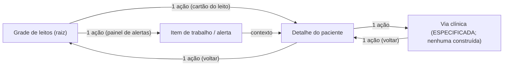

# Arquitetura de informação — IntensiCare V2

> **PREMISSA (reversível, GDEC-0015/0017):** este documento materializa a
> arquitetura de informação da V2 sob o regime MODO CONSTRUÇÃO, com a decisão
> do titular de UX/UI de primeira classe (GDEC-0016/ADR-0021). Nada aqui fecha
> gate, risco ou hazard; toda afirmação clínica de compreensão de usuário
> permanece VALIDATION REQUIRED (SPR-G4-5).
>
> **Rótulos locais:** os identificadores `IA-P*` e `IA-N*` usados abaixo são
> **IDs documento-locais, pendentes de ratificação em
> `docs/00-governance/traceability-policy.md` §1.1** (mesmo regime dos rótulos
> MD/MG/SPR do mapa). Nenhum prefixo novo de taxonomia é cunhado.

## 0. Base de evidência e limites declarados

- **SOURCE (prompt §11):** "Design the experience from observed work, not
  legacy screens. Preserve useful patterns only after validation: clear
  four-tier prioritization, non-color-only cues, alert grouping without source
  loss, direct bed-grid/patient/pathway navigation, accessible navigation, and
  privacy-aware cache clearing." Os padrões preservados abaixo são, portanto,
  **candidatos a preservação condicionada a validação** (SPR-G4-5) — não fatos
  validados.
- **SOURCE (dossiê substituto G1 v0.1.1, §1.3):** nenhum usuário da V2 foi
  observado; a evidência do G1 é o dossiê substituto multi-fonte, sob o risco
  aceito RISK-0013 ("usuário imaginado"). Esta IA foi desenhada a partir dessa
  evidência substituta e das hipóteses do titular **rotuladas como hipótese de
  especialista** — jamais como observação.
- **Estado factual preservado (OBSERVED no repositório):** 0 vias acionáveis;
  47/47 vias inelegíveis; Observation da AMH não consumível; a relação com a
  AMH é de **candidato a integração**; safety case em M0; **nenhum dado real
  foi acessado**. Toda tela citada neste documento opera exclusivamente sobre
  dados sintéticos com marcação `SYNTH-`.
- **Critério transversal:** WCAG 2.2 AA é requisito de projeto em toda
  superfície descrita aqui (prompt §11; ADR-0021 F7). **Preferência estética
  não é critério de aceite** (encargo §4.4; nota da linha SPR-G4-3 do mapa).

## 1. Princípios de IA derivados da evidência

| # | Princípio | Base de evidência (rótulo + fonte) |
|---|---|---|
| IA-P1 | **A grade de leitos é a superfície-raiz.** Toda sessão começa na vigilância da unidade; paciente e via são destinos de aprofundamento, nunca pré-requisitos da visão de conjunto. | SOURCE (prompt §11 — "direct bed-grid/patient/pathway navigation"); OBSERVED (`apps/web/src/App.tsx` — a fatia já navega grade ↔ detalhe) |
| IA-P2 | **Cada sinal novo tem custo real de atenção.** A IA minimiza superfícies concorrentes e agrega antes de multiplicar: em UTI real a carga documentada é de ~187 alarmes audíveis/leito/dia com 88,8% de falso-positivos em alarmes de arritmia anotados. | SOURCE (dossiê §2.1 L-1 — Drew et al. 2014); INFERENCE (dossiê §2.1, bloco final) |
| IA-P3 | **O dono da escalada é explícito, visível e transferível.** O elo aferente falha com frequência alta mesmo com critérios documentados (acionamento tardio em 21–57%); a IA expõe "quem é responsável agora" como informação derivável do estado do item de trabalho, nunca por heurística. | SOURCE (dossiê §2.1 L-6; §3.1); SOURCE (ADR-0009 D2, Q1-A) |
| IA-P4 | **Estado de segurança precede severidade.** `não avaliado`/`inválido` nunca são dobrados em "normal", nunca somem de listas e nunca ficam no fim da ordenação como se fossem quietude; roll-ups contam cada status não-`valid` em categoria própria. | SOURCE (ADR-0008 N4-iii/N7; HAZ-0005); SOURCE (dossiê §3.7 — lista nunca-normal) |
| IA-P5 | **Falsa tranquilização é classe de perigo de primeira classe.** O rótulo "consultivo" não desculpa display falsamente tranquilizador; a IA trata a exibição de ausência como conteúdo, não como espaço vazio. | SOURCE (dossiê §3.4, IU-10); SOURCE (forense ALTB — floor-to-normal REJECT) |
| IA-P6 | **Agrupar sem perder a fonte.** Um item de trabalho pode agregar N alertas, mas a identidade e a origem de cada alerta permanecem individualmente navegáveis (ver §4). | SOURCE (prompt §11 — "alert grouping without source loss"); SOURCE (ADR-0009 Q1-A, glossário §5) |
| IA-P7 | **A navegação é ciente de papel e propósito.** Perfis distintos (vigilância da unidade × tratamento de um item × revisão de histórico) têm caminhos diretos próprios; a modelagem concreta de papéis é consumida do backend (authz server-side), nunca decidida pela IA. | SOURCE (prompt §11 — "role- and purpose-aware navigation"); VALIDATION REQUIRED (modelo de papéis — ADR-0016; hipóteses UR-01..08 não validadas) |

## 2. Mapa de navegação

### 2.1 Destinos diretos (três, com profundidade máxima 2 a partir da raiz)

| Destino | Estado nesta fase | Regras de IA |
|---|---|---|
| **Grade de leitos** | OBSERVED — construída na fatia (`GradeLeitos.tsx`) | Tela-raiz; um cartão por leito com escore/banda/frescor/estado de avaliação; leito vago declarado como vago (nunca omitido); alertas pendentes visíveis na mesma tela sem navegação adicional (IA-P2) |
| **Detalhe do paciente** | OBSERVED — construído na fatia (`DetalhePaciente.tsx`) | Alcançável em 1 ação de qualquer cartão; retorno à grade em 1 ação; carrega explicação por parâmetro, insumos ausentes/velhos declarados, tempo de fonte e versão de regra (ADR-0021 F8) |
| **Via clínica** | ESPECIFICADA, não construída. **Estado factual: 0 vias acionáveis; 47/47 inelegíveis** — a rota existe nesta IA como contrato de navegação futuro, jamais como funcionalidade operacional | Alcançável em 1 ação a partir do detalhe do paciente e do item de trabalho que a referencie; a tela de via exibe o status da avaliação da via (5 estados, ADR-0008) e **nunca** apresenta via sem fonte populada como "quieta" (HAZ-0043 — não-avaliação persistente é sinal operacional) |

- **IA-N1 — Nenhuma navegação obrigatória por menu profundo.** Grade→paciente,
  grade→alerta e paciente→via são sempre 1 ação direta (prompt §11). Telas
  administrativas/configuração ficam fora do caminho clínico primário.
- **IA-N2 — Retorno sempre disponível e sem perda de contexto.** Voltar do
  detalhe restaura a grade com o mesmo estado de filtro/rolagem; se um comando
  estiver em andamento, aplica-se a proteção de trabalho não salvo
  (`trabalho_nao_salvo_protegido`, modelo de estados §4 do documento irmão).
- **IA-N3 — Nenhuma capacidade inacabada apresentada como operacional.** A rota
  de via só aparece na UI quando existir via aprovada (G2) — até lá não há
  entrada de menu "vias" desabilitada de forma enganosa nem tela vazia que
  sugira produto pronto (prompt §11, "no unfinished capability presented as
  operational").

### 2.2 Navegação acessível (WCAG 2.2 AA — obrigações da IA)

| Obrigação | Critério verificável |
|---|---|
| Toda navegação operável por teclado, sem armadilha de foco | WCAG 2.1.1/2.1.2; teste automatizado + manual |
| Ordem de foco segue a ordem clínica de leitura (banner de contexto → estado da tela → conteúdo → ações) | WCAG 2.4.3 |
| Alvos de toque ≥ 24×24 CSS px nos cartões e botões de ação | WCAG 2.5.8 (2.2) |
| Foco visível e não obscurecido por banners/painéis fixos | WCAG 2.4.11 (2.2) |
| Zoom 400%/reflow sem perda de conteúdo ou de estado de segurança visível | WCAG 1.4.10 |
| Mudanças de estado anunciadas por live region coalescida (nunca uma rajada por alerta — IA-P2) | prompt §11; OBSERVED `RegiaoAoVivoAlertas.tsx` como padrão de referência |
| `prefers-reduced-motion` respeitado em qualquer transição | WCAG 2.3.3 (AAA como alvo; AA como piso) |

## 3. Priorização em quatro níveis

- **SOURCE (prompt §11):** "clear four-tier prioritization" é padrão candidato
  a preservação **após validação**. **OBSERVED (`apps/web/src/domain/estados.ts`):**
  a fatia implementa `BandaRisco = baixo | medio | alto | critico`, sempre com
  rótulo textual + glifo, nunca só cor.
- **IA-N4 — Os quatro níveis ordenam severidade entre avaliações `válida` (ou
  `parcial` sob política ratificada).** A banda **não existe** para avaliações
  `não avaliada`/`inválida`: severidade/cor só é legível quando o status
  permite (ADR-0008 N7 — "safety state precedes severity"). O estado
  fail-closed é um **eixo separado e visível**, não um quinto nível nem um
  nível zero.
- **IA-N5 — Ordenação da grade e de filas (PROPOSAL, VALIDATION REQUIRED em
  SPR-G4-5):** (1º) itens de trabalho ativos por severidade decrescente;
  (2º) leitos com estado fail-closed (`não avaliada`/`inválida`) — agrupados e
  contados em categoria própria, visualmente distintos de baixo risco, jamais
  no fim da lista como se fossem os "mais tranquilos"; (3º) demais leitos por
  banda decrescente; (4º) leitos vagos, declarados como vagos. A hipótese de
  que essa ordenação reduz carga cognitiva em interrupção é **não testada**
  (dossiê L-4: interrupção é condição basal e degrada execução mensuravelmente).
- **IA-N6 — Nenhum roll-up mais tranquilizador que o pior membro.** Contadores
  de unidade/setor herdam a monotonicidade de ADR-0008 N4/SAF-0006: cada
  categoria não-`valid` tem contagem própria; proibido "florear para normal".

## 4. Agrupamento de alertas sem perda de fonte

- **SOURCE (ADR-0009, Q1-A aceita em GDEC-0008):** o `WorkItem` é a única
  entidade operada por humanos e **pode agregar mais de um `Alert` sem perder a
  identidade de cada um** (glossário §5). A IA materializa isso assim:

| Regra | Enunciado | Fonte |
|---|---|---|
| IA-N7 | O cabeçalho de um grupo mostra contagem por severidade e o pior estado do grupo; expandir revela **cada alerta individual** com sua origem: leito, paciente, avaliação geradora, versão de regra e tempo de fonte (explicabilidade F8) | prompt §11; ADR-0009 E3; ADR-0021 F8 |
| IA-N8 | Ações em grupo são atômicas OU exibem resultado por item; falha parcial jamais mostra o grupo como tratado | ADR-0009 W11; HAZ-0033 |
| IA-N9 | Itens suprimidos permanecem visíveis com contagem própria dentro do grupo; supressão nunca é apresentada como ausência (P6 da ADR-0029) | ADR-0009 W7; HAZ-0022 |
| IA-N10 | O agrupamento nunca atravessa pacientes de forma que oculte a que paciente pertence cada alerta; a referência de paciente é parte irremovível da linha do alerta | INFERENCE (de HAZ-0001/HAZ-0002 — atribuição errada é dano-raiz; ADR-0004) |
| IA-N11 | A dimensão de entrega (notificação pendente/entregue/falhou) aparece **junto** do item, jamais como estado do item (DIV-1) — uma notificação perdida não faz o alerta "sumir" (P4 da ADR-0029) | ADR-0009 W1/E3; HAZ-0015 |

- **OBSERVED (fatia):** `PainelAlertas.tsx` lista alertas individuais com
  leito, severidade e estado; ainda **não** implementa grupos — o agrupamento é
  especificação desta IA para as telas seguintes, com as regras acima como
  critério de aceite.

## 5. Inventário de superfícies e seu estado

| Superfície | Estado | Referência |
|---|---|---|
| Banner permanente de contexto (consultivo + sintético) | OBSERVED — construída | `BannerContexto.tsx` |
| Grade de leitos | OBSERVED — construída | `GradeLeitos.tsx`, `CartaoLeito.tsx` |
| Detalhe do paciente (explicação por parâmetro) | OBSERVED — construída | `DetalhePaciente.tsx`, `ContribuicaoParametroLinha.tsx` |
| Painel de alertas + ação de reconhecimento em duas etapas | OBSERVED — construída | `PainelAlertas.tsx`, `ReconhecerAlerta.tsx` |
| Rótulo "registro limitado a esta instituição" | **ESPECIFICADA — pendência da fatia** (ver `requisito-registro-limitado-instituicao.md`) | HAZ-0046; ADR-0004 §6.2 |
| Tela de via clínica | ESPECIFICADA — 0 vias acionáveis | §2.1 |
| Fila de trabalho da unidade (itens agrupados) | ESPECIFICADA | §4 |
| Suporte à passagem de plantão | ESPECIFICADA — o legado **não tinha** jornada de passagem (WF-04); a V2 não herda a lacuna | dossiê §3.5; `service-blueprint.md` |

## 6. Cache e privacidade na navegação

- **SOURCE (prompt §11):** "privacy-aware cache clearing" é padrão candidato a
  preservação. **IA-N12 (PROPOSAL):** ao expirar a sessão (`expirada`, modelo
  de estados §4 do documento irmão), toda superfície com dado de paciente é
  limpa do estado de cliente antes da tela de reautenticação; nenhum dado de
  paciente persiste em armazenamento local do navegador além da sessão. A
  política concreta de cache/telemetria é de ADR-0017/0018 (QAS-0028) — esta IA
  fixa apenas o comportamento visível de navegação.

## 7. O que esta IA não decide

- Não decide semântica clínica de nenhum estado (backend origina os
  identificadores — ADR-0021 F1); não decide vocabulário final pt-BR
  (processo ADR-0029, condição C2 ABERTA); não decide modelo de papéis
  (ADR-0016); não decide canal/conteúdo de notificação (ADR-0011/0019).
- Não fecha VAL-0027/VAL-0031 (compreensão de `não avaliado` e dos termos
  pt-BR) — a validação com usuários em cenários simulados de tempo crítico é
  SPR-G4-5, com usuários de tecnologia assistiva, e os resultados retroalimentam
  este documento mesmo se contrários.
