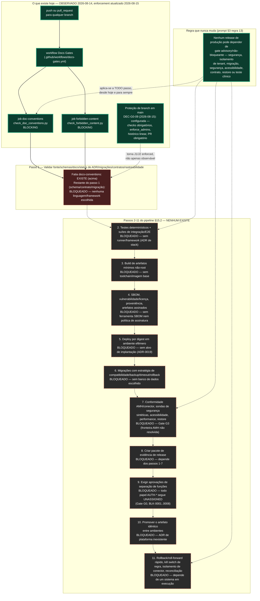

# IntensiCare V2 — Fluxo de promoção CI/CD e evidência

**Status: PROPOSAL quanto à forma do pipeline futuro; OBSERVADO quanto ao que existe
hoje.** Este arquivo é **novo** — não edita `ci-policy.md` nem
`branch-protection-request.md`, que permanecem a autoridade textual sobre o que existe e
o que está bloqueado. Este diagrama apenas **renderiza** o que esses dois documentos (e
`HANDOFF.yaml`) já registram, tornando visível quanto do pipeline de 11 passos do prompt
§15.2 é real hoje: **um passo parcial, de onze.**

## 1. Legenda

| Marcação | Significado |
|---|---|
| **OBSERVADO** (sólido) | Existe e roda hoje, verificado nesta revisão. |
| **ALVO PROPOSTO** (tracejado laranja) | Passo do pipeline §15.2 nomeado pelo prompt; nada construído. |
| **BLOQUEADO** (tracejado vermelho escuro) | Existe uma decisão/recurso específico faltando que impede o passo de começar, citado no próprio nó. |

## 2. Diagrama

## 3. Contradição observada entre documentos-fonte, registrada e não resolvida aqui

`docs/14-devsecops-and-delivery/branch-protection-request.md` (2026-08-14) declara, em
seu próprio título e §1: **"Status: BLOCKED — requires repository admin action"** e
registra que nenhuma chamada `gh api` foi feita. `HANDOFF.yaml` (2026-08-15,
`repository_state.branch_protection`) registra: **"CONFIGURADA em main (DEC-G0-09,
2026-08-15): checks doc-conventions + forbidden-content obrigatórios, enforce_admins,
histórico linear, PR obrigatório."**

Por regra desta tarefa ("se dois documentos-fonte contradisserem, o decidido prevalece e
a contradição vai ao handoff — não a resolva silenciosamente"): `DEC-G0-09` é uma
decisão humana registrada, posterior, e mais específica — ela prevalece, e este diagrama
mostra a proteção de branch como **configurada**. A contradição textual entre os dois
arquivos-fonte **não foi editada por este autor** (fora do escopo de escrita desta
tarefa: `branch-protection-request.md` pertence a `docs/14-devsecops-and-delivery/`, mas
a instrução desta tarefa permite apenas criar um arquivo novo neste diretório, não
editar os existentes) — fica registrada aqui e no HANDOFF desta tarefa para que o
próximo agente/humano concilie os dois arquivos.

## 4. O que este diagrama afirma e o que não afirma

**Afirma:**

- Exatamente **um** dos onze passos do pipeline §15.2 tem qualquer automação real hoje,
  e mesmo esse passo (validação) só cobre a fatia de convenções documentais — não
  schema, contrato, migração, ou status de ADR em código.
- Cada um dos dez passos restantes está bloqueado por uma decisão nomeada e específica
  (ADR de stack, ADR-0019, Gate G3, Gate G0), nunca por "falta de tempo" genérica.
- A regra "nenhum gate advisory em release de produção" (§3 regra 13) se aplica a todo
  passo futuro igualmente — os dois gates que existem hoje já a cumprem (`BLOCKING`,
  sem `continue-on-error`).

**Não afirma:**

- Que qualquer passo além da validação documental tenha sequer um esboço de
  implementação.
- Que a ordem 1→2→...→11 desenhada seja a única sequência possível — é a ordem do
  próprio prompt §15.2, reproduzida, não inventada por este diagrama.
- Que a proteção de branch, mesmo configurada, substitua a necessidade de humanos
  nomeados para as aprovações de separação de funções do passo 9 — esses papéis
  continuam `UNASSIGNED`.

## 5. Proveniência

| Elemento | Fonte |
|---|---|
| O que existe hoje (workflow, dois jobs, ambos bloqueantes) | `docs/14-devsecops-and-delivery/ci-policy.md` §1 |
| Os 11 passos do pipeline e o que cada um requer | `docs/14-devsecops-and-delivery/ci-policy.md` §2; `INTENSICARE_V2_ORCHESTRATOR_PROMPT.md` §15.2 |
| Regra "nenhum gate advisory" (§3 regra 13) | `docs/14-devsecops-and-delivery/ci-policy.md` §3; `INTENSICARE_V2_ORCHESTRATOR_PROMPT.md` §3 regra 13 |
| Pedido de proteção de branch, status `BLOCKED` (2026-08-14) | `docs/14-devsecops-and-delivery/branch-protection-request.md` §1 |
| Proteção de branch configurada (`DEC-G0-09`, 2026-08-15) | `HANDOFF.yaml` `repository_state.branch_protection` |
| Todo papel `AUTH-*` `UNASSIGNED` (bloqueio do passo 9) | `docs/00-governance/registers/blockers-register.md` `BLK-0001`-`BLK-0008` (citado via `ci-policy.md` §2) |
| Gate G3 bloqueando o passo 7 | `docs/08-interoperability/amh-data/four-layer-dossier.md`; `BLK-0010` |

## 6. O que este diagrama deliberadamente não faz

- Não escolhe stack, banco de dados, plataforma de nuvem, ferramenta de SBOM, ou
  vendor de assinatura.
- Não chama a API do GitHub nem altera nenhuma configuração real de repositório.
- Não resolve a contradição de status entre `branch-protection-request.md` e
  `HANDOFF.yaml` — apenas a registra.
- Não nomeia nenhum papel `AUTH-*`.
