# Mapa ágil e rastreável do IntensiCare V2 até produção

Rótulos epistêmicos conforme `docs/00-governance/evidence-notation.md`.
Este documento é **PROPOSAL**: nada aqui decide, aprova, fecha ou encerra
gate, bloqueador, risco, hazard, ADR ou OS. Esforço relativo (P/M/G) não
representa prazo, compromisso, SLA ou data de entrega. Nenhuma data de
calendário é usada como cronograma; datas que aparecem em nomes de arquivos
ou em proveniência são referências documentais.

---

## 1. Sumário executivo

**Onde o programa está (OBSERVADO).** Os ciclos 0–2 produziram a fundação de
governança, o corpus clínico revisado (GDEC-0007), a minuta completa do
contrato AMH×IntensiCare v1 com harness de conformidade (22 cenários, não
executáveis), o kit de pesquisa G1 comissionável, o pacote de decisão C-1 e
16 ADRs redigidos. O estado factual duro permanece: **0 vias acionáveis;
matriz §7.2 com 47/47 linhas inelegíveis; `Observation` da AMH não
consumível; compatibilidade = somente "candidato a integração"; caso de
segurança em maturidade M0** (fontes na seção 2). Nenhum código de produção
existe; a AMH tem apenas ambiente `dev` — as condições de ambiente de G3 e
G8 não são satisfazíveis unilateralmente pela V2.

**O que mudou depois do relatório do ciclo 2 (OBSERVADO).** A fila de seis
decisões do §8 do relatório foi objeto de uma sessão de decisão do titular
registrada como **GDEC-0008** e persistida na `main` (commit `75838b5`,
da sessão dona da janela, durante a produção deste mapa). Cada decisão,
porém, deixou **atos residuais** — envio físico do pedido OS-16 e nome do
jurista; confirmação da interpretação de composição O3; dono AMH do
contrato; ADR-0006; execução das OS novas (OS-22/23/24) — além de
propagações documentais residuais e do espelho YAML deste mapa ainda não
rastreado (ver seção 2.2 e risco SR-1). O mapa trata as seis decisões como
marcos MD-1..MD-6 com estado de formalização explícito.

**Caminho crítico em uma frase (INFERENCE).** Após GDEC-0009 (agentificação
de G1/G2), o parecer OS-16 concentra ainda mais o caminho: do residual de
MD-1 (enviar o pedido e nomear o jurista) dependem o dado real de toda a
cadeia AMH, o **baseline retrospectivo** (AGT-2 — cujo corte histórico deve
ser fixado antes de qualquer exposição visível a clínicos, RISK-0008) e a
própria **exercibilidade** da promoção acionável por agentes (AGT-3,
condição 4). Em paralelo e independentes: a execução AMH (OS-01..24, rumo à
IG 1.1.0 e ao contrato publicado), o dossiê substituto multi-fonte do G1
(SPR-G1-9 — pode iniciar de imediato) e o trabalho V2 de ADRs restantes
(13 not-started), UX §11 e fundação de testes — que convergem em G3/G4 e
habilitam a fatia vertical sintética (G7) sem esperar dado real. G8
permanece condicionado a ambiente AMH production-like hoje inexistente e a
validações humanas externas (a observação real de usuários migrou para o
piloto — AGT-1), sem data atribuível.

**O que este mapa não é.** Não é cronograma nem promessa: é um grafo de
dependências condicionado por evidências e decisões, com trabalho separado
por autoridade (titular × V2 × AMH × terceiros) e com os pontos de espera
indeterminada explicitados.

---

## 2. Estado consolidado atual

### 2.1 Estado factual obrigatório (preservado — §4.2 do encargo)

| Afirmação (SOURCE) | Evidência (caminho + seção) | O que poderia alterar o estado (conforme os próprios documentos) |
|---|---|---|
| Vias acionáveis: **0** | `docs/08-interoperability/amh-data/pathway-source-matrix/matrix.yaml` (contagem, `elegiveis_hoje: 0`); `docs/05-clinical-safety/pathway-portfolio/hard-gate-assessment.md` §7.7; `candidate-inventory.md` §8.5 | Fechamento item a item das lacunas L-1..L-16 **e** dos portões de programa (uso pretendido aprovado, dono clínico, fluxo observado, baseline, vigilância financiada) — "nenhuma combinação das lacunas fechadas produz uma via acionável neste horizonte" (`lacunas-e-proximas-evidencias.md` §5) |
| Matriz de vias §7.2: **47/47 inelegíveis** | `pathway-source-matrix/matrix.yaml`; `matriz-leitura.md` §4 (todos os 8 requisitos do §7.2 em 0/47) | Evidência por camada (declarado→implantado→povoado→apto) via execução AMH das OS-01..21 + medições |
| `Observation` AMH: **não consumível** | `identity-adjudication/adjudicacao-decisoes-2026-08-15.md` §6.1; `interim-identity-policy.md` IDP-12 (1 perna resolvida por decisão, 3 abertas) | IG 1.1.0 publicada e pinada por digest (OS-01..05); população real medida (OS-20); forma LOINC+UCUM conformante; emissão corrigida (OS-07/08) |
| Compatibilidade: somente **"candidato a integração"** | `compatibility-finding.md` §7; `contract-inventory.md` §E.5; `contracts.lock.draft.yaml` ("a natureza do bloqueio mudou de INDEFINICAO para EXECUCAO E AMBIENTE") | As 8 condições do `compatibility-finding.md` §5 — todas juntas apenas habilitam uma audiência do Gate G3, não a decidem |
| Caso de segurança: **maturidade M0** | `docs/05-clinical-safety/safety-case/safety-case-skeleton.md` §6 ("the maturity state remains M0"); 47/47 hazards OPEN | M1 exige aprovação humana de uso pretendido que não existe (= saída do Gate G1) |
| Ambientes AMH `stg`/`prod`: **inexistentes** | `four-layer-dossier.md` Layer 2 ("Só `dev` existe"); `contracts.lock.draft.yaml` `required_but_absent.supported_environments` | Decisão de orçamento do titular + provisionamento AMH (`lacunas-e-proximas-evidencias.md` §L-14; RISK-0004) |

### 2.2 Estado de decisão e de propagação (reconciliação — OBSERVADO/INFERENCE)

A reconciliação factual entre HANDOFF.yaml, relatório do ciclo 2 e registros
identificou divergências que este mapa **registra sem resolver** (regra §0
do encargo). As mais materiais:

1. **GDEC-0008 foi persistida durante a produção deste mapa.** No corte
   inicial (árvore de trabalho sobre `4669915`/`41a115c`), a entrada
   existia apenas não commitada; o commit `75838b5` (HEAD da `main`, da
   sessão dona da janela) persistiu o registro e propagou parte dos
   artefatos. Propagações residuais confirmadas no HEAD: GDEC-0008 ausente
   da tabela-índice do próprio `decision-register.md`; bloco §6 do
   `pedido-de-comissionamento.md` vazio; `traceability-policy.md` §1.1 sem
   os prefixos ratificados por GDEC-0002/GDEC-0008 e sem os deste mapa;
   `lacunas-e-proximas-evidencias.md` L-4/L-6 sem referência a OS-23/24;
   marca da decisão P-1 no `hard-gate-assessment.md` §7 não localizada
   (verificar). O espelho YAML deste mapa segue não rastreado. Risco SR-1;
   sprint SPR-G0-1 (reduzido a esses residuais).
2. **Alegação de merge para `main` — dissolvida.** No corte inicial, o
   HANDOFF.yaml (seção `sessao_de_decisao_gdec_0008`) alegava "merge seguro
   do PR p/ main + higiene de branches executados nesta sessão" sem
   corroboração no git local; após `75838b5`, a `main` contém todo o
   conteúdo e a divergência se dissolveu. Registrada como histórico de
   reconciliação; nenhum ato pendente.
3. **ADRs: registro × índice — propagado.** GDEC-0008 item 4 aceita
   ADR-0001/0003/0004/0005/0009/0010/0011; no corte inicial o
   `adr-index.md` ainda os listava como proposed/under-review; `75838b5`
   propagou os estados (índice no HEAD: 14 accepted — 7 por GDEC-0007 + 7
   por GDEC-0008 —, 2 proposed: ADR-0002 e ADR-0006; 13 not-started).
   Restrição inalterada: "accepted ≠ implemented" (índice §2.1) — nenhuma
   implementação dependente é apresentada como autorizada por este mapa;
   ADR-0002/0006 e ADR-0012..0024 seguem não aceitos.
4. **Fila §8 × GDEC-0008.** O encargo pede a fila de seis decisões "prontas
   para decisão"; o registro mostra que a sessão ocorreu. O mapa apresenta
   as seis como marcos MD-1..MD-6 com estado "decidida em GDEC-0008 item n;
   atos residuais pendentes" (seção 3) — sem presumir nada além do texto.
5. **Contagens reconciliadas como INFERENCE** (registradas, não decididas):
   42×43 itens G1 — o kit mapeia 43 itens VAL, dos quais 42 bloqueiam o G1
   (`protocolo-pesquisa-g1.md` §6.1); "1 histórico" da expectativa do
   encargo não existe no índice (no corte inicial: 7 accepted + 8 proposed
   + 1 under-review; após `75838b5`: 14 accepted + 2 proposed); duas
   matrizes distintas coexistem legitimamente (25 linhas
   no lado clínico ciclo 0/1; 47 linhas na matriz §7.2 do ciclo 2 — este
   mapa usa a de 47).
6. **Colisões e dispersões de IDs** (não resolvidas aqui): rótulos N-11/N-12
   usados com dois significados (`contract-v1/memoria-de-desenho.md` §8.1 ×
   `conformance/contract-v1/mapeamento-seguranca-tenant.md`); VAL-* e N-*
   sem registro centralizado; divergência N-8 (5×6 tipos de evento,
   ASM-0006/ASM-0009). Ver SR-5/SR-6.
7. **GDEC-0009 — Gates G1/G2 agentificados** (commit `ac4b1bd`, decisão do
   titular; ata `registers/agentificacao-g1-g2-2026-08-15.md`): AGT-1 — a
   observação direta de usuários deixa de ser exigência do G1 (dossiê
   substituto multi-fonte por agentes + risco bloqueante formalmente
   ACEITO; DEC-G0-05 superseded quanto ao G1; BLK-0013 reclassificado
   G1→pré-piloto; RISK-0013); AGT-2 — baselines G2-VAL-0025/VAL-0035
   satisfeitos por reconstrução retrospectiva de dados (o perecível passa a
   ser o **corte histórico pré-exposição**; dado real atrás de OS-16);
   AGT-3 — autorização permanente para o G2 100% por agentes, inclusive
   promoção a ACIONÁVEL, sob 7 condições cumulativas vinculantes (exercível
   somente após parecer OS-16 e G3 aprovado por via; RISK-0012 S5; decisão
   CONTRA a recomendação do orquestrador, divergência registrada; gatilhos
   de revisita nomeados); AGT-4 — independência autor≠aprovador transposta
   a agentes via painel adversarial (autor, revisor, ≥3 verificadores de
   lentes distintas; maioria refuta = artefato morre). `ac4b1bd` também
   acrescentou a linha GDEC-0008 à tabela-índice do decision-register
   (residual de SPR-G0-1 concluído). Contra-assinatura do titular sobre a
   ata recomendada e pendente. Esta versão do mapa incorpora a emenda nas
   fases G1/G2 (commit próprio, separado do verbatim `9382c8b`); G3..G8
   permanecem inalterados (ata, "o que NÃO muda").
8. **Parecer OS-16 COMPLETO e 2ª revisita AGT-3 aprovada** (GDEC-0011/
   GDEC-0012; `lgpd-os16/parecer-os16-2026-08-15-recebido.md`): favorável
   nos 4 pontos + extensão; critérios de conteúdo satisfeitos; BLK-0014
   EXECUTADO; via retrospectiva coberta (SPR-G1-10 exequível); campo segue
   atrás de CEP/CONEP (BLK-0013); condição 4 da AGT-3 satisfeita e revisita
   aprovada (titular + 2º revisor, GDEC-0010) — gatilho remanescente:
   primeiro evento adverso. As **condicionantes por operação** do parecer
   viram os sprints SPR-G0-4, SPR-G3-13, SPR-G4-7, SPR-G6-6 e SPR-G6-7
   (esta emenda). Nenhuma operação de dado real inicia sem a sua
   condicionante satisfeita.
9. **Modo construção ágil (GDEC-0013, 2026-08-16 — decisão do titular).**
   Os excessos de verificação ficam removidos do caminho de
   desenvolvimento. Para TODOS os sprints da swimlane Engenharia/agentes
   V2, leia-se doravante: **DoR = dependências satisfeitas; DoD = objetivo
   entregue + CI verde**; as exigências de painel AGT-4 por artefato,
   pacotes de tarefa formais, escopos de escrita disjuntos e handoffs em
   formato fixo deixam de ser vinculantes (viram prática a critério do
   executor). Conteúdo clínico durante a construção: **revisão única**
   (revisor distinto do autor) basta — lastro: aval do 2º revisor clínico
   (GDEC-0010..0012) e parecer jurídico OS-16. O painel N-de-M e as 7
   condições da AGT-3 permanecem vinculantes **somente** na promoção
   sombra→acionável (SPR-G2-4/MG-G2) e nos gates de piloto/produção (G8).
   Gates de CI, PR para `main` e dados sintéticos como default permanecem.
   Primeira exposição a usuário real ou dado real reabre a calibração.

### 2.3 O que já está FEITO e não será replicado como trabalho futuro

Kit G1 comissionável (5 arquivos); minuta OS-16 + pedido pronto; pacote de
decisão C-1 (com decisão transcrita); minuta do contrato v1 + fixtures + 7
artefatos de harness §7.6; matriz §7.2 (47 linhas); 16 ADRs redigidos; specs
0.2.0 SOFA/NEWS2/GCS com 149 vetores CRV (DRAFT para execução); hazard log
com 47 itens + 42 SAF; threat model integrado; 10/10 diagramas §19;
adjudicação AQ-1..6; ordens de serviço OS-01..24 redigidas. Cada um desses
itens aparece adiante apenas pela sua **lacuna residual** (executar, medir,
aprovar, propagar) — nunca como redação nova (anti-padrão 15).

---

## 3. Fila de decisões do titular (marcos MD-1..MD-6)

Primeira coluna operacional do mapa (encargo §2.1). Fonte da fila:
`cycle-2-delivery-orchestrator-report.md` §8; estado de formalização:
`decision-register.md` GDEC-0008 (persistida em `75838b5`; linha da
tabela-índice acrescentada em `ac4b1bd`). Nenhuma
decisão é presumida além do texto citado. Autoridade em todos os marcos:
rodaquino-OMNI (titular; papéis interinos GDEC-0004; revisor clínico
GDEC-0003).

| Marco | Questão (fila §8) | IDs existentes | Insumos obrigatórios | Estado de formalização (OBSERVADO) | Ato residual bloqueante | Bloqueia (fases/sprints) | Critério para considerar formalizada | Artefato de registro |
|---|---|---|---|---|---|---|---|---|
| **MD-1** | Enviar pedido de parecer OS-16 e nomear destinatário jurídico | BLK-0014; BLK-0013; HAZ-0047; BLK-0004; OS-16 | `docs/11-security-privacy-compliance/lgpd-os16/` (minuta + pedido prontos) | Decidida em GDEC-0008 item 1 (destinatário institucional: conselho jurídico interno; escopo ampliado p/ ética — pós-GDEC-0009, de campo futuro pré-piloto) | **Envio físico + nome do jurista individual** | SPR-G1-2 (parecer); dado real (OS-11/13/15) e reativação da OS-21; baseline retrospectivo (SPR-G1-10, AGT-2); exercibilidade da promoção acionável (AGT-3 condição 4); campo futuro opcional (SPR-G1-4, BLK-0013 pré-piloto); G6/G8 | Pedido enviado a jurista nomeado, com data e escopo registrados | `decision-register.md` (emenda a GDEC-0008 ou nova entrada GDEC com o próximo ID livre na integração) + `blockers-register.md` BLK-0014 |
| **MD-2** | Decidir C-1 (sinais vitais / Observation não-laboratorial) | GDEC-0008 item 2; RISK-0003; OS-22 | `vital-signs-decision/pacote-decisao-c1-sinais-vitais.md` | Decidida: **O3** com re-ponderação automática O1-first se sonda Bronze positiva; sonda = ordem de execução zero (OS-22) | Confirmar interpretação de composição O3×ADR-0001; fixar face D-c (escopo estreito×amplo); executar OS-22 (AMH) | SPR-G3-6; escopo de ADR-0001 na implementação; matriz §7.2 (linhas M-01) | Confirmação/correção da composição registrada; face D-c fixada por escrito | `decision-register.md` + pacote C-1 (transcrição já existente) |
| **MD-3** | Comissionar pesquisa G1 e destravar ética | BLK-0013; RISK-0008; VAL-0035; G2-VAL-0025; GDEC-0008 item 3 | `g1-kit/pedido-de-comissionamento.md` (bloco §6 ainda vazio) | Decidida: "comissionar TUDO agora" (GDEC-0008 item 3); **superada em parte por GDEC-0009** (AGT-1/AGT-2): campo deixa de ser exigência do G1 — o kit vira especificação da variante observacional opcional | Preencher bloco §6 do pedido (ditado pelo titular — ver SPR-G0-1); atos de sítio/agenda/rota apenas SE a variante observacional for comissionada (SPR-G1-3) | SPR-G1-3 (variante opcional); consolidação SPR-G1-7 | Bloco §6 preenchido com a decisão ditada; variante observacional registrada como opcional | `g1-kit/pedido-de-comissionamento.md` §6 + `decision-register.md` |
| **MD-4** | Revisar os 8 ADRs propostos + contra-assinar ata AQ-1..6 + fechar N-8 (5×6) | ADR-0001/0003/0004/0005/0009/0010/0011; ADR-0006; ASM-0006; ASM-0009; GDEC-0005; GDEC-0008 item 4 | ADRs individuais; `identity-adjudication/adjudicacao-decisoes-2026-08-15.md`; `contract-v1/eventos-ciclo-de-vida-identidade.md` | Decidida em parte: 7 ADRs aceitos; ata contra-assinada; ADR-0006 permanece proposed; **N-8 não fechado** | Fechar N-8 (5×6 tipos de evento); decidir ADR-0006 (propagação ao adr-index concluída em `75838b5`; residuais documentais em SPR-G0-1) | SPR-G3-9 (contrato), SPR-G4-1, consumidor de eventos (ASM-0009 fail-closed até lá); G7 (DoR) | N-8 fechado por escrito; estados propagados; ADR-0006 decidido ou explicitamente diferido | `decision-register.md`; `adr-index.md`; `contract-v1/memoria-de-desenho.md` §8 |
| **MD-5** | Ratificar N-11..N-14 do contrato v1 + nomear dono AMH | BLK-0015; GDEC-0008 item 5; OS-19 | `contract-v1/memoria-de-desenho.md` §8.1; `contract-manifest.draft.yaml` | Decidida em parte: N-11..N-14 **ratificadas** (emenda compatível) | **Nomear dono AMH do contrato** (`producer.owner`; critério 6 da OS-19 — ato do lado AMH) | SPR-G3-8/9 (negociação N-1..N-10, publicação OS-19); MG-G3 | Dono AMH nomeado no manifesto publicado | `contract-manifest` publicado no repo AMH + `blockers-register.md` BLK-0015 |
| **MD-6** | Dar dono às lacunas de classe (MedicationAdministration; ordem clínica) | BLK-0012; BLK-0016; OS-23; OS-24; GDEC-0008 item 6 | `pathway-source-matrix/lacunas-e-proximas-evidencias.md` §L-4/§L-6; OS-23/OS-24 (redigidas, Status: ABERTA) | Decidida: OS-23/OS-24 comissionadas ao lado AMH | Execução e resposta AMH (profile + fonte povoada; contrato de ordem); propagar L-4/L-6 → OS-23/24 (SPR-G0-1) | RULE-GCS inteira (gate sedativo fail-closed), SOFA-CV, NEWS2 escala/limitação; SPR-G3-6 | OS-23/OS-24 atendidas com evidência de camada 2/3 aceita | `ordens-de-servico-amh-2026-08-15.md` §11 + `blockers-register.md` BLK-0012/0016 |

Os seis marcos aparecem como nós no diagrama Mermaid (seção 9) e no YAML
(`decision_milestones`).

---

## 4. Legenda

**Estados de fase/gate** — `FEITO` (evidência de saída aceita por humano
nomeado); `PARCIAL` (parte das camadas percorrida; diferenciar preparação ≠
decisão ≠ implementação ≠ verificação ≠ aprovação); `NÃO INICIADO`;
`BLOQUEADO` (impedimento externo ou decisão pendente impede progresso
material). Documento preparatório existente **não** torna fase concluída.

**Esforço relativo** — `P`: escopo estreito, poucas dependências, baixa
incerteza. `M`: múltiplos artefatos ou dependências moderadas. `G`:
transversal, dependência externa, alta incerteza ou validação extensa. Não é
prazo, compromisso, SLA nem data.

**Rótulos epistêmicos** — SOURCE / OBSERVED / INFERENCE / PROPOSAL /
VALIDATION REQUIRED / DECIDED, conforme `evidence-notation.md` §2. Neste
mapa: fatos citados = SOURCE/OBSERVED; reconciliações = INFERENCE;
sprints/épicos/caminho crítico = PROPOSAL; decisões citadas = DECIDED
somente quando o registro as marca assim.

**Swimlanes (ordem fixa)** — 1. Decisões do titular · 2. Engenharia/agentes
V2 · 3. Execução AMH · 4. Dependências externas.

**IDs locais deste mapa** — `MD-n` (marco de decisão do titular), `MG-Gn`
(marco humano de saída de gate), `EPC-Gn-m` (épico), `SPR-Gn-m` (sprint/
pacote), `SR-n` (risco de sequência), `OC` (operação contínua). Prefixos
documento-locais, **pendentes de ratificação** em
`traceability-policy.md` §1.1 (mesmo regime do QAS; ver seção 11).

---

## 5. Mapa das fases

Formato por fase: objetivo; estado; evidência; lacunas; épicos; sprints (nas
quatro swimlanes, na ordem fixa); marco humano de saída; dono; critérios de
entrada/saída; dependências e riscos de sequência. Cada sprint traz os
campos obrigatórios do encargo §1.2 de forma compacta — quando uma coluna
não couber na tabela de uma fase (entregáveis, DoR/DoD ou premissas), o
campo correspondente do sprint homônimo está no espelho YAML
(`deliverables`, `definition_of_ready`, `definition_of_done`,
`estimation_assumptions`); a rastreabilidade completa está na seção 13.

### 5.0 G0 — autoridade e acesso (residual; fora da enumeração G1–G8, incluído por dependência de sequência)

- **Objetivo**: autoridade, acesso e governança estabelecidos (prompt §5).
- **Estado**: `PARCIAL`.
- **Evidência**: 9/11 bloqueadores G0 resolvidos/reclassificados
  (`blockers-register.md`, veredito final; GDEC-0004); proteção de branch
  executada (DEC-G0-09/EVID-0009); GDEC-0008 persistida em `75838b5`;
  **BLK-0002 e BLK-0008 OPEN** (credencial verificada, linha de reporte e
  segundo revisor pendentes); RISK-0007 (concentração de autoridade) OPEN.
- **Lacunas**: propagações residuais de GDEC-0008 (seção 2.2, item 1);
  espelho YAML deste mapa não rastreado; BLK-0002/0008; tradução
  retroativa (GDEC-0008 item 8).
- **Épico EPC-G0-1 — fundações de governança (residual)**

| Sprint | Swimlane | Objetivo verificável | Entregáveis (caminho) | DoR | DoD | Verificações §14/§15 | Dependências → Desbloqueia | IDs rastreados | Esforço | Premissas |
|---|---|---|---|---|---|---|---|---|---|---|
| **SPR-G0-2** | Decisões do titular | BLK-0002/BLK-0008 fechados: credencial verificada, linha de reporte, segundo revisor nomeado | Entradas atualizadas em `blockers-register.md`; nomeação registrada em `decision-register.md` | GDEC-0003 vigente | Segundo revisor humano nomeado e aceito; verificação de credencial registrada | — | RISK-0007 mitigação → G1 aprovação, G6/G8 pares de independência §4 | BLK-0002, BLK-0008, GDEC-0003, RISK-0007 | P | Existe um segundo profissional qualificado disponível (VALIDATION REQUIRED) |
| **SPR-G0-1** | Engenharia/agentes V2 | Propagações residuais de GDEC-0008/0009 concluídas. **Já FEITOS** (não replicados): persistência do registro e adr-index (`75838b5`); linha GDEC-0008 na tabela Index (`ac4b1bd`); commit do espelho YAML (`9382c8b`); `pedido-de-comissionamento.md` §6 e `traceability-policy.md` §1.1 (ditados/decididos pelo titular — D#/D4 desta sessão) | Residuais: `hard-gate-assessment.md` §7 com marca da decisão P-1 (verificar estado atual antes); `lacunas-e-proximas-evidencias.md` L-4/L-6 → OS-23/24 | Ler-antes-de-escrever (anti-padrões 3/14); verificar `git status`/mtimes | Artefatos atualizados e commitados; gates CI verdes; nenhum status DECIDED em front matter (anti-padrão 6) | `check_doc_conventions` + `check_forbidden_content` (§15.1) | GDEC-0008 → **todos** os sprints que citam decisão de GDEC-0008 | GDEC-0008, GDEC-0009, GDEC-0002, BLK-0012, BLK-0016 | P | O dono da janela commita o próprio trabalho (padrão do ciclo 2) |
| **SPR-G0-3** | Engenharia/agentes V2 | Tradução retroativa EN→pt-BR, tranches 2+ | Corpus forense, ADR-0001/0002, adr-index em pt-BR | GDEC-0008 item 8 persistido | Tranches registradas; CI verde | `check_doc_conventions` | — (não bloqueia gate) | GDEC-0006, GDEC-0008 | M | Execução em tranches, não nova decisão |
| **SPR-G0-4** | Decisões do titular | **NOVO (parecer OS-16)**: PDF original assinado do parecer arquivado em `lgpd-os16/` e referenciado; EVID-* da recepção alocado pelo steward | Arquivo do original + referência no doc do parecer; entrada EVID | Titular fornece o PDF | Original arquivado; EVID alocado | `check_forbidden_content` | GDEC-0011 → higiene documental do G6/G8 | GDEC-0011, OS-16 | P | Pendência de forma, não de mérito |

- **Marco humano de saída**: nomeações de BLK-0002/0008 (ato do titular).
- **Dono**: rodaquino-OMNI (GDEC-0004).
- **Entrada**: n/a (fase residual). **Saída**: BLK-0002/0008 fechados +
  propagações residuais de GDEC-0008 concluídas.
- **Riscos de sequência**: SR-1 (decisão não persistida), SR-8 (propagações
  pendentes).

### 5.1 G1 — problema e uso pretendido (AGENTIFICADO — GDEC-0009/AGT-1/AGT-2)

- **Objetivo**: fronteiras de população/setting, resposta humana e
  comportamento consultivo estabelecidos. Por decisão do titular (AGT-1), a
  observação direta de usuários **deixa de ser exigência de passagem**: vale
  a válvula do próprio gate — **dossiê substituto multi-fonte** produzido e
  verificado por agentes (SPR-G1-9) + ausência de observação **aceita como
  risco bloqueante por escrito** (RISK-0013). A observação real migra para o
  piloto supervisionado (G8), onde ocorre por construção.
- **Estado**: `PARCIAL` (preparação FEITA; campo deixou de ser exigência —
  GDEC-0009; dossiê substituto e baseline retrospectivo ainda não
  produzidos; aprovação humana do uso pretendido pendente).
- **Evidência**: ata `registers/agentificacao-g1-g2-2026-08-15.md`
  (AGT-1/AGT-2, DECIDED, `ac4b1bd`); BLK-0013 reclassificado G1→pré-piloto
  (índice do blockers-register); RISK-0013 registrado; DEC-G0-05
  **superseded quanto ao G1** (o princípio "conhecimento do titular =
  hipótese" permanece e vai no rótulo do dossiê); kit G1 (5 arquivos)
  permanece válido como especificação da **variante observacional
  opcional**; banner [AGENTIFICADO] no prompt §5.
- **Lacunas**: dossiê substituto multi-fonte (SPR-G1-9, painel AGT-4);
  baseline retrospectivo com corte histórico fixado (SPR-G1-10 — dado real
  atrás de OS-16/DEC-G0-03); aprovação formal do uso pretendido (BLK-0008 —
  ato humano que permanece); contra-assinatura da ata (recomendada,
  pendente).
- **Épicos**: EPC-G1-1 destrave jurídico (OS-16); EPC-G1-2 baseline
  retrospectivo (AGT-2) + variante observacional opcional; EPC-G1-3 dossiê
  substituto e aprovação.

| Sprint | Swimlane | Objetivo verificável | Entregáveis (caminho) | DoR | DoD | Verificações §14/§15 | Dependências → Desbloqueia | IDs rastreados | Esforço | Premissas |
|---|---|---|---|---|---|---|---|---|---|---|
| **SPR-G1-1** | Decisões do titular | Residual de MD-1 executado: pedido OS-16 enviado a jurista nomeado | Registro do envio + destinatário em `blockers-register.md` BLK-0014 e `decision-register.md` | Minuta e pedido prontos (`lgpd-os16/`) | Envio registrado com data e escopo (incl. cobertura ética de campo futuro — BLK-0013, pré-piloto) | — | MD-1 → SPR-G1-2 | BLK-0014, BLK-0013, BLK-0004, HAZ-0047, OS-16 | P | Conselho jurídico interno aceita o encargo |
| **SPR-G1-3** | Decisões do titular | **Opcional/pré-piloto (GDEC-0009)**: se o titular comissionar a variante observacional, sítio nomeado com anuência, agenda e rota ética escolhida | Registros em `g1-kit/pedido-de-comissionamento.md` §6 (partes c/d) e `plano-de-recrutamento-e-etica.md` §11 itens 1-3 | Decisão do titular de comissionar a variante (não exigida para o G1 — AGT-1) | Sítio+anuência+rota registrados | — | MD-3 → SPR-G1-4 | VAL-0039, VAL-0040, VAL-0041, G2-VAL-0026, GDEC-0009 | P | Kit G1 permanece válido como especificação da variante |
| **SPR-G1-8** | Decisões do titular | **MG-G1**: uso pretendido aprovado formalmente pelo revisor nomeado, com evidência substituta (AGT-1) e risco aceito registrado por escrito | Aprovação em `decision-register.md`; fechamento de BLK-0008; atualização do safety case (M0→M1 avaliável) | SPR-G1-9 (dossiê aprovado pelo painel AGT-4); SPR-G1-10 (corte histórico fixado); SPR-G0-2 (segundo revisor, p/ conteúdo autorado pelo titular) | Registro DECIDED por humano nomeado com regra de supersessão | — | → G2 (portões de programa), G4 (UX com evidência), safety case M1 | BLK-0008, GDEC-0003, GDEC-0009, VAL-0005 | P | AGT-1 trocou a evidência do gate, não o aprovador humano |
| **SPR-G1-9** | Engenharia/agentes V2 | **NOVO (AGT-1) — dossiê substituto multi-fonte**: literatura de fatores humanos/fluxo de UTI + forense do legado + dados retrospectivos quando acessíveis + hipóteses do titular **rotuladas como hipótese de especialista**; 42 itens VAL dispostos (cobertos pelo dossiê ou risco aceito registrado) | Dossiê em `docs/02-users-and-workflows/` (§18 item 5); trilha do painel AGT-4 | GDEC-0009 vigente; painel AGT-4 instanciado (SPR-G2-1) | Aprovado por painel AGT-4 (autor, revisor, ≥3 adversariais de lentes distintas; maioria refuta = morre); cada item VAL com evidência ou risco aceito explícito | `check_doc_conventions`; painel AGT-4 | → SPR-G1-8; EPC-G4-2 (UX baseada em evidência) | VAL-0001..0043 (mapeamento §6.1), RISK-0013, GDEC-0009, HAZ-0046 (E-6.9) | M | Pode iniciar de imediato; a perna retrospectiva engrossa quando houver dado real |
| **SPR-G1-10** | Engenharia/agentes V2 | **NOVO (AGT-2) — baseline retrospectivo**: corte histórico fixado **antes de qualquer exposição visível a clínicos** (gatilho §3.5 define o corte); carga de alertas, proxies de tempo-até-reconhecimento e desfechos reconstruídos do histórico Tasy/Gold, com vieses declarados linha a linha | Baseline retrospectivo arquivado + declaração de vieses (RISK-0013); disposição de G2-VAL-0025/VAL-0035 | Corte histórico fixado e registrado; acesso a dado histórico real (parecer OS-16/DEC-G0-03) | Reconstrução verificada por painel AGT-4; vieses declarados; corte anterior a qualquer exposição | Painel AGT-4 | → SM-01/SM-04/HM-02/HM-05 avaliáveis; SPR-OC-1 | VAL-0035, G2-VAL-0025, RISK-0008, ASM-0007, GDEC-0009, RISK-0013 | M | Dado histórico AMH acessível após parecer (gated em OS-16) |
| **SPR-G1-7** | Engenharia/agentes V2 | **Superseded como exigência do G1 (GDEC-0009; absorvido por SPR-G1-9)**: permanece apenas como consolidação da variante observacional, se comissionada | Consolidação dos dados de campo da variante em `docs/02-users-and-workflows/` | SPR-G1-5/6 (dados da variante existem) | Cada item VAL da variante com evidência ou lacuna explícita | `check_doc_conventions` | → retroalimenta SPR-G1-9 | VAL-0001..0043 (conforme mapeamento §6.1), HAZ-0046 | M | Executado somente se a variante observacional for comissionada |
| **SPR-G1-2** | Dependências externas | Parecer jurídico emitido cobrindo os 4 pontos da minuta + cobertura ética de pesquisa com humanos (campo futuro) + ADR-043 (AMH)/DPO + ratificação AQ-3 | Parecer anexado conforme critérios da OS-16 (emissor qualificado, escopo, o que não cobre, condições de mudança) | SPR-G1-1 | 4 critérios de aceitação da OS-16 satisfeitos; BLK-0013/BLK-0004 dispostos pelo parecer | — | SPR-G1-1 → dado real (OS-11/13/15); SPR-G1-10 (dado histórico); exercibilidade AGT-3 (condição 4); SPR-G1-4 (campo futuro); G6/G8 | OS-16, BLK-0013, BLK-0004, HAZ-0045, HAZ-0047, ASM-0004, RISK-0011 | G | Sem prazo atribuível a terceiros; escopo estável (ASM-0004 P-1..P-7); primeiro parecer é gatilho de revisita do AGT-3 |
| **SPR-G1-4** | Dependências externas | **Opcional/pré-piloto (GDEC-0009)**: cobertura ética efetiva + recrutamento — obrigatória para qualquer campo futuro (BLK-0013) | Submissão/dispensa documentada; checklist §11 com 12/12 fechados por dono privacy/legal nomeado | SPR-G1-2, SPR-G1-3 | Proibição de campo suspensa por escrito | — | → SPR-G1-5/6; campo do piloto (G8) | BLK-0013, VAL-0040, VAL-0041 | G | Rota ética depende do teor do parecer (não presumida) |
| **SPR-G1-5** | Dependências externas | **Opcional/pré-piloto (GDEC-0009)**: captura observacional B1-B4a da variante, antes de qualquer exposição visível a clínicos | Dados de baseline conforme `protocolo-baselines-pereciveis.md` (cápsula ≈28 pessoa-dias, estimativa do pedido §3) | SPR-G1-3/4; nenhuma exposição ocorrida (gatilho §3.5) | B1-B4a medidos e arquivados; B4b desdobrado (ASM-0007) | — | → SPR-G1-7 (consolidação da variante) | VAL-0035, G2-VAL-0025, RISK-0008, ASM-0007, GDEC-0009 | G | Executada somente se comissionada; a exigência do gate foi satisfeita pela via retrospectiva (SPR-G1-10) |
| **SPR-G1-6** | Dependências externas | **Opcional/pré-piloto (GDEC-0009)**: protocolo do kit executado (observação, entrevistas, cenários simulados, usuários de TA); a observação real de usuários ocorre por construção no piloto (G8) | Dados de campo conforme `protocolo-pesquisa-g1.md` §3-§5 | SPR-G1-4; moderador ≠ UX designer (§4) | Cobertura dos itens C/CI do §6.1; VAL-0033 executado ou NÃO TESTADO explícito | §11 | → SPR-G1-7 (consolidação da variante) | VAL-0005, VAL-0012..0016, VAL-0027, VAL-0031, VAL-0033 | G | Executada somente se comissionada pelo titular antes do piloto |

- **Marco humano de saída (MG-G1)**: aprovação nominal do uso pretendido —
  **permanece ato humano** (AGT-1 substituiu a evidência exigida, não o
  aprovador; BLK-0008).
- **Dono**: rodaquino-OMNI (interino; segundo revisor por SPR-G0-2).
- **Entrada**: GDEC-0009 vigente (o dossiê SPR-G1-9 pode iniciar de
  imediato); dado real do baseline retrospectivo atrás de MD-1. **Saída**:
  MG-G1 com dossiê aprovado pelo painel AGT-4 + risco aceito registrado +
  corte histórico do baseline fixado (VAL-0005: a rota escolhida foi o
  aceite formal do risco — "silêncio é a única opção que o portão não
  permite").
- **Dependências/riscos**: SR-2 (natureza alterada: o perecível é o **corte
  histórico** pré-exposição); SR-4 (parecer); SR-3 (UX antes da evidência);
  RISK-0013 (usuário imaginado — aceito pelo titular).

### 5.2 G2 — portfólio de vias clínicas (AGENTIFICADO — GDEC-0009/AGT-3/AGT-4)

- **Objetivo**: método de portfólio, pesos MCDA, hard-gates §6.2 e pacote de
  release §6.4 executados **integralmente por agentes**, incluindo a
  promoção sombra→**acionável**, sob **autorização permanente do titular**
  (AGT-3 — decidida CONTRA a recomendação do orquestrador; divergência
  registrada) e sob **7 condições cumulativas vinculantes** da ata; o
  "comitê humano qualificado" do §6.4 original fica superseded neste escopo
  (banner [AGENTIFICADO] no prompt §6.4); independência autor≠aprovador
  transposta a agentes (AGT-4).
- **Estado**: `BLOQUEADO` — por **dados** (G3/AMH), não mais por atos
  humanos; a contagem acionável continua **0** (a ata não cria dados).
- **Evidência**: 0/99 hard-gates (ciclo 0); §7.7 "actionable-pathway count
  remains ZERO"; método "EXECUTION BLOCKED" (P2 matriz; P1 papéis disposto
  por AGT-3); ata AGT-3/AGT-4 (DECIDED, `ac4b1bd`); RISK-0012 (S5)
  registrado; G2-VAL-0001..0035 OPEN.
- **Lacunas**: painel AGT-4 instanciado com trilha imutável; limiares de
  sombra pré-registrados; fontes (G3); runtime (G7); kill switch/rollback
  testados; **exercibilidade** (condições 3 e 4: G3 por via + parecer
  OS-16).
- **Épico EPC-G2-1 — método e promoção agentificados**

Nota de swimlane: a coluna "Decisões do titular" desta fase é o próprio ato
já exercido — a autorização permanente GDEC-0009/AGT-3 — e seus **gatilhos
de revisita nomeados** (primeiro parecer jurídico, primeiro evento adverso
em sombra/piloto, entrada de segundo revisor clínico humano); não há ato
humano por item.

| Sprint | Swimlane | Objetivo verificável | Entregáveis | DoR | DoD | Verificações | Dependências → Desbloqueia | IDs | Esforço | Premissas |
|---|---|---|---|---|---|---|---|---|---|---|
| **SPR-G2-1** | Engenharia/agentes V2 | Mecanismo AGT-3/AGT-4 instanciado: painel adversarial por artefato (autor, revisor, ≥3 verificadores com lentes mínimas — correção clínica contra fonte primária; segurança/fail-closed; reprodutibilidade), trilha imutável por via/versão, limiares de sombra pré-registrados (falso-positivo, carga de alertas/paciente-dia, no-fire explicado) | Definição operacional do painel + trilha em release-evidence; G2-VAL-0001 disposto por AGT-3 | GDEC-0009 vigente (registro commitado em `ac4b1bd`) | Painel demonstrado em artefato-piloto; trilha imutável gravada; tier econômico excluído de conteúdo clínico (§0.5) | Painel AGT-4 | → SPR-G2-2, SPR-G1-9 | GDEC-0009, RISK-0012, G2-VAL-0001 | M | A composição do painel, vereditos e modelos integram a trilha do artefato |
| **SPR-G2-4** | Engenharia/agentes V2 | **MG-G2**: promoção sombra→acionável pelo painel sob as 7 condições cumulativas do AGT-3 — (1) hard-gates §6.2 inalterados; (2) independência AGT-4 provada em trilha; (3) **G3 aprovado para os insumos da via**; (4) **parecer OS-16/DEC-G0-03 satisfeito**; (5) sombra medida dentro de limiares pré-registrados; (6) kill switch e rollback testados; (7) registro imutável da promoção | Registro imutável por promoção (versão, evidência, painel, data) em release-evidence | SPR-G2-2/3; SPR-G1-2 (condição 4); MG-G3 por via (condição 3); SPR-G7-2 (sombra exige runtime) | 7/7 condições demonstradas; violação de limiar em produção reverte a via a sombra automaticamente | Painel AGT-4; §14 | → admissão de vias; G8 (aprovação de portfólio) | GDEC-0009, RISK-0012, G2-VAL-0035, HAZ-0043 (reavaliar L antes de G2), ASM-0010 | M | Autorização existe desde já; só se torna exercível com as condições 3-4 |
| **SPR-G2-2** | Engenharia/agentes V2 | Método executado por agentes sobre matriz com fontes evidenciadas (hard-gates §6.2 inalterados — condição 1); portfólio proposto | Análise MCDA atualizada; `candidate-inventory.md`/`hard-gate-assessment.md` atualizados | SPR-G2-1 + progresso material em G3 (fontes deixam de ser 0/47) | Contagem honesta recalculada sem enfraquecer gate (anti-padrão 10) | §14; painel AGT-4 | → SPR-G2-3/4 | CAND-0001..0020, G2-VAL-0002..0024, GDEC-0009 | M | Nenhuma via é admitida por expectativa |
| **SPR-G2-3** | Engenharia/agentes V2 | Pacote de release clínico assinável por via candidata | Bundle conforme ADR-0007 (assinatura, ativação, rollback); vetores CRV executados red/green com aprovador-agente independente (AGT-4; §3 regra 10 transposta) | ADR-0007 propagado; runtime G7 existente; painel AGT-4 (independência de autoria dos CRV) | Pacote imutável e versionado; independência autor≠aprovador satisfeita na trilha | §14 (vetores clínicos independentes, mutação no kernel); painel AGT-4 | → SPR-G2-4 | ADR-0007, ADR-0025..0029, G2-VAL-0030..0035, GDEC-0009 | G | Só após fatia G7; specs 0.2.0 "nothing is signable" até lá |

- **Marco (MG-G2)**: promoção condicionada pelo painel — o **marco humano**
  é a autorização permanente já exercida (GDEC-0009/AGT-3) mais seus
  gatilhos de revisita; a accountability concentra-se no ato da autorização
  (§3.15 emendado). **Dono**: rodaquino-OMNI, por autorização permanente,
  exercida pelo mecanismo agentico condicionado.
- **Entrada**: MG-G1 (portões de programa) + fontes evidenciadas (G3
  parcial). **Saída**: portfólio com contagem honesta; promoções acionáveis
  somente com condições 3-7 demonstradas.
- **Riscos**: RISK-0012 (S5 — modo de falha residual: defeito compartilhado
  entre agentes não é endereçável por redundância, só por diversidade de
  lentes + sombra medida; reserva jurídica ANVISA/SaMD/CFM para G6/G8);
  SR-7; HAZ-0043 (reavaliar L antes de G2 — ASM-0010).

### 5.3 G3 — compatibilidade AMH

- **Objetivo**: manifesto e schemas autoritativos, publicados, digest-
  verificados e pinados; donos AMH+V2 aprovam fronteiras; matriz prova
  insumos com dados populados e latência/completude **medidas**; testes §7.6
  passam em ambiente production-like (§7.6 Gate G3).
- **Estado**: `BLOQUEADO` (preparação extensa FEITA; execução é
  integralmente do lado AMH; ambiente production-like inexistente).
- **Evidência**: IG 1.1.0 não publicada (`contract-manifest.draft.yaml`:
  observada 1.0.0, digest null, `pinned: false`); contrato v1 DRAFT não
  aceito; harness 22 cenários não executável ("um emulador V2 provaria V2
  contra V2"); só `dev` existe; N-1..N-10 abertos; N-11..14 ratificadas.
- **Lacunas**: OS-01..24 (execução AMH); N-8; dono AMH; ambientes; pinagem;
  medições de camada 2/3/4.
- **Épicos**: EPC-G3-1 execução AMH das ordens de serviço; EPC-G3-2 contrato
  v1 e conformidade; EPC-G3-3 ambiente e audiência do gate.

Swimlane 1 — Decisões do titular:

| Sprint | Objetivo | Entregáveis | DoR | DoD | Dependências → Desbloqueia | IDs | Esforço | Premissas |
|---|---|---|---|---|---|---|---|---|
| **SPR-G3-7** | Residuais de MD-4/MD-2 fechados: N-8 (5×6), composição O3, face D-c; decisão sobre ADR-0006 | Registros em `decision-register.md` + `memoria-de-desenho.md` §8 | Pacotes já existentes | Cada ponto com registro escrito e regra de supersessão | → SPR-G3-9 (contrato), SPR-G4-1 (ADR-0006), consumidor de eventos (ASM-0009) | ASM-0006, ASM-0009, ADR-0006, GDEC-0008 | P | Nenhum novo insumo é necessário (pacotes prontos) |

Swimlane 2 — Engenharia/agentes V2:

| Sprint | Objetivo | Entregáveis | DoR | DoD | Verificações | Dependências → Desbloqueia | IDs | Esforço | Premissas |
|---|---|---|---|---|---|---|---|---|---|
| **SPR-G3-9** | Posições V2 de N-1..N-10 consolidadas para fechamento bilateral (o fechamento em si é ato conjunto com o dono AMH — BLK-0015); `contracts.lock` pinado por digest após o fechamento | `contracts.lock.yaml` (sai de draft) com digests reais; memória de desenho atualizada | OS-05 (IG 1.1.0 publicada) + SPR-G3-7 + SPR-G3-8 | Todos os campos `pinned: true` com digest; zero VALIDATION_REQUIRED em campos de pin | Parse YAML; `check_forbidden_content` (padrão PSR) | → SPR-G3-10; MG-G3 | BLK-0015, ASM-0002, ASM-0006, OS-19 | M | Re-pinagem AMH a cada sessão (ASM-0002) |
| **SPR-G3-10** | Harness §7.6 executável como código e 22 cenários executados contra sandbox pinado | Suite executável + resultados dos 22 cenários (falhas documentadas) | ADRs de stack aceitos+propagados (SPR-G4-1/2); sandbox AMH pinado existente | 22/22 executados (não necessariamente verdes) com relatório | §14 (contrato consumer-driven; replay/duplicata/fora-de-ordem) | → MG-G3 (evidência); SPR-G5-1 | OS-17, OS-18, ASM-0009, SEC-0051..0059 | G | Sandbox AMH pinado disponível (dependência externa real) |

Swimlane 3 — Execução AMH (a V2 não escreve nem executa; para cada OS:
o que fornece / o que depende dela / evidência de atendimento / autoridade —
detalhado em `ordens-de-servico-amh-2026-08-15.md`; aqui, agrupamento por
onda):

| Sprint | OS agrupadas | O que fornecem | Trabalhos V2 dependentes | Evidência de atendimento | Autoridade que confirma | IDs | Esforço | Premissas |
|---|---|---|---|---|---|---|---|---|
| **SPR-G3-1** | OS-01..OS-06 | IG 1.1.0 publicada com digest citável (identifier autoritativo; 12 tenants; sem bypass; ADR-006 (AMH) superseded) | Pinagem (SPR-G3-9); toda a suite §7.6; consumo de `Observation` | Critérios de aceitação de cada OS (ex.: OS-05 digest + notas + política de compatibilidade) | Dono AMH (a nomear — MD-5) | AQ-1, AQ-2, AQ-6, OS-01..06 | G | AMH prioriza a onda A/B |
| **SPR-G3-2** | OS-07..OS-09 | Produtor conforme (URLs canônicas; amostra validada = 1ª evidência de camada 3); partições HAPI 12 tenants (camada 2) | Matriz §7.2 (campos de povoamento); testes de isolamento | Validação FHIR registrada; taxa de povoamento medida por tenant; consulta por partição | Dono AMH | AQ-2, AQ-6, OS-07..09 | G | Depende de OS-05 |
| **SPR-G3-3** | OS-10..OS-15 | Espinha PSR (SP-1..SP-5, SP-7): tabela tenant→PJ, DDL em dev sintético, chave, consent_decision_ref, backfill | Chaveamento V2 por (PSR, encontro); fixtures reais de identidade | Critérios por OS (ex.: backfill medido por tenant; rotação de chave testada) | Dono AMH + owner cadastral (OS-10) | AQ-3, AQ-4, OS-10..15 | G | Dado real somente após OS-16 (MD-1) |
| **SPR-G3-4** | OS-17, OS-18 | Eventos de ciclo de vida (6 tipos, latência declarada E medida) + `resolve(ref, as_of)` fail-closed | Condição declarada de passagem do G3 (AQ-5); replay determinístico V2 | Fixtures dos 6 tipos incl. inválidas; teste de replay reconstruindo história | Dono AMH | AQ-5, OS-17, OS-18, ASM-0009 | G | N-8 fechado (SPR-G3-7) antes do congelamento do contrato |
| **SPR-G3-5** | OS-19, OS-20 | Pacote de contrato publicado no repo AMH (sujeito=PSR; exclusões mínimas {vitais, Observation lab}); `Observation` populada via caminho estruturado com cobertura LOINC medida | Pinagem final; matriz §7.2 sai de 0 fontes evidenciadas | Manifesto completo com dono nomeado; povoamento e vínculo Encounter medidos | Dono AMH (critério 6 da OS-19) | OS-19, OS-20, BLK-0015, RISK-0003 | G | Depende de OS-05/08 e ondas anteriores |
| **SPR-G3-6** | OS-22, OS-23, OS-24 | Sonda Bronze (ordem zero de C-1 — pode re-ponderar O3→O1-first); profile+fonte MedicationAdministration; contrato de ordem clínica | Escopo de implementação de C-1; RULE-GCS (gate sedativo); NEWS2 escala 2/limitação | Resultado da sonda registrado; critérios das OS-23/24 | Dono AMH | OS-22, OS-23, OS-24, BLK-0012, BLK-0016, RISK-0003 | M | OS-22 é barata e primeira ("ordem de execução zero") |
| **SPR-G3-8** | (ato AMH) | Dono AMH do contrato nomeado (`producer.owner`) | MG-G3 (aprovação bilateral); SPR-G3-9 | Campo owner preenchido no manifesto publicado | Titular (como autoridade AMH declarada em DEC-G0-04) | BLK-0015, OS-19 | P | O titular, CEO de ambas, pode designar sem terceiros |
| **SPR-G3-13** | (atos AMH — parecer OS-16) | Segregação explícita do `ie_perm_sms_email` no lago (Q-22); anexação do parecer ao ADR-043; emenda Q-06 ao ADR-043 (nomear art. 11, II, "f" e finalidade exclusiva) | Dado real de identidade (OS-11/15) com trilha jurídica completa | Segregação verificável; parecer anexado; emenda registrada | Dono AMH | GDEC-0011, GDEC-0012 | P | Atos pequenos do lado AMH; SPR-G3-12 permanece deliberadamente não cunhado |

Swimlane 4 — Dependências externas:

| Sprint | Objetivo | Entregáveis | DoR | DoD | Dependências → Desbloqueia | IDs | Esforço | Premissas |
|---|---|---|---|---|---|---|---|---|
| **SPR-G3-11** | Ambientes AMH `stg`/`prod` existentes e alcançáveis (decisão de orçamento + provisionamento) | Ambientes provisionados com credenciais e tfstate | Decisão de orçamento do titular (L-14) | Ambiente production-like alcançável para os testes §7.6 | → SPR-G3-10 (execução plena), MG-G3, MG-G8-PILOTO (via SPR-G8-2) | RISK-0004, L-14 (lacuna documentada) | G | Espera indeterminada; não é compromisso |

- **Marco humano de saída (MG-G3)**: donos AMH e V2 aprovam as fronteiras
  (responsabilidade, identidade/tenant, consentimento, segurança, temporal,
  qualidade, gestão de mudança) com evidência §7.6 completa; concessão por
  interface/via/tenant/modo, sem generalização. MG-G3 é o próprio ato de
  audiência bilateral — sem sprint dedicado neste mapa.
- **Dono**: rodaquino-OMNI (V2, DEC-G0-04) + dono AMH (BLK-0015 — pendente).
- **Entrada**: MD-4/MD-5 residuais + OS-05. **Saída**: pinagem completa +
  testes §7.6 verdes em ambiente production-like + aprovação bilateral.
- **Riscos**: SR-4 (espera indeterminada AMH/ambiente); SR-6 (N-8);
  anti-padrão 1 (schema ≠ dado populado) e 2 (decisão ≠ disponibilidade)
  citados como risco de leitura otimista da matriz.

### 5.4 G4 — coerência UX/domínio/API

- **Objetivo**: jornada, máquina de estados de domínio, schemas de API/
  evento, estados de erro/degradação, autorização e auditoria concordam,
  provado por testes de contrato de cenário (§11 Gate G4).
- **Estado**: `NÃO INICIADO` (gate) / `PARCIAL` (baseline de decisão: 7 ADRs
  aceitos em GDEC-0008 pendentes de propagação; 13 not-started).
- **Evidência**: nenhum modelo de estados §11, nenhuma tabela de contrato
  UI/backend, nenhum teste de acessibilidade (três fontes do inventário);
  requisito vinculante de UI de HAZ-0046 pendente.
- **Lacunas**: ADR-0002/0006 + ADR-0012..0024; artefatos UX §11; contratos
  de API/evento; validação com usuários (pós-G1).
- **Épicos**: EPC-G4-1 programa de ADRs restante; EPC-G4-2 UX e contratos
  baseados em evidência.

| Sprint | Swimlane | Objetivo | Entregáveis | DoR | DoD | Verificações | Dependências → Desbloqueia | IDs | Esforço | Premissas |
|---|---|---|---|---|---|---|---|---|---|---|
| **SPR-G4-2** | Decisões do titular | ADRs aceitos por lote (arquitetura executável) | Aceites em `decision-register.md` + índice | SPR-G4-1 | Estados propagados no mesmo ato (anti-SR-8) | — | → SPR-G4-4, SPR-G7-1 (DoR de implementação), SPR-G3-10 | ADR-0012..0024, RISK-0010 | M | Aceite formal precede qualquer implementação dependente |
| **SPR-G4-6** | Decisões do titular | **MG-G4**: coerência aprovada com testes de contrato de cenário como evidência | Registro de aprovação por fatia | SPR-G4-4/5; testes de cenário existentes (G7) | "Generated schemas alone are insufficient" satisfeito | §14 | → G7 amplo, G8 | UX/API/EVT rastreados | M | Aprovação por fatia vertical, não em bloco |
| **SPR-G4-1** | Engenharia/agentes V2 | ADR-0002 completado; ADR-0006 instruído p/ decisão; ADR-0012..0024 redigidos em ordem de dependência (0012 API; 0013 FHIR/HL7; 0015/0016/0017 auth/authz/cripto; 0019 plataforma; 0020 observabilidade; 0021 frontend; 0022 supply chain; 0014 MCP; 0018 auditoria; 0023 legado; 0024 IA/ML) | 13+2 ADRs com opções e recomendação | SPR-G0-1 (estados propagados); premissas ASM-0008/0011 com dono | Cada ADR com opções, consequências, premissas §2.2 com dono | — | → SPR-G4-2 | ADR-0002, ADR-0006, ADR-0012..0024, ASM-0008, ASM-0011, RISK-0010 | G | Capacidades descritas como requisito, nunca fornecedor escolhido fora de ADR (§3.14) |
| **SPR-G4-3** | Engenharia/agentes V2 | Artefatos UX §11: IA, modelo completo de estados obrigatórios (loading/empty/unavailable/…; fresh/aging/stale/…; estados de alerta; sessão), service blueprint, tabela contrato UI↔backend por elemento; requisito "registro limitado a esta instituição" (HAZ-0046/ADR-0004 §6.2) especificado | `docs/09-ux/` (ou local definido pelo índice §16) | Evidência G1 disponível (SPR-G1-7) para fundamentar; senão, marcado hipótese | Cada elemento de UI mapeado a fonte/estado/erro/authz/audit | §11 estados obrigatórios; WCAG 2.2 AA planejado | → SPR-G4-5, SPR-G7-2 | UX (taxonomia §8), HAZ-0046, DEC-G0-05 | G | UX evidence-based: preferência pessoal não é critério de aceite |
| **SPR-G4-4** | Engenharia/agentes V2 | Contratos publicados: OpenAPI, AsyncAPI, perfis FHIR/terminologia, política MCP | `docs/07-apis/` conforme §12 e §16 | SPR-G4-2 (ADR-0012/0013/0014) | Contratos versionados antes de implementação (§12.1) | §14 contrato consumer-driven (estrutura) | → SPR-G5-1, SPR-G7-2 | ADR-0012, ADR-0013, ADR-0014, API/EVT (taxonomia §8) | G | Nenhum connector implementado antes do contrato |
| **SPR-G4-7** | Engenharia/agentes V2 | **NOVO (parecer, Q-15)**: evidência consolidada e citável do **caráter consultivo** dos escores/alertas (decisão clínica permanece com profissional): requisito vinculante + trilha de revisão humana, ligados a §11, HAZ-0046 e ADR-0004 §6.2 | Artefato de evidência apto a ser citado no RIPD (SPR-G6-7) e no G6 | GDEC-0011 (parecer completo) | Artefato aprovado por painel AGT-4; citável | Painel AGT-4 | GDEC-0011 → SPR-G6-7, MG-G6 | GDEC-0011, HAZ-0046, GDEC-0009 | P | Consolida material já existente; não cria UX nova |
| **SPR-G4-5** | Dependências externas | Validação com usuários (cenários simulados de tempo crítico) e usuários de tecnologias assistivas sobre os artefatos §11 | Relatórios de validação; medidas de usabilidade/compreensão/recuperação de erro/carga cognitiva | SPR-G4-3; participantes recrutados (herda infraestrutura de SPR-G1-4/6) | Critérios mensuráveis definidos antes; resultados registrados mesmo se contrários | §11 ("not preference-only interviews") | → MG-G4; retroalimenta SPR-G4-3 | VAL-0027, VAL-0031, VAL-0033 | G | Usuários de TA disponíveis; senão NÃO TESTADO explícito |

- **Marco (MG-G4)**: aprovação de coerência por fatia. **Dono**: AUTH-UX +
  AUTH-PRODUCT (interinos; validação por usuários obrigatória).
- **Entrada**: SPR-G0-1 + evidência G1. **Saída**: contratos + UX validada.
- **Riscos**: SR-3 (UX desenhada antes da evidência G1 = retrabalho);
  RISK-0010 (fronteira decidida por omissão se ADRs estagnarem).

### 5.5 G5 — conformidade de conectores

- **Objetivo**: conector production-ready somente com testes de contrato,
  semântica, segurança, proveniência, replay, falha, carga, observabilidade
  e recuperação contra sistema externo representativo (§12.4).
- **Estado**: `NÃO INICIADO` (desenho do harness FEITO como preparação).
- **Evidência**: 7 artefatos §7.6 PROPOSAL; "nenhum cenário executado".
- **Lacunas**: suites executáveis; sistema representativo/ambiente
  aprovado; aceitador externo nomeado (≠ implementador).
- **Épico EPC-G5-1 — conformidade executável**

| Sprint | Swimlane | Objetivo | DoR | DoD | Dependências → Desbloqueia | IDs | Esforço |
|---|---|---|---|---|---|---|---|
| **SPR-G5-1** | Engenharia/agentes V2 | Suites de conformidade de conector como código (AMH primeiro; FHIR/HL7/MCP conforme contratos) | SPR-G4-4; SPR-G3-10 (harness base) | Suites executam localmente contra fixtures pinadas | → SPR-G5-2 | OS-17/18 (semântica), SEC-0051..0059 | G |
| **SPR-G5-2** | Dependências externas | Execução contra sistema representativo/ambiente aprovado + aceitação por verificador externo (implementador ≠ aceitador, §4) | SPR-G5-1; SPR-G3-11 (ambiente) | **MG-G5**: relatório aceito por verificador independente | → G7 promoção, G8 | RISK-0004 | M |

- **Marco (MG-G5)**: aceitação externa. **Dono**: aceitador de conformidade
  externo (a nomear). **Riscos**: SR-4 (ambiente).

### 5.6 G6 — design de segurança e segurança clínica

- **Objetivo**: hazards de alta severidade com controles implementados e
  verificados ou risco residual formalmente aceito; P0/P1 fechados/aceitos;
  isolamento de tenant com evidência adversarial; privacy/legal aprova
  fluxos e processadores (§13).
- **Estado**: `NÃO INICIADO` (aprovação) / `PARCIAL` (identificação: 47 HAZ
  OPEN, 42 SAF PROPOSAL, threat model com 27 P0 + 39 P1 e zero fechados,
  safety case M0).
- **Épicos**: EPC-G6-1 análise conjunta e controles; EPC-G6-2 verificação
  adversarial e aceite.

| Sprint | Swimlane | Objetivo | DoR | DoD | Verificações §14/§15 | Dependências → Desbloqueia | IDs | Esforço | Premissas |
|---|---|---|---|---|---|---|---|---|---|
| **SPR-G6-4** | Decisões do titular | **MG-G6**: risco residual aceito por humanos autorizados; P0/P1 fechados ou aceitos nominalmente; aprovação privacy/legal dos fluxos (parecer OS-16 + DPO ADR-043) | SPR-G1-2 (parecer); SPR-G6-1/2/3 | Registro de aceite com regra de supersessão; HAZ-0045 disposto (barreira fora da V2 reconhecida — RISK-0011) | — | → G8 (piloto production-like) | BLK-0004, HAZ-0045, RISK-0011, THR (P0/P1) | M | Aceite por autoridade com escopo real (não interina onde §4 exige terceiro) |
| **SPR-G6-1** | Engenharia/agentes V2 | Sessões conjuntas hazard×ameaça realizadas (8 hazards `joint`) com participantes humanos nomeados; L de HAZ-0027/0043/0045 reavaliado por dono nomeado | SPR-G0-2 (donos) | Atas + atualizações de S/L por humano | — | → SPR-G6-4 | HAZ-0003/0013/0014/0028/0029/0034/0041/0042, HAZ-0027, HAZ-0043, ASM-0010 | M | Sessões exigem humanos; agentes só preparam material |
| **SPR-G6-2** | Engenharia/agentes V2 | Controles SAF de alta severidade implementados e verificados no código da fatia/plataforma | SPR-G7-1 (código existe); ADRs 0015..0018 aceitos | Controle a controle: teste que o verifica; kernel com mutation testing | §14 (SAST/SCA/secret/IaC/SBOM; mutação; testes de segurança) | → SPR-G6-3/4 | SAF-0001..0042, THR-0001..0083 (P0 primeiro), SEC-0001..0059 | G | Implementação depende de stack aceita |
| **SPR-G6-5** | Engenharia/agentes V2 | Safety case progride M1→M2/M3 com slots E-* populados por evidência real; defeaters retirados só com evidência; residual de BLK-0017 verificado (SAF-0042 já existe em `safety-requirements.md`) e submetido à disposição de AUTH-CLINSAFETY | MG-G1 (M1); evidências de G6/G7 | Slots atualizados sem promoção por agente (§7 do skeleton); BLK-0017 disposto por humano (não fechado por este mapa) | — | → MG-G8-PILOTO (safety case exigido) | HAZ-0045/0046/0047 (E-3.8/3.9/6.9), SAF-0042, BLK-0017 | M | Maturidade avança por evidência, nunca por redação |
| **SPR-G6-3** | Dependências externas | Evidência adversarial de isolamento de tenant + teste de penetração por verificador independente (implementador ≠ verificador) | SPR-G6-2 | Relatório de pentest; achados triados | §14 penetração | → SPR-G6-4, G8 | AQ-6, DEC-G0-02 (G6 exige terceiro) | G | Verificador terceiro contratável |
| **SPR-G6-6** | Dependências externas | **NOVO (parecer, itens II/Q-02/Q-08)**: instrumento escrito do art. 39 entre controladores (PJs clínicas, operadora, AMH) com alocação de papéis **por operação** e espelhamento da V2 como operadora do laço — redação jurídica + assinaturas | Instrumento assinado, arquivado e citável | GDEC-0011 (parecer completo); minuta jurídica externa | Assinado pelos controladores; condição do 1º apply do índice satisfeita | — | GDEC-0011 → 1º apply do índice (dado real OS-11/15), MG-G6 | GDEC-0011, BLK-0004, RISK-0011 | M | Redação é ato jurídico (externo); sem prazo atribuível |
| **SPR-G6-7** | Engenharia/agentes V2 | **NOVO (parecer, Q-09)**: RIPD do índice cross-PJ — descrição, finalidade, necessidade/proporcionalidade, riscos aos titulares, salvaguardas e **vedações do §5º verificáveis** (controle negativo testável) — como PROPOSAL para aprovação privacy/legal | RIPD em `docs/11-security-privacy-compliance/` | GDEC-0011; SPR-G4-7 (evidência consultiva citável) | Aprovado por privacy/legal; anterior ao 1º apply | Painel AGT-4 | GDEC-0011, SPR-G4-7 → 1º apply do índice, MG-G6 | GDEC-0011, BLK-0004, RISK-0011, HAZ-0045 | M | Conteúdo mínimo ditado pelo parecer (Q-09) |

- **Marco (MG-G6)**: aceite nominal de risco residual + aprovação
  privacy/legal. **Dono**: humanos autorizados + advogados (BLK-0004
  reclassificado para cá).
- **Riscos**: RISK-0011 (barreira única fora da V2); RISK-0007
  (concentração); SR-4 (parecer).

### 5.7 G7 — primeira fatia vertical segura

- **Objetivo**: uma fatia estreita ponta-a-ponta com dados sintéticos,
  cobrindo os 11 passos do §14 (fixture pinada → ingestão autenticada →
  proveniência/qualidade → avaliação determinística revisada → status
  explícito → alerta durável+outbox → leitura autorizada tempo-real →
  explicação/frescor → ação humana concorrente-segura → auditoria imutável →
  evidência automatizada), com caminhos felizes **e** degradados. Não é
  release de produção.
- **Estado**: `NÃO INICIADO` — explicitamente adiado até ADRs de stack
  aceitos (relatório §8: "fatia G7 com dados sintéticos após aceitação de
  ADR-0001/0003/0005/0009/0010/0011" — aceitos em GDEC-0008 e propagados ao
  índice em `75838b5`, porém ainda sem os ADRs de plataforma 0012+ e sem
  implementação autorizada).
- **Lacunas**: fundações executáveis (estrutura de código, CI §15.2,
  ambientes V2); fatia completa com caminhos degradados; revisão
  independente da avaliação determinística.
- **Épico EPC-G7-1 — fundação executável e fatia sintética**

| Sprint | Swimlane | Objetivo | DoR | DoD | Verificações | Dependências → Desbloqueia | IDs | Esforço | Premissas |
|---|---|---|---|---|---|---|---|---|---|
| **SPR-G7-3** | Decisões do titular | **MG-G7**: fatia aceita como fundação (revisor independente da regra ≠ autor) | SPR-G7-2 | Registro de aceitação; explícito "não é produção" | — | → fase 7 (§17) entrega incremental; G8 | ADR-0007, GDEC-0003 | P | Independência autor≠aprovador |
| **SPR-G7-1** | Engenharia/agentes V2 | Fundações executáveis: estrutura de código, CI com os estágios §15.2 (validação→SBOM/assinatura→deploy por digest→migrações→checks→bundle de evidência→aprovações→promoção→rollback), ambientes V2 conforme ADR-0019, política de dados sintéticos | SPR-G0-1 + SPR-G4-2 (ADRs aceitos e propagados) | Pipeline verde com gates bloqueantes (nenhum advisory — anti-padrão 11) | §15.1/§15.2 integral | → SPR-G6-2, SPR-G7-2 | ADR-0010, ADR-0019, ADR-0022, DEC-G0-09 | G | Nada implementado antes do aceite formal (criterio 12) |
| **SPR-G7-2** | Engenharia/agentes V2 | Fatia vertical sintética completa (11 passos; uma regra; caminho feliz + degradados representativos) com evidência automatizada | SPR-G7-1; SPR-G4-3/4 (estados e contratos da fatia); fixture sintética pinada | 11/11 passos demonstrados; testes §14 da fatia verdes; revisão independente da avaliação determinística registrada | §14 camadas exigidas (unit/propriedade/mutação/vetores/matrizes de ausência/contrato/isolamento/outbox-replay/UI por estado/a11y/E2E/segurança/sondas) | → SPR-G2-3 (bundle), SPR-G6-2, MG-G7 | ADR-0007/0008/0009/0010/0011, HAZ-0005 (ausente→normal proibido), CRV (execução red/green) | G | Dados 100% sintéticos; AMH não é pré-requisito (fixture pinada) |

- **Marco (MG-G7)**: aceitação da fatia. **Dono**: revisor clínico nomeado +
  AUTH-* pertinentes.
- **Riscos**: SR-3 (implementar antes de ADR/propagação); HAZ-0005
  (reconstruir "ausente → normal silencioso" é proibição de projeto).

### 5.8 G8 — piloto e promoção a produção

- **Objetivo**: registro go/no-go baseado em evidência cobrindo as 12
  dimensões do §15.3; shadow → piloto supervisionado → rollout por
  capacidade validada.
- **Estado**: `NÃO INICIADO`; **condições de ambiente não satisfazíveis
  unilateralmente pela V2** (ambientes AMH stg/prod inexistentes —
  RISK-0004/L-14).
- **Lacunas**: todas as 12 dimensões do go/no-go (§15.3) sem evidência;
  ambientes AMH; validações clínicas/fatores humanos/acessibilidade/pentest
  externas; treinamento e runbooks; autoridade de go-live não nomeada.
- **Épicos**: EPC-G8-1 prontidão operacional e validações; EPC-G8-2 piloto e
  produção.

| Sprint | Swimlane | Objetivo | DoR | DoD | Dependências → Desbloqueia | IDs | Esforço | Premissas |
|---|---|---|---|---|---|---|---|---|
| **SPR-G8-3** | Decisões do titular | **MG-G8-PILOTO**: go/no-go de shadow/piloto (12 dimensões §15.3); shadow primeiro; autorização de pesquisa/privacidade para modo sombra (nota do §6.4) | SPR-G8-1/2; MG-G2 (portfólio aprovado); SPR-G6-5 (safety case) | Registro go/no-go completo, nominal e datado; kill switch e autoridade de rollback nomeada | → SPR-G8-4 | BLK-0004 (aprovação legal), RISK-0008 (baseline capturado ANTES) | M | Baselines já capturados — piloto destrói a janela (SR-2) |
| **SPR-G8-5** | Decisões do titular | **MG-G8-PROD**: go/no-go de produção — artefato idêntico, aprovações, monitoramento, rollback; autoridade de go-live ≠ dono do pipeline (§4) | SPR-G8-4 | Registro nominal; rollout por capacidade validada, não contagem de features | → Operação contínua | RISK-0007 (segunda pessoa no G8 — DEC-G0-06) | M | Autoridade de go-live distinta nomeada |
| **SPR-G8-1** | Engenharia/agentes V2 | Prontidão operacional: SLOs medidos (§15.3), monitoramento, vigilância de desempenho de alertas, kill switches, runbooks de incidente/downtime, treinamento de suporte/operações, backup/restore/DR e migração/rollback **ensaiados** | MG-G7; ADR-0020 aceito | Cada dimensão com evidência de exercício (não render de infra — §20) | → SPR-G8-3 | ADR-0020, OPS (taxonomia §8), RISK-0004 | G | Ambiente V2 próprio existe (ADR-0019) |
| **SPR-G8-4** | Engenharia/agentes V2 | Shadow + piloto supervisionado com artefato assinado; evidência operacional coletada (alarmes, latência, incidentes) | SPR-G8-3 | Evidência de operação real; desvios triados; artefato idêntico por digest | → SPR-G8-5 | KPIR-14 (K-8), SM/HM (métricas) | G | Piloto limitado por sítio/capacidade validada |
| **SPR-G8-2** | Dependências externas | Validação clínica/fatores humanos representativa; evidência de acessibilidade; pentest final; conformidade AMH em ambiente production-like | SPR-G3-11 (ambientes); SPR-G4-5; SPR-G6-3 | Relatórios aceitos por verificadores independentes | → SPR-G8-3 | VAL-0033, MG-G5, MG-G6 | G | Espera indeterminada por ambiente AMH; sem data |

- **Marco**: MG-G8-PILOTO e MG-G8-PROD. **Dono**: autoridade de go-live (a
  nomear; segundo humano exigido — DEC-G0-06/RISK-0007).
- **Riscos**: SR-2 (piloto antes do baseline = perda permanente); SR-4
  (ambiente AMH).

## 6. Operação contínua (pós-produção — fase 10 do §17)

- **Objetivo**: vigilância de resultados, carga de alarmes, incidentes,
  deriva, atualização de evidência/regra; revisão recorrente.
- **Estado**: `NÃO INICIADO` (condicionado a MG-G8-PROD).
- **Épico EPC-OC-1 — vigilância e manutenção de evidência**

| Sprint | Swimlane | Objetivo | Dependências | IDs | Esforço |
|---|---|---|---|---|---|
| **SPR-OC-3** | Decisões do titular | Revisão recorrente de gates/hazards/riscos/decisões (regras de supersessão); reavaliação da concentração de autoridade | MG-G8-PROD | RISK-0007, GDEC-0001..0008 | M (recorrente) |
| **SPR-OC-1** | Engenharia/agentes V2 | Vigilância contínua: KPI de missão K-8/KPIR-14 ("altas vivas da UTI" — sem alegação de efetividade clínica; monitorização, não prova), carga de alarmes vs baselines B1..B4, incidentes, deriva de dados/fonte, vigilância de versão de score (ADR-0025) | MG-G8-PROD; SPR-G1-5 (baselines) | KPIR-14, ADR-0025, HM-02, SM-01/SM-04 | G (contínuo) |
| **SPR-OC-2** | Engenharia/agentes V2 | Re-pinagem AMH recorrente (ASM-0002) + detecção de mudança de contrato (`deteccao-mudanca-contrato.md`) a cada ciclo | SPR-G3-9 (contrato pinado) | ASM-0002, EVID-0012 | P (recorrente) |

- **Marco**: revisão recorrente nominal (sem data fixa neste mapa).

---

## 7. Caminho crítico

Derivado das dependências documentadas (não da ordem narrativa). Quatro
vistas, por autoridade de controle:

**(a) Dependente do titular** — menor custo, maior alavancagem:
`MD-1 residual (envio OS-16 + jurista)` → destrava SPR-G1-2 (parecer) →
BLK-0013 (ética) → campo G1 + baselines. Também: SPR-G0-2 (segundo revisor)
→ MG-G1; SPR-G3-7 (N-8/composição/D-c) → contrato congelável; SPR-G4-2
(aceites de ADR) → implementação; decisão de orçamento de ambientes
(SPR-G3-11). Nenhum destes tem pré-requisito técnico.

**(b) Controlável pela V2** (exceto o elo SPR-G4-2, ato de aceite do
titular):
`SPR-G0-1 (propagações residuais)` → `SPR-G4-1 (ADR-0012..0024)` →
`SPR-G4-2` → `SPR-G7-1 (CI/fundações)` → `SPR-G7-2 (fatia sintética)` →
MG-G7; SPR-G2-3 (bundle assinável) ramifica após a fatia, rumo a MG-G2. Em
paralelo: SPR-G4-3 (UX §11) e SPR-G4-4 (contratos), convergindo em
SPR-G7-2. Este caminho **não** espera a AMH (fixtures sintéticas pinadas).

**(c) Dependente da AMH**:
`OS-22 (sonda — ordem zero)` e `OS-01..05 → IG 1.1.0` → OS-07/08/09 →
OS-10..15 → OS-17/18 → OS-19/20 (+ OS-23/24) → pinagem (SPR-G3-9) → harness
executado (SPR-G3-10) → MG-G3. A matriz §7.2 só sai de 0/47 por este
caminho.

**(d) Dependente de terceiros** (espera indeterminada — SR-4):
parecer jurídico (SPR-G1-2); ética CEP/CONEP (SPR-G1-4); campo e usuários
(SPR-G1-5/6, SPR-G4-5); pentest/verificadores independentes (SPR-G5-2,
SPR-G6-3, SPR-G8-2); ambientes AMH (SPR-G3-11).

**Convergências**: MG-G3 ← (b)+(c); MG-G4 ← (b)+(d); MG-G6 ← (b)+(d)+
parecer; MG-G8-PILOTO/MG-G8-PROD ← todas. **Urgência real de sequência**: SPR-G1-5 (baselines)
deve preceder qualquer exposição visível a clínicos — inclusive
demonstrações informais e o próprio piloto (RISK-0008; prioridade de
sequência, não autorização de datas).

---

## 8. Paralelismo recomendado

| Trilha paralela | Sprints | Por que é independente |
|---|---|---|
| T1 — Jurídico-ético-campo | SPR-G1-1..8 | Só depende de MD-1 residual; nenhum insumo técnico (OS-16 "sem pré-requisito técnico", §0.6) |
| T2 — Execução AMH | SPR-G3-1..6, SPR-G3-8 | Escopo inteiro do lado AMH; V2 não escreve; OS-22 é barata e primeira |
| T3 — Arquitetura/UX/fundação V2 | SPR-G0-1/3, SPR-G4-1..4, SPR-G7-1..2 | Dados sintéticos e fixtures pinadas; não espera AMH nem parecer |
| T4 — Segurança (preparo) | SPR-G6-1, SPR-G6-5 (parcial) | Sessões e safety case avançam com material já existente |
| Serializações obrigatórias | SPR-G1-5 antes de qualquer demonstração/piloto; SPR-G4-2 antes de SPR-G7-1; SPR-G3-7 antes de congelar contrato; SPR-G0-1 antes de tudo que cita GDEC-0008 | Evita perda irreversível (SR-2), tecnologia sem ADR (SR-3), retrabalho de contrato (SR-6) e decisão não persistida (SR-1) |

Risco de retrabalho por início cedo demais: UX final antes da evidência G1
(fazer como hipótese rotulada); consumidor de eventos antes de N-8
(fail-closed ASM-0009 mitiga); implementação antes de propagação de ADR.

---

## 9. Diagrama de dependências (Mermaid)

Grafo de dependências — **não** é linha do tempo; nenhum eixo temporal.
Legenda: nós `MD-*` = marcos de decisão do titular; `MG-*` = marcos humanos
de gate; `SPR-*` = sprints; arestas com rótulo `AMH` = dependência de
execução AMH; `EXT` = dependência externa; demais = V2/titular. Caminho
crítico controlável pela V2 em traço grosso (classe `crit`). O grafo
sumariza: SPR-G0-3, SPR-G0-4, SPR-G1-1, SPR-G1-3, SPR-G1-7 (consolidação da
variante observacional), SPR-G2-1, SPR-G2-2, SPR-G3-13, SPR-G4-7, SPR-G6-6,
SPR-G6-7, SPR-OC-2 e SPR-OC-3 não têm nó próprio (dependências projetadas nos marcos MD-*/MG-*
correspondentes); a fonte única e completa das dependências é o campo
`dependencies` do YAML espelho. Nós `MG-*` equivalem aos sprints de marco
homônimos (MG-G1≡SPR-G1-8; MG-G2≡SPR-G2-4; MG-G4≡SPR-G4-6; MG-G6≡SPR-G6-4;
MG-G7≡SPR-G7-3; MG-G8-PILOTO≡SPR-G8-3; MG-G8-PROD≡SPR-G8-5; MG-G3 e MG-G5
são marcos sem sprint dedicado).

```mermaid
flowchart TB
  subgraph DT["Decisões do titular"]
    MD1["MD-1 OS-16: envio + jurista"]
    MD2["MD-2 C-1 = O3 (residuais)"]
    MD3["MD-3 G1 comissionado"]
    MD4["MD-4 ADRs + N-8"]
    MD5["MD-5 Contrato v1 + dono AMH"]
    MD6["MD-6 Lacunas de classe"]
    SPRG02["SPR-G0-2 BLK-0002/0008"]
    SPRG37["SPR-G3-7 N-8 / O3 / D-c / ADR-0006"]
    SPRG42["SPR-G4-2 aceites ADR-0012..24"]
    MGG1["MG-G1 uso pretendido aprovado"]
    MGG2["MG-G2 promoção por painel (AGT-3, 7 condições)"]
    MGG3["MG-G3 aprovação bilateral AMH×V2"]
    MGG4["MG-G4 coerência UX/domínio/API"]
    MGG5["MG-G5 conformidade de conectores aceita"]
    MGG6["MG-G6 aceite de risco residual"]
    MGG7["MG-G7 fatia aceita"]
    MGG8P["MG-G8-PILOTO go/no-go"]
    MGG8X["MG-G8-PROD go/no-go"]
  end
  subgraph V2["Engenharia/agentes V2"]
    SPRG01["SPR-G0-1 persistir/propagar GDEC-0008"]
    SPRG41["SPR-G4-1 ADR-0002/0006 + 0012..0024"]
    SPRG43["SPR-G4-3 UX §11"]
    SPRG44["SPR-G4-4 contratos API/eventos"]
    SPRG39["SPR-G3-9 pinagem contracts.lock"]
    SPRG310["SPR-G3-10 harness §7.6 executado"]
    SPRG51["SPR-G5-1 suites de conector"]
    SPRG61["SPR-G6-1 sessões hazard×ameaça"]
    SPRG62["SPR-G6-2 controles SAF"]
    SPRG65["SPR-G6-5 safety case M1→M3"]
    SPRG71["SPR-G7-1 fundações + CI §15.2"]
    SPRG72["SPR-G7-2 fatia vertical sintética"]
    SPRG23["SPR-G2-3 bundle assinável + CRV"]
    SPRG19["SPR-G1-9 dossiê substituto multi-fonte (AGT-1/AGT-4)"]
    SPRG110["SPR-G1-10 baseline retrospectivo (AGT-2)"]
    SPRG81["SPR-G8-1 prontidão operacional"]
    SPRG84["SPR-G8-4 shadow + piloto"]
    SPROC1["SPR-OC-1 vigilância contínua"]
  end
  subgraph AMH["Execução AMH"]
    SPRG31["SPR-G3-1 OS-01..06 IG 1.1.0"]
    SPRG32["SPR-G3-2 OS-07..09 produtor/partições"]
    SPRG33["SPR-G3-3 OS-10..15 PSR"]
    SPRG34["SPR-G3-4 OS-17/18 eventos+resolve"]
    SPRG35["SPR-G3-5 OS-19/20 contrato+Observation"]
    SPRG36["SPR-G3-6 OS-22/23/24"]
    SPRG38["SPR-G3-8 dono AMH (BLK-0015)"]
  end
  subgraph EXT["Dependências externas"]
    SPRG12["SPR-G1-2 parecer jurídico OS-16"]
    SPRG14["SPR-G1-4 ética + recrutamento"]
    SPRG15["SPR-G1-5 captura observacional B1-B4a (opcional)"]
    SPRG16["SPR-G1-6 campo G1 (variante opcional)"]
    SPRG45["SPR-G4-5 validação usuários + TA"]
    SPRG52["SPR-G5-2 execução + aceitação externa"]
    SPRG63["SPR-G6-3 pentest/isolamento adversarial"]
    SPRG311["SPR-G3-11 ambientes AMH stg/prod"]
    SPRG82["SPR-G8-2 validações finais"]
  end

  MD1 --> SPRG12
  SPRG12 -->|EXT| SPRG14
  MD3 --> SPRG14
  SPRG14 -->|EXT| SPRG15
  SPRG14 -->|EXT| SPRG16
  SPRG12 -->|EXT| SPRG110
  SPRG110 --> MGG1
  SPRG19 --> MGG1
  SPRG15 -. "se comissionada, retroalimenta" .-> SPRG19
  SPRG16 -. "se comissionada, retroalimenta" .-> SPRG19
  SPRG02 --> MGG1
  MGG1 --> SPRG43
  SPRG19 --> SPRG43
  MGG1 --> SPRG65
  MGG1 --> MGG2

  MD2 --> SPRG37
  MD4 --> SPRG37
  MD2 --> SPRG36
  MD6 --> SPRG36
  SPRG01 --> SPRG36
  MD5 --> SPRG38
  SPRG31 -->|AMH| SPRG32
  SPRG31 -->|AMH| SPRG33
  SPRG33 -->|AMH| SPRG34
  SPRG37 --> SPRG34
  SPRG32 -->|AMH| SPRG35
  SPRG34 -->|AMH| SPRG35
  SPRG38 -->|AMH| SPRG35
  SPRG31 -->|AMH| SPRG39
  SPRG35 -->|AMH| SPRG39
  SPRG36 -->|AMH| SPRG39
  SPRG37 --> SPRG39
  SPRG38 -->|AMH| SPRG39
  SPRG39 --> SPRG310
  SPRG42 --> SPRG310
  SPRG311 -->|EXT| SPRG310
  SPRG310 --> MGG3

  SPRG01 --> SPRG41
  MD4 --> SPRG41
  SPRG37 --> SPRG41
  SPRG41 --> SPRG42
  SPRG42 --> SPRG44
  SPRG42 --> SPRG71
  MD4 --> SPRG71
  SPRG01 --> SPRG71
  SPRG43 --> SPRG45
  SPRG14 -->|EXT| SPRG45
  SPRG44 --> SPRG51
  SPRG310 --> SPRG51
  SPRG45 -->|EXT| MGG4
  SPRG44 --> MGG4
  SPRG72 --> MGG4
  SPRG71 --> SPRG72
  SPRG43 --> SPRG72
  SPRG44 --> SPRG72
  SPRG72 --> SPRG23
  SPRG02 --> SPRG23
  SPRG72 --> MGG7
  SPRG71 --> SPRG62
  SPRG42 --> SPRG62
  SPRG02 --> SPRG61
  SPRG61 --> MGG6
  SPRG62 --> SPRG63
  SPRG12 -->|EXT| MGG6
  SPRG62 --> MGG6
  SPRG63 -->|EXT| MGG6
  MGG6 --> SPRG65
  SPRG72 --> SPRG65

  SPRG51 --> SPRG52
  SPRG311 -->|EXT| SPRG52
  SPRG52 -->|EXT| MGG5
  SPRG23 --> MGG2
  SPRG12 -->|EXT| MGG2
  SPRG35 -->|AMH| MGG2
  MGG2 --> MGG8P
  MGG3 --> MGG8P
  MGG4 --> MGG8P
  MGG5 --> MGG8P
  MGG6 --> MGG8P
  SPRG65 --> MGG8P
  MGG7 --> SPRG81
  SPRG42 --> SPRG81
  SPRG81 --> MGG8P
  SPRG311 -->|EXT| SPRG82
  SPRG45 -->|EXT| SPRG82
  SPRG63 -->|EXT| SPRG82
  SPRG82 -->|EXT| MGG8P
  SPRG110 -. "corte histórico ANTES de exposição (SR-2)" .-> MGG8P
  MGG8P --> SPRG84
  SPRG84 --> MGG8X
  MGG8X --> SPROC1
  SPRG110 --> SPROC1

  classDef crit stroke-width:4px
  class SPRG01,SPRG41,SPRG42,SPRG71,SPRG72,MGG7 crit
```

---

## 10. Riscos de sequência

| ID | Condição | Consequência | Mitigação (PROPOSAL) | IDs rastreados |
|---|---|---|---|---|
| **SR-1** | Propagações residuais de GDEC-0008 não persistidas (linha na tabela-índice do registro; pedido §6; traceability-policy §1.1; L-4/L-6; marca P-1) e espelho YAML deste mapa não rastreado | Fontes internas divergem entre si; o mapa perde o espelho legível por máquina em sessão futura (anti-padrões 4/7) | SPR-G0-1 primeiro; commit do YAML pelo dono da janela correta (anti-padrão 14) | GDEC-0008 |
| **SR-2** | Qualquer demonstração, treinamento ou piloto visível a clínicos antes de **fixar o corte histórico** do baseline retrospectivo (AGT-2) — e antes da captura B1-B4a, se a variante observacional for comissionada | Contaminação/perda **permanente** do baseline; SM-01/SM-04/HM-02/HM-05 inavaliáveis para sempre | Serialização dura: corte histórico de SPR-G1-10 fixado antes de qualquer exposição (gatilho §3.5 do protocolo continua definindo o corte); prioridade de sequência, não data | RISK-0008, VAL-0035, G2-VAL-0025, ASM-0007, GDEC-0009 |
| **SR-3** | Implementação (G7) ou escolha tecnológica antes de ADR aceito+propagado | Tecnologia fora do processo de ADR (§3.14); retrabalho; fronteira decidida por omissão | DoR de SPR-G7-1 exige SPR-G4-2; capacidades descritas como requisito até lá | RISK-0010, ADR-0012..0024 |
| **SR-4** | Espera indeterminada de terceiros: parecer, ética, usuários, pentest, ambientes AMH stg/prod | Caminhos (a)/(c)/(d) param sem data prevista; pressão por atalho | Explicitar espera; avançar T3 (sintético); jamais converter dependência em compromisso (§8 do encargo) | BLK-0013/0014/0015, RISK-0004 |
| **SR-5** | Colisão de rótulos N-* (dois namespaces) e VAL-*/N-* sem registro central | Rastreabilidade ambígua em contrato e conformidade; citação errada em release evidence | Steward de rastreabilidade desambiguar na propagação (SPR-G0-1); registrar em traceability-policy §1.1 | GDEC-0002 |
| **SR-6** | Consumidor de eventos implementado antes do fechamento de N-8 (5×6 tipos) | Retrabalho de contrato/consumidor; risco clínico em `reassignment` sem alcance definido | ASM-0009 (tipo desconhecido = erro fail-closed) até SPR-G3-7; N-13 quarentena fail-closed proposta | ASM-0006, ASM-0009 |
| **SR-7** | Tratar preparação como conclusão (kit, harness, minuta, specs 0.2.0, CRV DRAFT) | Gate declarado satisfeito sem evidência de execução (anti-padrões 1/15); "PARTIAL is not PASS" | Estados deste mapa separam preparação/decisão/implementação/verificação/aprovação; contagens honestas preservadas | — |
| **SR-8** | Propagações pendentes acumulam (adr-index, pedido §6, hard-gate §7 sem marca P-1, L-4/L-6 sem OS-23/24) | Fontes divergem entre si; próxima sessão re-deriva estado errado | SPR-G0-1 como primeiro sprint V2; ler-antes-de-escrever | GDEC-0007, GDEC-0008 |
| **SR-9** | Confusão nominal entre gates de ciclo de vida (G0–G8) e hard-gates 1–11 do §6.2 | Leitura errada de "gate 4 FAIL" como Gate G4 | Este mapa usa exclusivamente `Gn` para ciclo de vida e "hard-gate n (§6.2)" para elegibilidade | — |

---

## 11. Premissas e limites do mapa

1. **Fonte de corte**: conteúdo originado na branch `cycle-1/clinical-content`
   (árvore de trabalho de 2026-08-15 sobre `4669915`/`41a115c`). Durante a
   produção deste mapa, a sessão dona da janela integrou `75838b5` à `main`
   (persistindo GDEC-0008 e incluindo a versão inicial deste próprio
   documento) e, depois, `ac4b1bd` (GDEC-0009 — agentificação de G1/G2).
   A versão verbatim pré-GDEC-0009 está preservada em `9382c8b`; esta
   versão incorpora a emenda GDEC-0009 (seção 2.2 item 7) em commit
   próprio. Modificações de outras sessões foram lidas, jamais editadas.
2. **Prefixos locais** `MD/MG/EPC/SPR/SR/OC` são documento-locais deste mapa
   (PROPOSAL), auto-sinalizados como pendentes de inclusão em
   `traceability-policy.md` §1.1 — mesmo regime das extensões já
   consolidadas ali; a atualização do §1.1 é pendência registrada de
   GDEC-0002/GDEC-0008 item 7 (SPR-G0-1). Nenhum prefixo novo além destes.
3. **Não replicação**: itens FEITOS (seção 2.3) aparecem apenas por lacuna
   residual. Nenhum bloqueador, risco, hazard, OS, ADR ou gate é encerrado
   por este documento.
4. **Estados factuais** da seção 2.1 preservados; qualquer mudança exige a
   evidência citada na terceira coluna, nunca inferência.
5. **INFERENCEs deste mapa** (reconciliações da seção 2.2, itens 5-6)
   são leituras do orquestrador com fontes citadas; permanecem abertas à
   correção pelo titular.
6. **Esforço P/M/G** estimado sob as premissas registradas em cada sprint;
   premissas de estimativa globais: equipe V2 = agentes orquestrados +
   titular; trabalho AMH dimensionado pelas próprias OS; externos não
   estimados em pessoa-dias aqui (exceto citações do próprio kit G1).
7. **Limites**: este mapa não cria datas, não nomeia terceiros, não escolhe
   tecnologia, não altera registros; divergências listadas na seção 2.2
   permanecem não resolvidas até ato do titular ou do steward competente.

---

## 12. Matriz de cobertura dos gates

| Gate | Dono do gate (hoje) | Critérios de entrada | Evidência exigida na saída | Critério objetivo de saída | Marco humano bloqueante | Estado |
|---|---|---|---|---|---|---|
| G0 (residual) | rodaquino-OMNI (GDEC-0004) | — | Donos nomeados + acesso + pinagem + governança | BLK-0002/0008 fechados; propagações residuais de GDEC-0008 concluídas | Nomeações (SPR-G0-2) | PARCIAL |
| G1 | Revisor nomeado (GDEC-0003) + segundo revisor (SPR-G0-2) | GDEC-0009 vigente; dado real atrás de MD-1 | Dossiê substituto multi-fonte aprovado por painel AGT-4 (SPR-G1-9) + risco aceito registrado (AGT-1/RISK-0013) + corte histórico do baseline fixado (SPR-G1-10) | Uso pretendido aprovado com evidência substituta (VAL-0005 — rota do risco aceito) | **MG-G1** (SPR-G1-8 — permanece ato humano) | PARCIAL |
| G2 | rodaquino-OMNI por autorização permanente (GDEC-0009/AGT-3), exercida por painel agentico AGT-4 | MG-G1; fontes evidenciadas (G3) | 7 condições cumulativas do AGT-3 (hard-gates inalterados; trilha AGT-4; G3 por via; parecer OS-16; sombra medida; kill switch/rollback; registro imutável) | Promoção com 7/7 condições demonstradas; reversão automática a sombra em violação de limiar | Autorização GDEC-0009 (já exercida) + gatilhos de revisita nomeados | BLOQUEADO (por dados) |
| G3 | Donos AMH+V2 (BLK-0015 pendente) | OS-05; MD-4/MD-5 residuais | Pinagem por digest; matriz com dados populados medidos; testes §7.6 em ambiente production-like | 6 blocos do §7.6 satisfeitos, por interface/via/tenant/modo | **MG-G3** (audiência bilateral AMH×V2) | BLOQUEADO |
| G4 | AUTH-UX/AUTH-PRODUCT + validação de usuários | ADRs aceitos+propagados; evidência G1 | Jornada×domínio×API×erro×authz×audit + testes de contrato de cenário | Coerência provada por cenário (não schemas gerados) | **MG-G4** (SPR-G4-6) | NÃO INICIADO |
| G5 | Aceitador de conformidade externo (a nomear) | Contratos publicados (SPR-G4-4) | 9 famílias de teste §12.4 contra sistema representativo | Suites verdes aceitas por verificador ≠ implementador | **MG-G5** (SPR-G5-2) | NÃO INICIADO |
| G6 | Humanos autorizados + privacy/legal (BLK-0004) | Parecer OS-16; controles implementados | Controles verificados; P0/P1 dispostos; isolamento adversarial; aprovação legal | Aceite nominal de risco residual | **MG-G6** (SPR-G6-4) | NÃO INICIADO (prep. PARCIAL) |
| G7 | Revisor independente da regra | SPR-G4-2 (stack); fixtures sintéticas | 11 passos + caminhos degradados + evidência automatizada §14 | Fatia demonstrada; revisão independente registrada | **MG-G7** (SPR-G7-3) | NÃO INICIADO |
| G8 | Autoridade de go-live (≠ dono do pipeline) | MG-G2/G3/G4/G5/G6/G7; ambientes AMH | Go/no-go de 12 dimensões (§15.3), shadow→piloto→produção | Registro go/no-go nominal e datado por etapa | **MG-G8-PILOTO / MG-G8-PROD** | NÃO INICIADO / ambiente BLOQUEADO |
| Op. contínua | AUTH-OPERATIONS + revisão recorrente | MG-G8-PROD | Vigilância K-8/alarmes/incidentes/deriva; re-pinagem ASM-0002 | Revisões recorrentes registradas | SPR-OC-3 | NÃO INICIADO |

---

## 13. Matriz de rastreabilidade (sprint → origens)

Todo item acionável rastreia a pelo menos uma origem documental (encargo
§4.5). Artefatos futuros citam caminho de destino no corpo do sprint.

| Item | Origens rastreadas |
|---|---|
| MD-1..MD-6 | Relatório ciclo 2 §8; GDEC-0008; BLK-0012/0013/0014/0015/0016; OS-16/22/23/24; ASM-0006 |
| SPR-G0-1 | GDEC-0008, GDEC-0002, anti-padrões 3/7/14 (prompt §0.4), BLK-0012, BLK-0016 |
| SPR-G0-2 | BLK-0002, BLK-0008, GDEC-0003, RISK-0007 |
| SPR-G0-3 | GDEC-0006 (DEC-G0-10), GDEC-0008 item 8 |
| SPR-G1-1 | BLK-0014, OS-16, GDEC-0008 item 1 |
| SPR-G1-2 | OS-16 (critérios), BLK-0013, BLK-0004, HAZ-0045, HAZ-0047, ASM-0004, RISK-0011 |
| SPR-G1-3 | VAL-0039/0040/0041, G2-VAL-0026, `pedido-de-comissionamento.md` §6 |
| SPR-G1-4 | BLK-0013, `plano-de-recrutamento-e-etica.md` §11, G2-VAL-0001 |
| SPR-G1-5 (opcional — GDEC-0009) | RISK-0008, VAL-0035, G2-VAL-0025, ASM-0007, `protocolo-baselines-pereciveis.md` |
| SPR-G1-6 (opcional — GDEC-0009) | VAL-0005, VAL-0012..0016, VAL-0027, VAL-0031, VAL-0033, `protocolo-pesquisa-g1.md` |
| SPR-G1-7 (superseded como exigência — GDEC-0009) | 42 itens VAL (§6.1 do protocolo), HAZ-0046, prompt §18 item 5 |
| SPR-G1-8 | BLK-0008, VAL-0005, GDEC-0003, GDEC-0009, safety case M1 (skeleton §6) |
| SPR-G1-9 (novo — AGT-1) | GDEC-0009 (ata AGT-1/AGT-4), RISK-0013, VAL-0001..0043, HAZ-0046, prompt §5 Gate G1 (válvula do risco aceito) |
| SPR-G1-10 (novo — AGT-2) | GDEC-0009 (ata AGT-2), VAL-0035, G2-VAL-0025, RISK-0008, RISK-0013, ASM-0007 |
| SPR-G2-1 (reformulado — AGT-3/AGT-4) | GDEC-0009, RISK-0012, G2-VAL-0001, `portfolio-method.md` P1, prompt §6.3 |
| SPR-G2-2 | CAND-0001..0020, G2-VAL-0002..0024, anti-padrão 10 |
| SPR-G2-3 | ADR-0007, ADR-0025..0029, CRV (standard), G2-VAL-0030..0035 |
| SPR-G2-4 (MG-G2, reformulado — AGT-3, 7 condições) | GDEC-0009, RISK-0012, prompt §6.4 (superseded no escopo), G2-VAL-0001..0035, HAZ-0043, ASM-0010 |
| SPR-G3-1..6 | OS-01..24 (`ordens-de-servico-amh-2026-08-15.md`), AQ-1..6, BLK-0012/0016, RISK-0003 |
| SPR-G3-7 | ASM-0006, ASM-0009, ADR-0006, GDEC-0008 itens 2/4 |
| SPR-G3-8 | BLK-0015, OS-19 critério 6 |
| SPR-G3-9 | `contracts.lock.draft.yaml`, ASM-0002, N-1..N-14 (memória de desenho §8) |
| SPR-G3-10 | `conformance/contract-v1/` (7 artefatos, 22 cenários), SEC-0051..0059 |
| SPR-G3-11 | RISK-0004, `lacunas-e-proximas-evidencias.md` §L-14, prompt §7.6 |
| MG-G3 (audiência bilateral — sem sprint dedicado) | Prompt §7.6, BLK-0015 |
| SPR-G4-1 | adr-index §3 (ADR-0012..0024 not-started), ASM-0008, ASM-0011, RISK-0010, prompt §10/§3.14 |
| SPR-G4-2 | RISK-0010, evidence-notation §2 regra 3 |
| SPR-G4-3 | Prompt §11 (estados obrigatórios), HAZ-0046, ADR-0004 §6.2, DEC-G0-05 |
| SPR-G4-4 | Prompt §12, ADR-0012/0013/0014 |
| SPR-G4-5 | VAL-0027/0031/0033, prompt §11 (WCAG 2.2 AA) |
| SPR-G4-6 (MG-G4) | Prompt §11 Gate G4 |
| SPR-G5-1/2 | Prompt §12.4, §4 (independência), `conformance/` harness |
| SPR-G6-1 | Hazards `joint` (safety-plan §5.4), HAZ-0027/0043, ASM-0010 |
| SPR-G6-2 | SAF-0001..0042, THR (P0/P1), SEC-0001..0059, prompt §14 |
| SPR-G6-3 | AQ-6, DEC-G0-02, prompt §13 |
| SPR-G6-4 (MG-G6) | BLK-0004, HAZ-0045, RISK-0011, prompt §13 |
| SPR-G6-5 | Safety-case-skeleton (E-3.8/3.9/6.9, E-9.x), SAF-0042, BLK-0017 |
| SPR-G6-6 (novo — parecer item II) | GDEC-0011, GDEC-0012, BLK-0004, RISK-0011, parecer OS-16 (Q-02/Q-08), art. 39 |
| SPR-G6-7 (novo — parecer Q-09) | GDEC-0011, BLK-0004, RISK-0011, HAZ-0045, parecer OS-16 (vedações §5º verificáveis) |
| SPR-G4-7 (novo — parecer Q-15) | GDEC-0011, HAZ-0046, ADR-0004 §6.2, prompt §11 |
| SPR-G3-13 (novo — atos AMH do parecer) | GDEC-0011, parecer OS-16 (Q-06/Q-22), ADR-043 (AMH) |
| SPR-G0-4 (novo — forma) | GDEC-0011, OS-16 |
| SPR-G7-1 | Prompt §15.1/§15.2, ADR-0010/0019/0022, DEC-G0-09 |
| SPR-G7-2 | Prompt §14 Gate G7 (11 passos), HAZ-0005, ADR-0007..0011, CRV |
| SPR-G7-3 (MG-G7) | Prompt §14, GDEC-0003, §4 independência |
| SPR-G8-1 | Prompt §15.3 (SLOs), ADR-0020, prompt §20 (evidência insuficiente) |
| SPR-G8-2 | VAL-0033, RISK-0004, prompt §15.3 |
| SPR-G8-3/5 (MG-G8-*) | Prompt §15.3 (12 dimensões), §6.4 (autorização de sombra), RISK-0007/DEC-G0-06, RISK-0008 |
| SPR-G8-4 | KPIR-14 (K-8/GDEC-0007), SM/HM |
| SPR-OC-1 | KPIR-14, ADR-0025, HM-02, SM-01/SM-04, prompt §17 fase 10 |
| SPR-OC-2 | ASM-0002, EVID-0012, `deteccao-mudanca-contrato.md` |
| SPR-OC-3 | RISK-0007, GDEC-0001..0008 (regras de supersessão) |
| SR-1..SR-9 | Conforme coluna "IDs rastreados" da seção 10 |

Itens sem rastreabilidade: **nenhum** (critério de aceitação 8 do encargo).

O espelho legível por máquina deste mapa está em
`docs/14-devsecops-and-delivery/mapa-de-projeto-backlog.yaml` — mesmos IDs,
mesma estrutura lógica.
